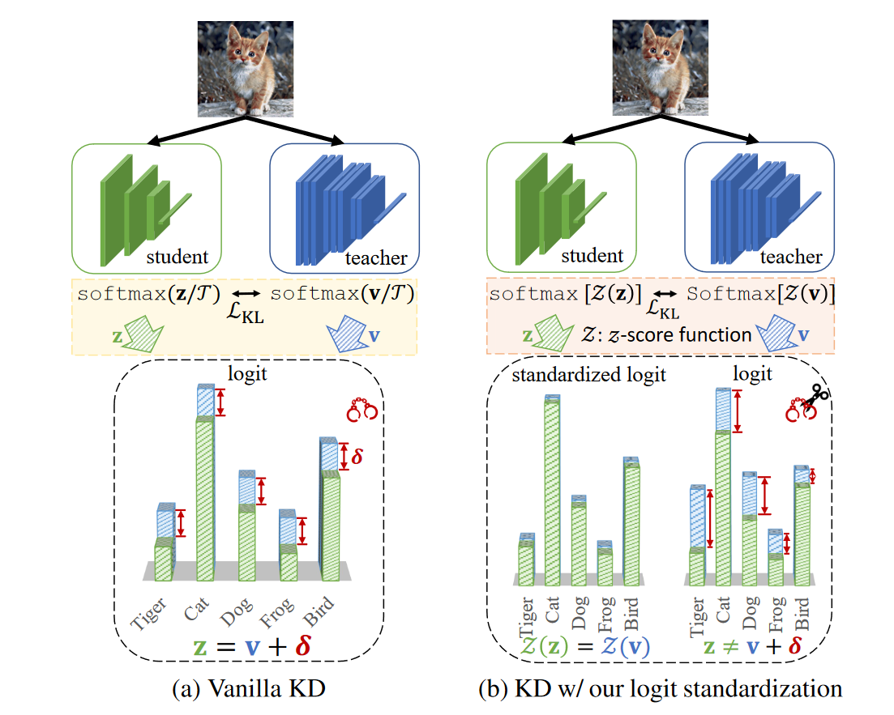
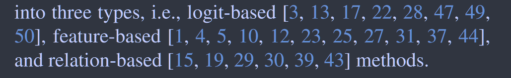
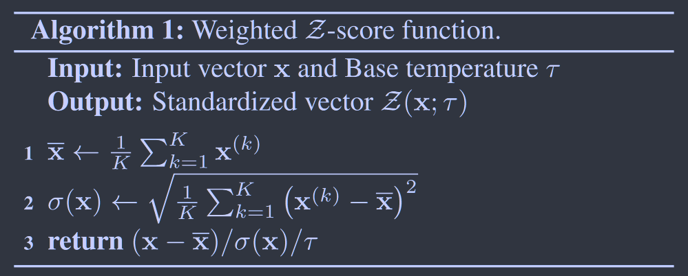
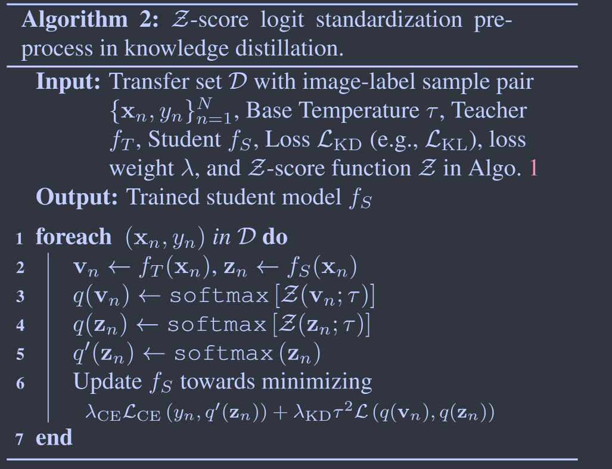
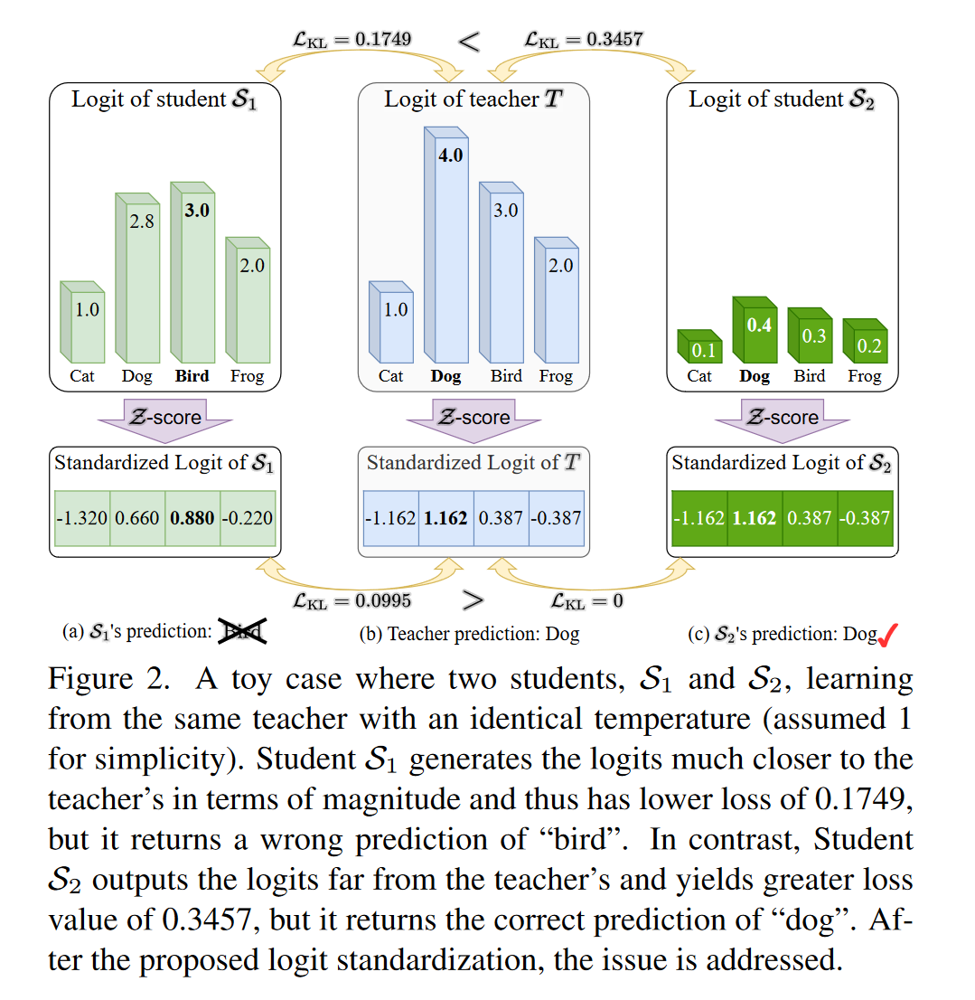

# Logit Standardization in Knowledge Distillation

**[CVPR 2024](https://arxiv.org/abs/2403.01427)	[code in github](https://github.com/sunshangquan/logit-standardization-KD)	CIFAR100  ImageNet	20240503**

*Shangquan Sun, Wenqi Ren, Jingzhi Li, Rui Wang, Xiaochun Cao*

这项工作研究了温度系数的作用，从信息论的角度利用最大熵理论推导softmax函数，温度系数是以拉格朗日乘子法的系数出现的，并基于此分析了传统KD对师生模型使用相同温度的弊端，提出了分别使用其各自logit均值和标准差进行标准化，来打破传统KD的弊端

## Introduction

先前工作对蒸馏的温度系数设定一个恒定的值，有的工作引入对抗学习模块来预测样本温度适应不同的难度，但是现有的方法仍然是师生共享相同的温度。我们从信息论最大熵理论给出推理，温度系数以拉格朗日乘子法的系数的形式出现。我们提出以加权logis标准差作为自适应温度并给出了标准化方法。

> 基于信息论中最大熵原理，利用拉格朗日乘子法推导了softmax的表达式，温度来自导出的乘子，允许对不同样本进行不同的选择。
>
> 为了解决传统KD基于logits方法的KD流程有共享温度引起的问题，提出一种logit蒸馏的预处理方法，自适应的在教师和学生之间以及跨样本之间分配温度，促进现有基于logit的KD方法。

## Related Work

## Method

### Background and Notation

假设有一个总共包含N个样本的迁移数据集$D = \{x_n, y_n\}^N_{n=1}, x_n\in\R^{H\times W}, y_n\in[1, K]$分别位第n个样本的图像和标签，H，W，K分别表示高度宽度和类别树。给定一个输入(xn, yn)，师生模型的logits输出分别为$v_n=f_T(x_n), z_n=f_S(x_n)\in\R^{1\times K}$，其对应的在温度$\mathcal{T}$下的softmax输出为：
$$
q(z_n)^{(k)} = \frac{exp(z_n^{(k)}/\mathcal{T})}{\sum^K_{m=1}exp(z_n^{(m)}/\mathcal{T})} \\
q(v_n)^{(k)} = \frac{exp(v_n^{(k)}/\mathcal{T})}{\sum^K_{m=1}exp(v_n^{(m)}/\mathcal{T})} \\
$$

### Irrelevance Between Temperatures

#### Derivation of softmax in Classification

在信息论中，分类中的softmax函数可以被证明是在概率的归一化条件和状态期望的约束下最大熵的唯一解，假设我们用如下的约束最大熵优化问题：
$$
\underset{q}{max}\mathcal{L}_1 = -\sum^N_{n=1}\sum^K_{k=1}q(v_n)^{(k)}log\ q(v_n)^{(k)}
$$

$$
s.t.\begin{aligned}
\begin{cases}
\sum^K_{k=1}q(v_n)^{(k)} =1, \forall n \\
\mathbb{E}_q[v_n] = \sum^K_{k=1}v_n^{(k)}q(v_n)^{(k)} = v_n^{(y_n)}, \forall n
\end{cases}
\end{aligned}
$$

第一个约束由离散概率密度的要求而成立，第二个约束控制了分布的范围，使得模型能够准确的预测目标类，通过拉格朗日乘子法，$\{\alpha_{1, n}\}^N_{i=1}, \{\alpha_{2, n}\}^N_{i=1}$:
$$
\mathcal{L}_T = \mathcal{L}_1 + \sum^N_{n=1}\alpha_{(1, n)}(\sum^K_{k=1}q(v_n)^{(k)}-1) + \sum^N_{n=1}\alpha_{(2, n)}(\sum^K_{k=1}v_n^{(k)}q(v_n)^{(k)} - v_n^{(y_n)})
$$
对其求偏导数并令其取0：
$$
\frac{\partial\mathcal{L}_T}{\partial q(v_n)^{(k)}} = -1-log\ q(v_n)^{(k)} + \alpha_{1, n} + \alpha_{2, n}v_n^{(k)} = 0 \\
q(v_n)^{(k)} = exp(\alpha_{2, n}v_n^{(k)})/exp(1-\alpha_{1, n})
$$
其中$Z_T = exp(1-\alpha_{1, n}) = \sum^K_{m=1}exp(\alpha_{2, n}v_n^{(m)})$为满足归一化条件的配分函数

#### Derivation of softmax in KD

延续这一思路，定义一个熵最大化问题来构造KD中的softmax，给定一个训练有素的教师和他的预测输出q(vn)，我们对学生预测的目标函数定义如下：
$$
\underset{q}{max}\mathcal{L}_2 = -\sum^N_{n=1}\sum^K_{k=1}q(z_n)^{(k)}log\ q(z_n)^{(k)}
$$

$$
s.t.\begin{aligned}
\begin{cases}
\sum^K_{k=1}q(z_n)^{(k)} =1, \forall n \\
\sum^K_{k=1}z_n^{(k)}q(z_n)^{(k)} = z_n^{(y_n)}, \forall n \\
\sum^K_{k=1}z_n^{(k)}q(z_n)^{(k)} = \sum^K_{k=1}z_n^{(k)}q(v_n)^{(k)}, \forall n
\end{cases}
\end{aligned}
$$

其中第三项来自KL散度约束，同样使用拉格朗日乘子法：
$$
\mathcal{L}_S = \mathcal{L}_2 + \sum^N_{n=1}\beta_{1, n}(\sum^K_{k=1}q(z_n)^{(k)}-1) + \sum^N_{n=1}\beta_{2, n}(\sum^K_{k=1}z_n^{(k)}q(z_n)^{(k)} - z_n^{(y_n)}) + \sum^N_{n=1}\beta_{3, n}\sum^K_{k=1}z_n^{(k)}(q(z_n)^{(k)} - q(v_n)^{(k)})
$$
对其求偏导并令其取0：
$$
\frac{\partial\mathcal{L}_S}{\partial q(z_n)^{(k)}} = -1-log\ q(z_n)^{(k)} + \beta_{1, n} + \beta_{2, n}z_n^{(k)} + \beta_{3, n}z_n^{(k)}  = 0 \\
q(z_n)^{(k)} = exp((\beta_{2, n}+\beta_{3, n})z_n^{(k)})/exp(1-\beta_{1, n})
$$
其中$Z_S = exp(1-\beta_{1, n}) = \sum^K_{m=1}exp(\beta_nz_n^{(m)}), \beta_n = \beta_{2, n}+\beta_{3, n}$为满足归一化条件的配分函数

**温度系数**  基于以上分析，若$\beta_n = \alpha_{2, n} = 1/\mathcal{T}$，则表示师生模型共享相同的温度，若$\beta_n = \alpha_{2, n} = 1$则为标准的softmax函数，最终我们选择$\beta_n \neq \alpha_{2, n}$来表示师生模型具有不同的温度

**不同温度的采样**  为所有样本定义一个全局温度是常见的操作，在不同的样本中使用相同的温度系数并不合理，因此可以采用分段变温的方法。

### Drawbacks of Shared Temperatures

我们分析传统共享温度系数的缺点，首先改写传统的softmax函数：
$$
q(z_n;a_S, b_S)^{(k)} = \frac{exp[(z_n^{k} - a_S)/b_S]}{\sum^K_{m=1}exp[(z_n^{m} - a_S)/b_S]}
$$
对于一个最终成绩良好的学生，我们假设KL散度损失达到最小，其预测的概率密度与教师的概率密度相匹配，即$\forall k\in[1, K],q(z_n;a_S, b_S)^{(k)} = q(v_n;a_T, b_T)^{(k)}$，对任意一对样本$i, j\in[1, K]$:
$$
\frac{exp[(z_n^{(i)} - a_S)/b_S]}{exp[(z_n^{(j)} - a_S)/b_S]} = \frac{exp[(v_n^{(i)} - a_T)/b_T]}{exp[(v_n^{(j)} - a_T)/b_T]} \Rightarrow (z_n^{(i)} - z_n^{(j)})/b_S = (v_n^{(i)} - v_n^{(j)})/b_T
$$
对j取1到K的平均，有：
$$
(z_n^{(i)} - \overline{z}_n)/b_S = (v_n^{(i)} - \overline{v}_n)/b_T
$$
对其求平方和，有：
$$
\frac{\frac{1}{K}\sum^K_{i=1}(z_n^{(i)} - \overline{z}_n)^2}{\frac{1}{K}\sum^K_{i=1}(v_n^{(i)} - \overline{v}_n)^2} = \frac{b_S^2}{b_T^2} = \frac{\sigma(z_n)^2}{\sigma(v_n)^2}
$$
其中$\sigma$为标准差，因此我们可以从logit便宜和方差匹配获得一个好的学生的特性

#### Logit Shift

传统的共享温度，师生模型具有恒定的logit偏移值，这意味着在传统的KD方法中，学生被迫严格模仿教师的转移逻辑，而考虑到模型大小容量，学生可能无法产生教师那样广泛的logit范围，而学生只要与教师的logit排名相匹配即可，这是传统KD的一个弊端，也是造成学生学习困难的原因之一

#### Variance Match

学生与教师温度之比等于其logit的标准差的比值，则传统KD会迫使学生logit的标准差与教师的相同，这是传统KD学习困难的另一个原因。相反，我们的超参数来自于拉格朗日乘子且易于调节，我们定义$b^*_S \propto \sigma(z_n), b^*_T \propto \sigma(v_n) $

### Logit Standardization

因此为了打破这两个舒服，我们将超参数$a_S, b_S$分别设为其logits的均值和标准差：
$$
q(z_n;\overline{z}_n, \sigma(z_n))^{(k)} = \frac{exp[\mathcal{Z}(z_n;\tau)^{(k)}]}{\sum^K_{m=1}exp[\mathcal{Z}(z_n;\tau)^{(m)}]}
$$

Z-socre具有零均值，有限标准差，单调性和有界性，其中单调性保证了经过转换后的logit排名关系不变

