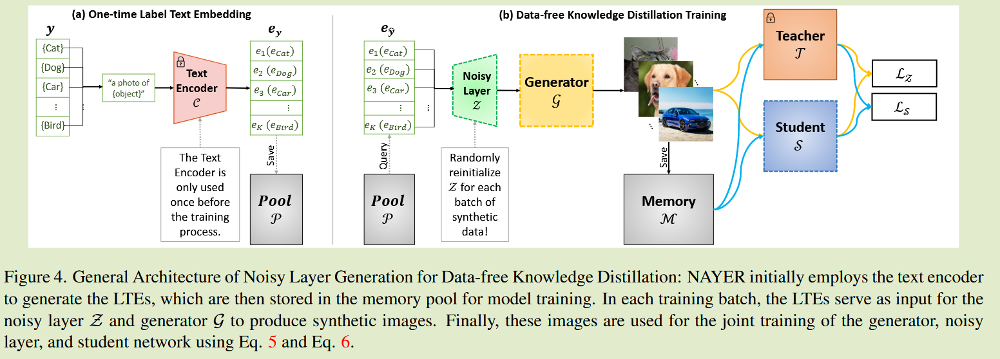
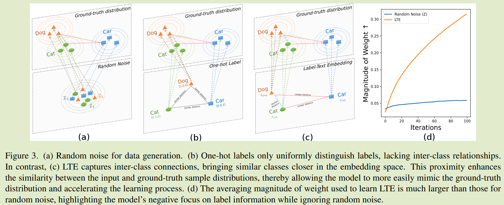
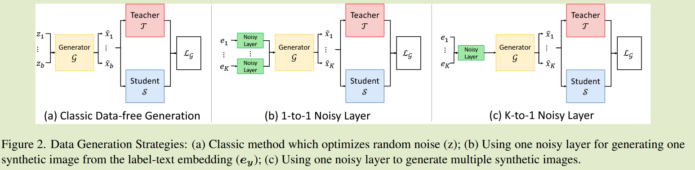
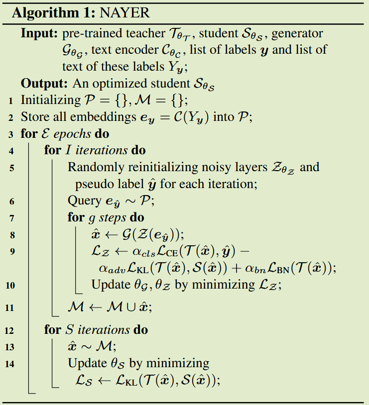

# NAYER: Noisy Layer Data Generation for Efficient and Effective Data-free  Knowledge Distillation

**[CVPR 2024](https://openaccess.thecvf.com/content/CVPR2024/html/Tran_NAYER_Noisy_Layer_Data_Generation_for_Efficient_and_Effective_Data-free_CVPR_2024_paper.html)	[code in github](https://github.com/tmtuan1307/nayer)	CIFAR  TinyImageNet	20240926**

*Minh-Tuan Tran, Trung Le, Xuan-May Le, Mehrtash Harandi, Quan Hung Tran, Dinh Phung*

本文提出一种无数据蒸馏框架，先前方法从随机噪声生成图像，这种方式缺乏类间关系，生成的图像质量相对较低，我们提出通过提示工程生成标签文本向量来指导生成器生成图像，来获得更高质量的数据；需要向LTE中添加噪声来获得更高的多样性，先前方法通过拼接或相加的方式存在局限性，我们提出一种通过由BN层和线性层组成的噪声层的方式来添加噪声，且多个类对应一个噪声层，使之能够从多个类获得信息。LTE保证了类间的语义信息提供了更高质量的样本，而噪声层为生成样本提供了更高的多样性，最终能更好的训练学生模型。

## Introduction

传统的KD方法一般假设模型可以访问教师的全部或部分训练数据，但在现实世界的应用往往对原始训练数据施加约束，通常包含隐私敏感数据，传统KD已经不足以解决这些问题。无数据蒸馏通过生成合成数据而不是访问原始训练数据，将知识从教师网络转移到学生网络，合成数据可对生成器和学生网络进行对抗训练，学生模型匹配教师模型对合成数据的预测，而生成器旨在创建样本来最大化师生预测之间的差异。

由于对合成样本的依赖，需要一种有效且高效的无数据生成技术，目前的DFKD(Data Free KD)的一个主要限制是仅仅从随机噪声中生成合成样本，而忽略了支持度和语义信息，这种限制会导致低质量的生成数据。

我们提出了一种噪声层（Noise lAYER）生成方法NAYER，将随机性噪声定位到噪声层，利用预训练语言模型LM生成有意义的标签文本向量(Label-Text Embedding， LTE)作为输入，LTE能有效封装类间信息，在加速训练起到至关重要的作用。

我们发现使用恒定的LTE作为输入，生成的数据缺乏多样性，我们通过添加噪声层来学习常量标签信息，引入层级别的随机信息来解决该问题，

- 我们提出了NAYER，一种简单而有效的基于LTE和噪声层的DFKD方法，提供了具有高分类性能的快速训练
- 我们引入了一个K - to - 1噪声层，它仅利用一个噪声层来生成多个样本

## Method

#### 问题形式化描述

训练数据集$D = \{ (x_i, y_i)\}^m_{i=1}, x_i\in\R^{c\times h\times w}, y_i\in \{1, 2, ..., K\}$， $T = T_{\theta_T}$表示在D上预训练的教师网络，DFKD的目标是训练一个学生网络$S = S_{\theta_S}$来模拟T的表现而不访问数据集D

我们用轻量级生成器G来生成合成图像，然后用它来训练一个学生网络S

#### Label-Text Embedding as Generator’s Input

现有DFKD方法局限性在于随机噪声中的合成数据没有支持语义信息，通常会生成较低质量的数据，或是经过较长时间的训练才能获得高质量数据；也有的方法使用类别one-hot向量作为生成器的额外输入，这只会带来微小的改进，因为one-hot的稀疏信息生成器难以调和。

我们提出将文本标签嵌入DFKD，将其作为生成器的输入，LTE作为信息更加丰富的稠密向量，为模型提供更容易的学习过程，LTE能够提供类间关系，更相似的类别距离更近，这促进了与真实标签更加相似，使之能够生成高质量图像。

##### Prompt Engineering  

给定所有类的列表$y = [y_1, ..., y_K]$，其对应的标签文本$Y_y = [y_{y_1}, ..., y_{y_K}]$是通过手动设计的提示模板生成的，通过预训练的文本编码器：
$$
e_y = C(Y_y)
$$

##### LTE Pool

文本向量ey只生成一次，然后存储到LTE池P中，在整个训练中保持不变，文本编码器C在训练中不被使用，我们使用一批伪标签$\hat{y}$从对应的LTE池中检索对应的文本编码向量，作为生成器的输入，通过这种方式来消除生成器对随机噪声的依赖
$$
\hat{x} = \mathcal{G}(e_{y_\hat{y}})
$$
得益于LTE的信息内容，我们能够以最小的计算代价生成了高质量样本，我们的实验研究表明，与随机噪声和onehot标签相比，使用LTE的交叉熵损失收敛显著加快，并且能够产生更高质量的图像。

#### Generating Diverse Samples with Noisy Layer  生成带有噪声层的多样本

虽然利用标签信息能够为生成数据提供优势，但是缺乏随机元生成的图像多样性较低，常见方法是将随机噪声z和文本向量ey拼接或相加作为输入，拼接增加了过度强调标签信息的风险，而相加则难以平衡两者的比例，随机噪声较低会导致随机源不足，较高则会导致文本标签信息被掩盖。

基于以上挑战，我们提出带有随机层的层级随机源的概念，此时随机源来自每次迭代时随机层NL的随机初始化

##### 噪声层架构

我们将噪声层$Z_{\theta_Z}$设计为一个BN层和一个线性层的组合，输入尺寸与文本向量ey相同，通常输出尺寸设置为1000，我们产生合成图像描述为：
$$
Z(e_\hat{y}) = Linear(BatchNorm(e_\hat{y})) \\
\hat{x} = \mathcal{G}(Z(e_\hat{y}))
$$

##### K-to-1 随机层

现有方法为每个类别创造一个噪声层，我们提出使用统一的噪声层，通过向单个噪声层Z输入$e_{\hat{y}}$，来从所有可用类中学习，这种噪声层能够同时产生多个样本，从而减少了参数量，加快了训练速度。

#### Generator and Student Updating

