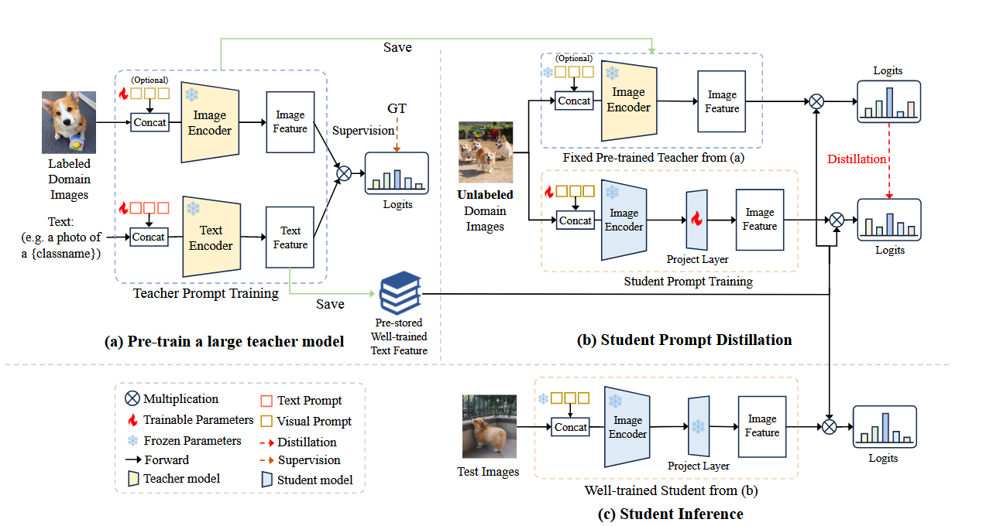

# PromptKD: Unsupervised Prompt Distillation for Vision-Language Models

[CVPR 2024](https://openaccess.thecvf.com/content/CVPR2024/html/Li_PromptKD_Unsupervised_Prompt_Distillation_for_Vision-Language_Models_CVPR_2024_paper.html)	[code in github](https://github.com/zhengli97/PromptKD)	-	20240903

*Zheng Li, Xiang Li, Xinyi Fu, Xin Zhang, Weiqiang Wang, Shuo Chen, Jian Yang*

（md 这特么跟我当初想法一模一样）

提出通过prompt来进行无监督蒸馏，首先通过少量标注数据微调教师模型prompt，将教师模型文本编码器对N各类的输出保存为共享向量供后续使用，然后利用文本共享向量和微调后的教师模型训练学生模型的prompt，只需引入少量prompt参数即可得到有竞争力的学生模型，推理阶段利用蒸馏的学生模型和保存的文本特征对未标记的图片进行推理。

## Introduction 

先前对于prompt方法的研究集中在使用稀缺的标注数据来获取有效的prompt格式并保留优秀的泛化能力，本文提出一个无监督框架，prompt作为领域知识提取器，允许CLIP学生模型在大量无标签的领域数据上的教师CLIP模型上汲取知识。

## Method

**本文探索了将Prompt作为知识提取器**，整体流程分为教师预训练阶段和学生提示蒸馏阶段。首先在少量标注数据上预训练一个大型CLIP教师模型，提取并保留从教师文本编码器中获得的高度精炼的文本特征作为类别向量；然后通过prompt促进学生模型产生一个相似的预测，最后利用训练好的学生模型图像编码器和预存储的教师文本特征进行推理。

### Stage 1： Teacher Pre-Training

使用少量标注数据预训练教师模型的prompt，经过图像编码器$f_I^t$和文本编码器$f_T^t$，得到归一化图像特征$u\in \R^d$和归一化文本特征$w \in \R^d$，最终输出结果pt:
$$
p(y|x) = \frac{exp(uw^T_y/\tau)}{\sum^N_{i=1}exp(uw^T_i/\tau)}
$$
文本编码器训练完成保持输出固定，将所有N类**$W = [w_1, w_2, ..., w_N] \in \R^{N\times d}$教师文本特征保存为共享类向量**，供后续阶段使用。从而达到在保持竞争力的前提下，降低部署的计算成本。

### Stage 2：Student Prompt Distillation

该阶段的目标是通过prompt模仿来让学生模型产生与教师模型类似的结果。由于**教师文本特征重用策略**，学生模型只需要学习prompt和投射层，利用教师模型输出和保存的文本特征对学生模型进行训练。

### Inference

利用训练好的学生模型和保存的文本特征对未标记的测试图片进行推理。