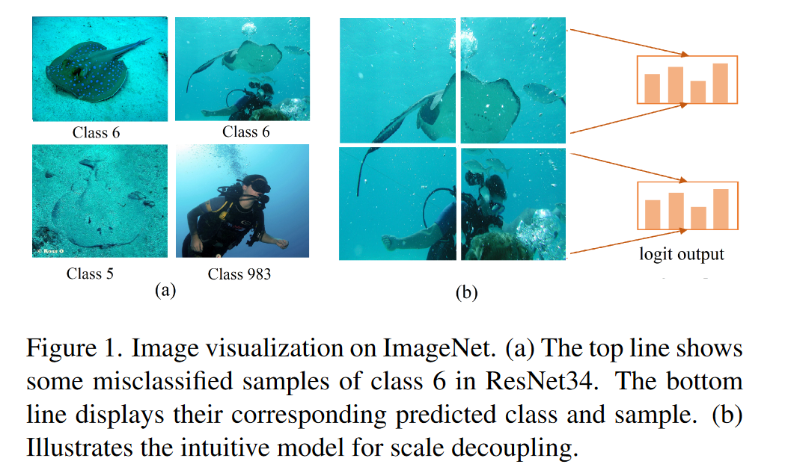
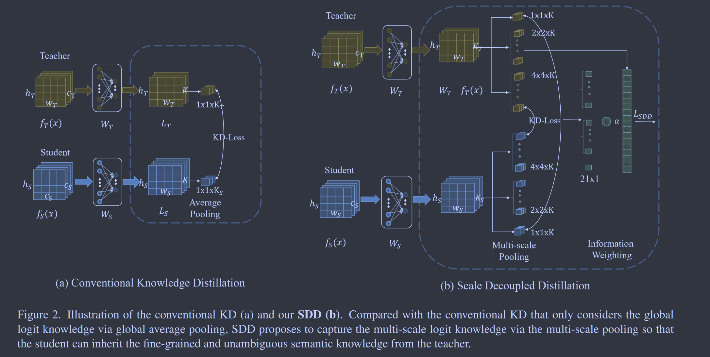

# Scale Decoupled Distillation

**[CVPR 2024](https://arxiv.org/abs/2403.13512)	[code in github](https://github.com/shicaiwei123/SDD-CVPR2024)	CIFAR100  CUB200  ImageNet	20240503**

这项工作认为现有的logits方法只利用了多种语义知识耦合的全局logits输出，这可能会将模棱两可的知识传递给学生，提出了一项多尺度的logit蒸馏方法，将全局的logits解耦为多个不同尺度的局部logits，学生模型与教师模型中对应尺度的logits进行学习，一致项将响应类别的多尺度知识传递给学生，互补项为学生保留了样本歧义。

## Introduction

目前基于logits的研究大致可以分为两类，一类旨在引入多分类器活自监督学习来提取更丰富的logits知识；另一类旨在通过动态温度活知识解耦技术来优化知识转移。这些方法虽然取得了不错的效果，但我们认为这可能并不是最优的结果，因为他们仅仅依赖于整个输入的全局logit知识，整幅图像通常会耦合多个类别的信息，这会导致教师将模棱两可的知识传递给学生，误导学生学习，导致成绩不理想。

我们提出尺度解耦蒸馏SDD来解决这个问题，SDD将整个输入的logit输出解耦为多个局部区域的logit输出，这有助于获得更丰富不含糊的语义知识，然后SDD将解耦的logit输出按其类别分为一致项和互补项。一致性与全局logit输出属于同一个类，将对应类的多尺度知识传递给学生，互补项属于不同于全局logit输出的类。

> 我们揭示了多类知识的耦合而导致的经典logit蒸馏的局限性，这些歧义样本阻碍了学生继承其语义知识。
>
> 我们提出SDD，SDD将全局logit输出解耦为一致且互补的局部logit输出，并为其建立蒸馏管道，来挖掘和传递更丰富且无二义性的语义知识。

## Method

T， S分别表示教师和学生网络，$f_{Net}, Net=\{T, S\}$表示其特征图，倒出第二层特征图表示为$f_{Net}(x)\in\R^{c_{Net}\times h_{Net}\times w_{Net}}$，$W_{Net}\in\R^{c_{Net}\times K}$将$f_{Net}(x)$投射到K个类别的logits$z^l_{Net}$上，令$f_{Net}(j,k) = f_{Net}(x)(:,j,k) \in \R^{c_{net} \times 1 \times 1}$表示在(j,k)处的特征向量，根据感受野理论，其可以表示在原始图像中$(t_x, t_y,t_x+d,t_y+d)$的区域，其中$t_x=d*j,t_y=d*k$，d表示下采样率。

### Conventional Knowledge Distillation

$$
\begin{aligned}
\begin{cases}
L_{KD} = KL(\sigma(P_T)||\sigma(P_S)) \\
P_T = W_T\sum^{h_T-1}_{j=0}\sum^{w_T-1}_{k=0}\frac{1}{h_Tw_T}f_T(j,k) \\
P_S = W_S\sum^{h_S-1}_{j=0}\sum^{w_S-1}_{k=0}\frac{1}{h_Sw_S}f_S(j,k) \\
\end{cases}
\end{aligned}
$$

由于全连接层的线性特性，其可改写为：
$$
\begin{aligned}
\begin{cases}
P_T = \sum^{h_T-1}_{j=0}\sum^{w_T-1}_{k=0}\frac{1}{h_Tw_T}L_T(j,k) \\
P_S = \sum^{h_S-1}_{j=0}\sum^{w_S-1}_{k=0}\frac{1}{h_Sw_S}L_S(j,k) \\
\end{cases}
\end{aligned}
$$
其中$L_T=W_Tf_T(x), L_S=W_Sf_S(x)$.

### Scale Decoupled Knowledge Distillation

SDD由两部分组成，多尺度池化和信息加权。给定师生模型的logits输出图，即$L_T,L_S$，多尺度池化分别在不同尺度上进行平均池化，获得输入图像不同区域的logits输出，与只考虑全局logits知识的传统KD相比，这有助于为学生保留具有明确语义的细粒度知识，对每个尺度下的logit建立知识蒸馏管道，对于与全局logits类别下不一致的局部logit，信息加权增加了蒸馏损失的权重，引导学生网络更加关注局部和全局不一致的歧义样本。

令C(m,n)表示第n个单元格在第m个尺度上的空间区域，Z(m,n)表示与该单元对应的输入x的区域，$\pi_T(m,n)\in\R^{K\times 1\times1}$表示教师区域Z(m,n)的logits输出，为该区域的聚合logits知识：
$$
\pi_T(m,n) = \sum_{j,k\in C(m,n)}\frac{1}{m^2}L_T(j,k)
$$
其中(j,k)表示在logits输出在C(m,n)中的坐标，学生对同一区域的输出表示为$\pi_S(m,n)\in\R^{K\times 1\times1}$:
$$
\pi_S(m,n) = \sum_{j,k\in C(m,n)}\frac{1}{m^2}L_S(j,k)
$$
对于每一个成对的logits输出，在该区域Z(m,n)上的蒸馏损失表示为D(m,n):
$$
\mathcal{D}(m,n) = \mathcal{LD}(\sigma(\pi_T(m,n)), \sigma(\pi_S(m,n)))
$$
LD表示蒸馏损失函数，如KL散度。

遍历$M=\{1, 2, 4, ..., w\}$中所有的尺度以及其对应的区域$N_m=\{1, 4, 16, ..., w^2\}$，我们有最终的SDD损失：
$$
\mathcal{L}_{SDD} = \sum_{m\in M}\sum_{n\in N_m}\mathcal{D}(m,n)
$$
我们可以进一步将解耦后的logits输出按其类别分为两组，一组是与全局logits输出属于同一类别的一致项，和与全局输出不一致的互补项。一致项将响应类别的多尺度知识传递给学生，互补项为学生保留样本歧义，当全局预测正确而局部预测错误时，不一致的局部知识鼓励学生保留样本的模糊性，避免对模糊样本的过拟合，当全局预测错误而局部预测正确时，不一致的局部知识可以鼓励学生从不同类别之间的相似成分中学习，缓解教师造成的偏差，为互补项引入独立的超参数来控制正则化水平，损失改写为：
$$
\mathcal{L}_{SDD} = \mathcal{D}_{con}  + \beta\mathcal{D}_{com}
$$
$\mathcal{D}_{con}, \mathcal{D}_{com}$分别表示一致logit损失和互补logit损失

总损失定义为：
$$
\mathcal{L}_1 = \mathcal{L}_{CE} + \alpha\mathcal{L}_{SDD}
$$
