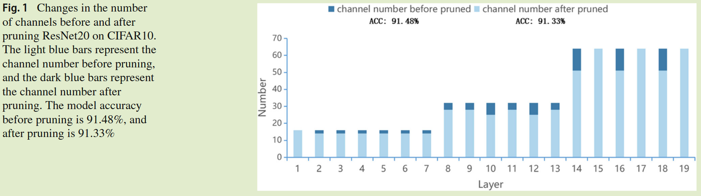
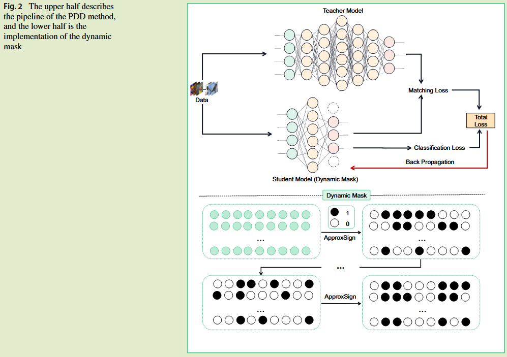

# PDD: Pruning Neural Networks During Knowledge Distillation

**[Cognitive Computation 2024](https://link.springer.com/article/10.1007/s12559-024-10350-9)	[code in github](https://github.com/YihangZhou0424/PDD-Pruning-during-distillation)	CIFAR  ImageNet	20240912**

*Xi Dan, Wenjie Yang, Fuyan Zhang, Yihang Zhou, Zhuojun Yu, Zhen Qiu, Boyuan Zhao, Zeyu Dong, Libo Huang & Chuanguang Yang* 

本文认为学生模型存在冗余参数，提出了给每一层添加一个可微分的掩码与蒸馏过程一同学习，最终掩码值为0的层可以看作是冗余参数，可以对其进行剪枝。实验发现PDD可以减少模型参数并且还能提升学生模型的性能。

## Introduction

现有的KD方法都默认认为学生模型是最优的，我们认为学生模型是可能存在未优化的冗余参数或结构，为了减少这部分冗余，我们提出在蒸馏过程中进行剪枝PDD，其在蒸馏过程中同时对学生模型的冗余通道进行剪枝，从而解决知识转移过程中潜在的低效和冗余问题。

提出一种可微掩码，用于在蒸馏过程中动态识别冗余通道，我们的PDD方法不仅降低了模型大小还提高了性能。

## 是否可以进一步优化学生模型？

我们通过通道剪枝算法对学生模型进行剪枝，我们发现尽管进行了剪枝，学生模型的性能几乎不受影响，因此我们认为学生模型确实存在冗余。

我们提出蒸馏剪枝模型PDD，旨在实时识别消除这些冗余结构，与先前方法不同，PDD将剪枝集成到蒸馏过程本身，这使得学生模型可以动态的调整自己的结构。

## Method

给定图像$M = \{ m_1, m_2, ..., m_N\}$以及对应的标签$Y = \{y_1,y_2,...,y_N\}$，输入到学生模型中得到中间表示：
$$
e_0 = h_0(M) \\
e_1 = h_1(h_0(M)) \\
... \\
e_{n-1} = h_{n-1}(...h_0(M)) \\
z = h_n(h_{n-1}(...h_0(M)) )
$$
$h_0(·), h_1(·), ..., h_{n-1}(·)$表示从下到上的层，$h_n(·)$表示分类器，$e_i \in \R^{N\times C_i\times W_i\times H_i}$表示第i层的中间特征，z表示logits

为了将剪枝融入到知识蒸馏的训练中，为每个卷积层设计了一个可微的掩码$x_i\in\R^{1\times C_i\times 1\times 1}$，根据损失来动态调整需要保存的通道，我们首先随机初始化每一个掩码x，然后利用一个可微的分段多项式函数对掩码进行二值化：
$$
ApproxSign(x) = 
\begin{cases}
\begin{aligned}
&0, &&if\ x < -1\\
&\frac{(x+1)^2}{2}, &&if\ -1\leq x\leq 0\\
&\frac{2x-x^2+1}{2}, &&if\ 0\leq x\leq 1\\
&1, &&otherwise
\end{aligned}
\end{cases}
$$

学生模型可以形式化为：
$$
\tilde{z_s} = h_{n}(h_{n-1}(...h_{0}(M)A(x_0)...)A(x_{n-1}))A(x_n)
$$
最终的损失函数描述为：
$$
L_total = L(\tilde{z_s}, z_t) + CE(\tilde{z_s}, y)
$$
由于掩码是可微的，他可以随着蒸馏一同训练。0分的掩码所在层可以认定的冗余的，可以对其进行剪枝。