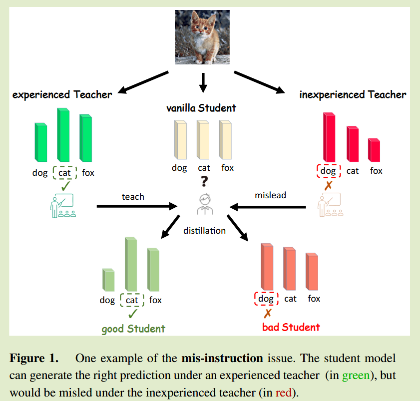
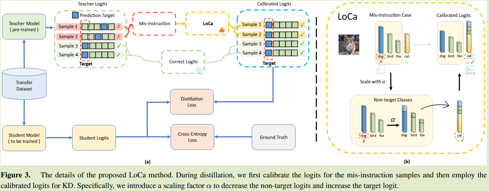

# LoCa: Logit Calibration for Knowledge Distillation

**[ECAI 2024](https://arxiv.org/abs/2409.04778)	no code	CIFAR100 ImageNet	20241009**	知识结构

*Runming Yang, Taiqiang Wu, Yujiu Yang*

本文提出了一种标签校正的方案，与先前方法不同之处在于该方法在校正错误预测的基础上保留了非目标类logit之间的比例不变，通过推导计算出一个缩放比例，将标签校正转换为一个优化问题

## Introduction

本文旨在处理教师错误预测对学生模型的影响，错误预测会对学生模型造成误导，我们通过真实标签对教师预测进行矫正

先前有的方法直接跳过了错误预测的样本，而这会丢失了许多有用的暗知识，我们希望对logits进行校正，来避免误导还能保持有用的暗知识，我们将校准过程建模为一个缩放问题，通过引入缩放因子来提出一种可行的方案，该优化问题围绕三个角度展开：概率分布、预测正确性、非目标比例不变性。

## Method

Logit Calibration (LoCa) method有两个目标：解决错误指导问题；保留非目标类别比例。

#### 概率分布

校准后的logits $p^{loca} = [p^{loca}_1, p^{loca}_2, ..., p^{loca}_C]\in\R^{1\times C}$需要满足和为1的约束条件：
$$
\sum^C_{i=1} p_i^{loca} = 1 \tag{1}
$$

#### 预测正确性

为了解决误导问题，保证预测标签与真实标签的一致性，该标签可以表示为：
$$
k^{loca}_{logits} = argmax_i\{p_i^{loca}\} = gt \tag{2}
$$

#### 非目标比例不变性

在校正时的关键是保持非目标类别logits之间的比例：
$$
\frac{p_i^{loca}}{p_j^{loca}} = \frac{p_i}{p_j}\ \forall i, j\neq gt \tag{3}
$$

### LoCa: Logit Calibration

我们设计了LoCa算法来满足上述约束，对于错误样本，校正后的logit定义为：
$$
p^{loca}_i = \begin{cases}
\begin{aligned}
&s \cdot p_i && if\ i\neq gt, \\
&1 - \sum^C_{i=1, i\neq k}p^{loca}_i && if\ i = gt
\end{aligned}
\end{cases} \tag{4}
$$
为满足预测正确性要求，应有$p^{loca}_{gt} > p^{loca}_i\ \forall i\neq gt$

针对错误标签，我们定义：
$$
k_{logit} = argmax_i\{p_i\}, k_{logit} \neq gt \tag{5}
$$
因此：
$$
p^{loca}_{gt} > \underset{i\neq gt}{max}(p^{loca}_{i}) = p^{loca}_{k_{logit}} \tag{6}
$$
因此结合eq4 eq6有：
$$
1 - s·\sum^C_{i\neq k}p_i > s·p_{k_{logit}} \\
s < \sigma = \frac{1}{1 - p_{gt} + p_{k_{logit}}}
$$
我们引入超参数$\alpha \in (0, 1), s = \alpha · \sigma$ 来满足上述约束进行样本的校正。