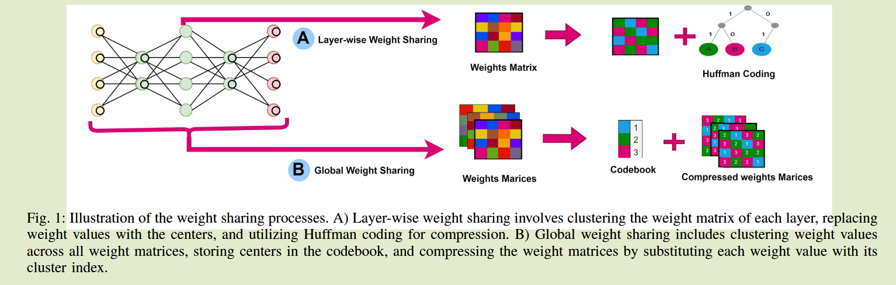
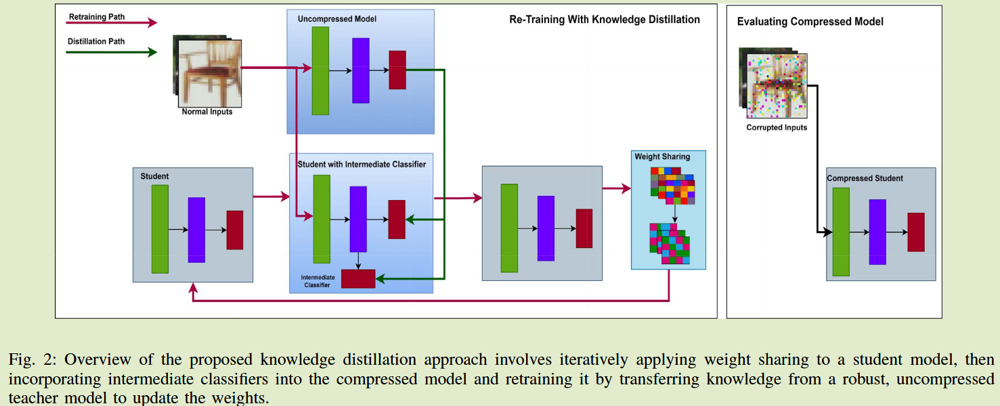

# Improving Robustness of Compressed Models with Weight Sharing through Knowledge Distillation

**EdgeCom 2024	no code	CIFAR10/100-C	20240910**	知识结构

*Saeed Khalilian Gourtani  Nirvana Meratnia*

本文证明了在存在数据损坏的情况下，权重共享会带来不利的影响，更高的压缩比会增加模型对损坏数据的敏感性，先前证明模型重训练和权重共享可以显著减轻正常和损坏数据上的性能损失，因此基于此本文提出一种自蒸馏和离线蒸馏相结合的方式，引入中间层分类器来进一步提升模型的鲁棒性。

## Introduction

模型压缩技术会加剧数据损失的影响，有的研究提出修建后的网络会对损坏表现出更高的敏感性，尤其是压缩比比较高的时候。

由于非对抗样本的权重共享压缩模型的鲁棒性方面存在差距；并且在边缘设备上低质量和损坏的数据带来的挑战。

本文旨在解决这一问题，我们证明了**存在损坏数据的情况下，权重共享会对模型的鲁棒性产生不利影响**，**更高水平的压缩和权重共享增加了模型对损坏数据的敏感性**；连续的**模型重训练和应用权重共享可以显著减轻正常和损害数据上的压缩造成的性能损失**；并且我们引入了**自蒸馏和离线蒸馏相结合的方式**，进一步提升鲁棒性。

## Preliminaries

权重共享可以在两个层次上应用：在每一层上或全局的应用在整个权重集合上

#### 基于层的权重共享

基于层的权重共享方法通常将聚类算法应用到每一层，用各自的聚类中心代替各层权重，通过哈夫曼编码对模型进行压缩，通过计算每个共享值的频率，创建哈夫曼树，并确定共享值的最佳编码长度。

#### 全局权重共享

全局权重共享将聚类算法一次应用于整个权重集合，将聚类中心保存在密码本中，并将权重值替换为对应的密码值。压缩比定义为：
$$
\frac{P \times wordlength}{P\times \lceil log_2 K\rceil + K\times wordlength}
$$
P表示模型参数数量，worklength表示每个网络元素所需要的比特数，K表示共享值的个数，$\lceil log_2 K\rceil$表示存储K个值所需要的比特数，K 乘 worklength表示密码本的大小。

基于层的权重共享需要比较小的聚类数，而全局权重共享需要比较大的聚类数。

## Method

我们对不同压缩模型框架在权重共享后的鲁棒性进行了基准测试

为了增强权重共享后压缩模型的鲁棒性，将离线蒸馏与自蒸馏相结合。

#### 权重共享的基准鲁棒性

- 权重共享是否会对压缩模型的稳健性产生不利影响?

- 知识蒸馏在多大程度上增强了权重共享后压缩模型的鲁棒性?

我们将逐层和全局权重共享应用于不同的预训练模型，并且逐步提高压缩比来探索更高压缩水平下的鲁棒性。

先前研究表明重训练可以有效恢复由于权重共享造成的性能损失，因此我们评估了带有再训练的权重共享在提高对损坏数据的鲁棒性的有效性，我们对特定迭代次数应用权重共享并更新共享值。

#### 通过知识蒸馏提高鲁棒性

由于在**高压缩比下模型性能显著下降**，利用**自蒸馏在同一压缩模型内传递知识可能会对性能提升带来挑战**，因此我们引入一种新的方式来训练：

在**应用权重共享后，将中间分类器集成到压缩模型**中，从未压缩且鲁棒的教师模型到压缩模型的知识不仅涉及教师的输出与最终分类器的比较，还考虑了中间分类器，我们调整的损失函数为：
$$
\alpha\sum^C_{i=1}L_{CE}(q_i, y) + (1-\alpha)\sum^C_{i=1}L_{KL}(q_i,y_t)
$$
y表示真实标签，C表示分类器的个数，qi表示分类器i在Softmax层的输出，yt表示教师在Softmax层的输出，