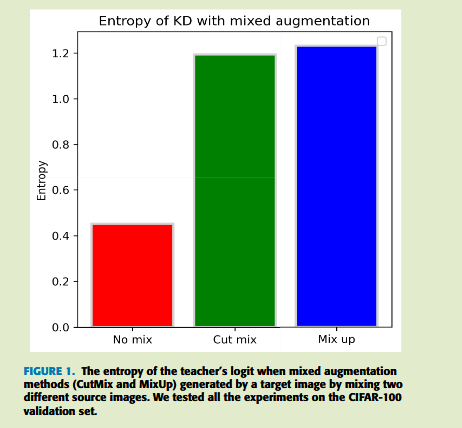
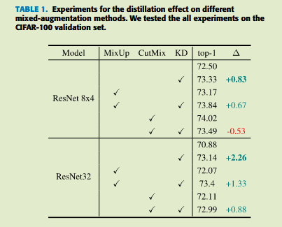
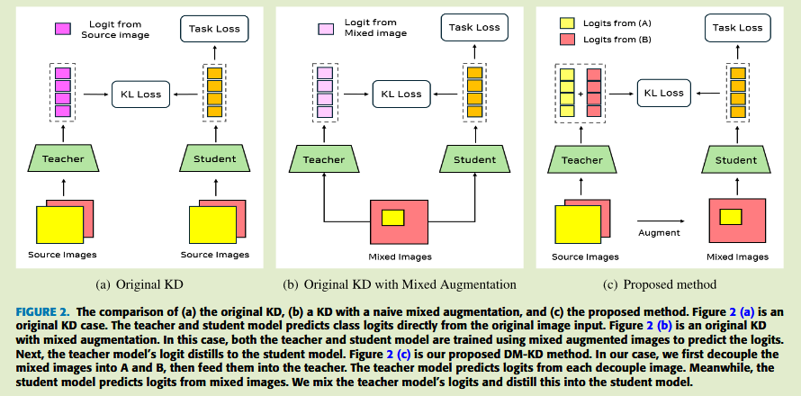

# DM-KD: Decoupling Mixed-Images for Efficient Knowledge Distillation

2024IEEE Access	no code	CIFAR ImageNet	20250226

本文发现mixup cutmix等数据增强方法会降低教师模型logit的质量，从而影响蒸馏的性能，提出通过解耦混合图像，将原始图像分别送入教师模型后得到logit，再混合logit得到教师模型的输出，该方法一定程度缓解了数据增强对KD的影响。

## Introduction 

当KD与CutMix和MixUp结合使用时，学生模型性能提升提升很小，由于这些数据增强技术在整个计算机视觉中广泛使用，数据增强与KD共存是一个重要问题。

从教师logit熵能看出，混合增强提供的logit质量较差，预测值变得模糊，对KD造成负面影响，高熵值

为了缓和混合系列数据增强方法引起的教师logit的可变性和质量退化，提出解耦混合图像知识蒸馏方法，我们分离混合输入图像并将其提供给教师模型，分离方法提高了教师模型logit质量

- 我们进行试验证明了蒸馏与混合增强相结合不能有效的工作
- 通过解耦混合图像并将其输入教师模型，提供一个更好的logit，从而结合了蒸馏和增强方法

## Method

师生模型分别表示为$z^T = T(x, \theta^T), z^S = S(x, \theta^S)$，x和z分别表示输入图像和logit，$\theta$表示模型参数，输入图像的一个批次表示为$X = \{x_1, x_2, ..., x_n\}$，其标签表示为$Y = \{y_1, y_2, ..., y_n \}$，组成输入图像的两个原图像表示为$A = \{a_1, a_2, ..., a_n\}, B= \{b_1, b_2, ..., b_n\}$，混合增强过程表示为$\psi$

##### 一致性正则化

一致性正则化采用未标记的数据，其思想是同一输入图像中模型提供的预测应当是相同的，其损失函数定义为：
$$
L_{con} = ||f(T(x_i)) - f(T(x_i))||
$$
T表示不同的随机变换函数，该损失来约束在同一幅图像的不同变换上表达一致性

##### 从解耦图像中蒸馏知识

我们将两幅图像传递给教师，并对两幅图像的logit插值，来生成教师模型的KD logit，学生模型则以混合图像来生成logit：
$$
z^T_{a, i} = T(a_i, \theta^T), \ z^T_{b, i} = T(b_i, \theta^T),\ z^S_i = S(x_i, \theta^S) \\
p^T_{a, i} = \sigma(z^T_a/\tau),\ p^T_{b, i} = \sigma(z^T_b/\tau),\ p^S_{i} = \sigma(z^S_i/\tau),\
$$
我们对解耦图像得到的概率分布进行加权，得到教师模型的最终输出：
$$
p_{dm , i}^T = \lambda·p^T_{a, i} + (1-\lambda) · p^T_{b, i}
$$
则蒸馏损失表示为：
$$
L_{distill} = \frac{1}{n} \sum^n_{i=1} \tau^2p^T_{dm, i} log\frac{p^T_{dm, i}}{p^S_i}
$$
(这里$\tau^2$是为了求导时抵消softmax中的温度系数项，Hinton原文中有求导分析)

最终损失函数表示为：
$$
L_{DM-KD} = \alpha · L_{ce} + \beta · L_{distill}
$$
