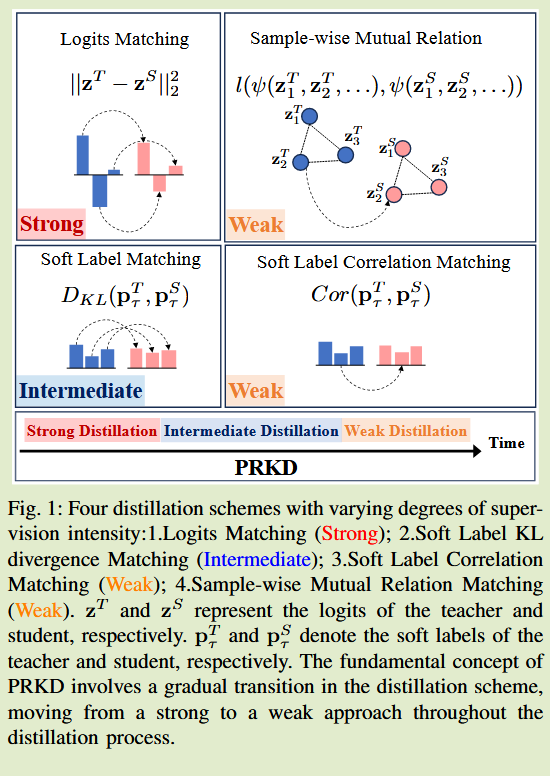
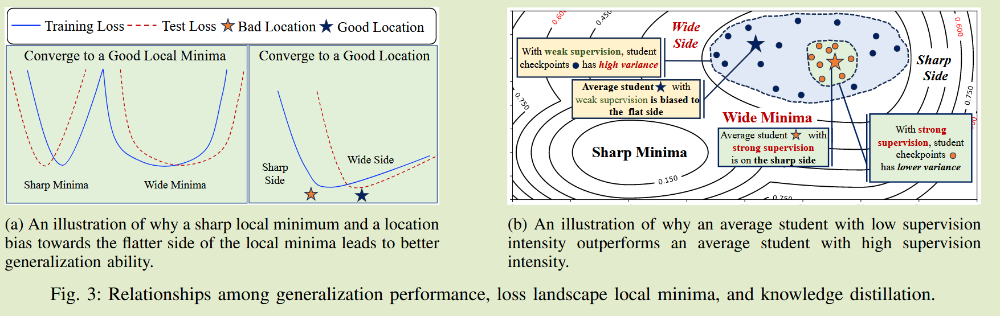

# Progressively Relaxed Knowledge Distillation

**[2024 IJCNN](https://ieeexplore.ieee.org/abstract/document/10650544)	no code	CIFAR  TinyImageNet  CalTech256	20241014**

Xiaozhe Gu; Ran Jin; Mingliang Li

本文从蒸馏算法上对蒸馏进行改进，对学生模型施加强约束会导致过度的正则化，而施加较低的监督强度会使得学生模型学到的知识变少，都会导致学生模型的性能下降，因此提出一种渐进松弛蒸馏，先施加一个较强的监督信号，过度到相关性关系的蒸馏来逐步减弱监督信号，从而缓解过度正则化的问题，在最后施加模型平均来合并多个学生模型检查点，从而缓解因为后期监督信号降低而收敛到局部最小值的不利位置。

## Introduction

KD通过从教师模型中迁移知识来增强学生的泛化能力，研究表明，师生模型存在着容量缺口，即使学生模型有足够的能力，也会收到蒸馏算法的限制而很难完美的匹配教师模型的预测，对学生模型施加的强约束可能会导致过度正则化和性能下降。而施加较低监督强度的方案，能够缓解过度正则化的问题，但这会使得学生获得的有益知识变少。

针对该问题，我们提出了渐进式松弛蒸馏PRKD，能够在整个训练过程中动态的调整教师监督信号的强度，PRKD建立在一个由强到弱的蒸馏方案上，通过这种方式学生能够保留教师必要的知识，同时缓解了过度正则化的问题。

过大或过小的蒸馏监督强度都会造成学生模型的性能下降，在实际实验中实验人员往往通过大量实验找到合适的蒸馏强度，这会浪费大量的计算资源，并且无法考虑不同阶段对不同成都监督强度的需求。

- 对于三种广泛采用的蒸馏方式进行了监督强度分析
- 提出一种改进的蒸馏框架PRKD，可以动态组织具有不同监督强度的各种蒸馏方案

## Method

#### 监督强度分析

对于Logits的匹配要比对预测结果的匹配施加更强的约束，这是因为logits匹配会要求学生模型复制教师模型所有的logits，即使是非常小的类别特征；而在结果匹配中这些经过softmax会趋近于0，梯度也会非常小。

而基于关系的KD，通过专注于保持预测的相对排名，缓解了KL散度中师生模型的严格对齐。皮尔森相关系数被认为是更宽容的指标，因为他优先考虑方向而受大小差异的影响较小，相比之下KL散度对概率分布的尺度变化非常敏感，即使是微小的变化

因此Logits匹配的监督强度最强，其次是软标签的KL散度匹配，最后是类别相关行匹配

#### 渐进松弛知识蒸馏

核心原则是整个训练过程教师主键降低监督强度，我们考虑了以下策略：

##### PRKDa

软标签KL散度匹配，在温度系数较高时会退化为logit匹配，因此我们提出一个温度调整方案来从一个常数$\tau$线性调整到一个较低的温度$\tau^L$，来改变教师信号的监督强度：
$$
\tau(e) = \tau - \Delta\times \frac{e}{E},\ where\ \Delta = \tau - \tau^L
$$
e表示当前epoch，E表示epoch总数：
$$
L_{PRKD_a} = D_{KL}(p^T_{\tau(e)}, p^S_{\tau(e)})
$$

##### PRKDb

我们介绍一种线性调度器，在整个蒸馏过程中实现软标签KL散度匹配和相关性匹配的平稳过度：
$$
L_{PRKD_b} = (1-\frac{e}{E}) \times D_{KL}(p^T_\tau, p^S_\tau) + \frac{e}{E} \times Cor(p^T_\tau, p^S_\tau)
$$

##### PRKD

我们最终的PRKD合并了上述两种策略：
$$
L_{PRKD_b} = (1-\frac{e}{E}) \times D_{KL}(p^T_{\tau(e)}, p^S_{\tau(e)}) + \frac{e}{E} \times Cor(p^T_\tau, p^S_\tau)
$$

#### PRKD会得到一个更宽的局部最小值

由于初期教师模型的强蒸馏方案，得到了教师模型的充分监督，有利于其收敛到一个更平稳的损失地形中

#### PRKD会导致在局部最小值中的不利位置

随着监督强度的逐渐降低，学生被过度正则化的风险降低，但同样从教师获得的知识也随之减少，这会增加最后收敛到局部最小值中的不利位置的可能性，而这会抵消松弛蒸馏带来的优势。

#### 如何解决该问题？

我们采用模型平均来缓解这个问题，通过综合蒸馏结束过程所有学生检查点的平均值，$W^S_e$表示第e轮次的学生模型权重，最终权重表示为：
$$
\overline{W} = \frac{\sum^{e+I-1}_{e}W_e^S}{I}
$$
I表示抽样的学生检查点数量。

#### 为什么将PRKD和MA结合会带来更好的泛化性能？

在弱监督下，学生检查点显示出更高的方差，且分散在局部极小值周围，因此平均学生会更偏向于局部最小值更平坦的一侧；而在较高的监督下，学生检查点的方差较小，相应的平均学生没有明显的优势。

在实验中发现，MA施加在普通的蒸馏上并没有显著的改善，因为软标签的KL散度能够提供强有力的监督；而MA在PRKD上又很明显的改善；在相关性KD上会远低于PRKD，这可以归因于在早期由于较低的监督强度，学生模型会收敛到更差的局部最小值中。

