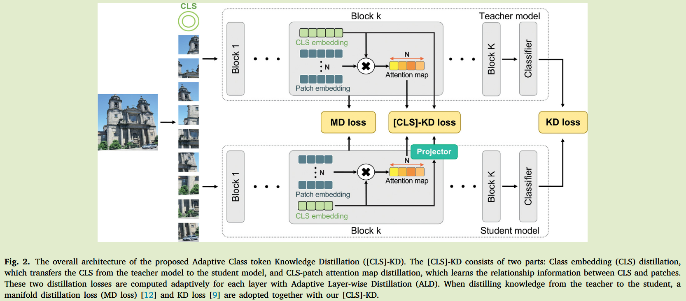
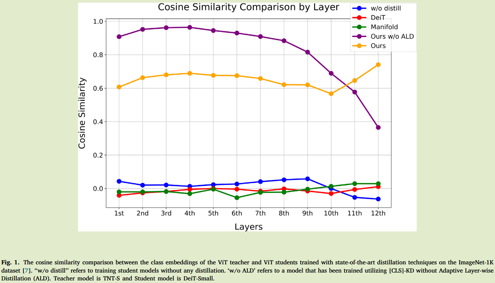

# Adaptive class token knowledge distillation for efficient vision transformer

**[2024 KBS](https://www.sciencedirect.com/science/article/pii/S0950705124011651)	no code	CIFAR CALTECH-256	20241016**	ViT to ViT

*Minchan Kang, Sanghyeok Son, Daeshik Kim*

本文针对ViT的cls蒸馏做了更深层次的探究，先前忽略了token信息的重要性，提出**提取cls与patch之间的注意力图来识别出关键区域**，并且提出了自适应离散蒸馏来平衡的从各个层中提取知识，还引入了流形蒸馏损失manifold distillation MD来获取ViT中块之间的信息

## Introduction

例如DeiT、CaiT，目前的ViT KD方法往往依赖于CNN作为教师或忽略了类别token信息的重要性，

我们提出了自适应token蒸馏方法，利用cls token和cls与其他块的注意力输出，cls蒸馏和cls-patch蒸馏，前者确保学生模型能够模仿教师模型的cls输出，后者蒸馏提取cls和每个补丁之间的注意力图，使模型能够识别出需要关注的特殊领域

我们还提出自适应离散层蒸馏来缓解蒸馏过于集中于浅层的问题，这能够促进那些努力从教师模型中学习的层获得更高的权重

- 类蒸馏是学生模型从教师ViT中学习cls token中的概括表示
- cls-token注意力图使模型能够动态提取patch信息，并在教师的指导下融入到cls中
- 自适应离散蒸馏ALD保证了学生模型cls在更深层次上与教师模型的cls紧密模仿
- 实验表明我们的方法达到sota

## Method

在我们提出的方法中，基于两种结构采用不同的软蒸馏：结构相似模型和结构不同模型。结构相似模型拥有相同的模型架构，但是在头数量、维度和层数稍有不同，而结构不同的模型具有不同的模型结构。

当师生模型使用相似模型架构时，我们只使用教师的软标签而不使用真实标签指导；而在使用不同架构时，同时使用软标签和真实标签来指导学生模型学习。这种策略基于的假设是：**具有相似结构的ViT的师生模型在传授知识时是更容易被学生接受的，而具有不同结构的ViT教师所传授的知识是不兼容的需要用真实标签来指导才能成功训练学生模型**

### 自适应类token知识蒸馏

现有对ViT的KD方法要么使用卷积教师，要么忽略了cls token而只传递其他patch之间的关系。cls token封装了所有patch的表示，并直接影响了分类性能，基于此我们引入了自适应类标记知识蒸馏cls-KD

#### cls蒸馏

为了保证师生模型之间的维度匹配，我们设计了投影层来进行对齐

投影层隐藏层维度取了师生模型隐藏层的平均值，除非师生模型维度相同，否则投影层一直被使用，师生模型的cls token分别表示为：$e^s_{cls} \in \R^{B\times 1 \times d_s}, e^t_{cls} \in \R^{B\times 1\times d_t}$，cls损失计算为：
$$
L_{cls} = ||e^t_{cls} - Proj(e^s_{cls})||^2_F
$$

#### cls-patch蒸馏

cls蒸馏保证学生模型捕获高层次的综合信息，cls中封装了patch中的信息，因此如何从中进行有效的提取是至关重要的，我们提出捕获cls与patch之间的类注意力图来辅助蒸馏，注意力图计算：
$$
A^t = e^t_{cls}{e^t_{pat}}^T \\
A^s = e^s_{cls}{e^s_{pat}}^T
$$
其中$e^t_{pat} \in \R^{B\times N\times d_t}, e^s_{pat} \in \R^{B\times N\times d_s}; A^t, A^s\in\R^{B\times 1\times N}$，我们希望最小化师生模型之间的注意力图的差异：
$$
L_{attn} = ||A^t - A^s||^2_F
$$
通过模仿cls与patch之间的注意力映射，学生模型能够有效的从cls中学习到那些patch需要更多的注意力

#### 流形蒸馏损失MD

我们还引入了manifold distillation损失(MD loss)，MD损失最小化了师生模型中图像内、图像间以及随即信息之间的差距，其在最后一个特征图上进行归一化计算流形图：
$$
M(\Psi(F_S)) = \Psi(F_S)\Psi(F_S)^T \\
L_{mf} = ||M(\Psi(F_S)) - M(\Psi(F_T))||^2_F
$$
$F_S \in \R^{B\times N\times d_s}, F_T \in \R^{B\times N\times d_t}$表示师生模型特征图，$\Psi$表示重塑操作，生成流形空间，通过纳入这一损失，学生模型从教师那里获得了基于图像块分割关系的知识。这种知识补充了我们提出的双重损失，从而产生了更有效的学习过程。

#### 自适应离散层蒸馏

先前研究表明，随着ViT的层数增加，类别和图像token的可识别性均增加，深层的CLS比浅层的要发挥更重要的作用，但是我们观察到经过cls-kd和cls-patch注意力图蒸馏之后随着层数的增加很难从教师模型中学习到cls特征。

因此我们提出自适应离散层蒸馏ALD：
$$
r_k = \frac{L_k}{\sum^L_{i=1}L_i} \\
L^{LD} = L(\sum^{L-1}_{k-1}r_kL_k + \mu r_LL_L)
$$
$L_k$表示第k层的损失，$r_K$为第k层损失相对于所有蒸馏层损失和的比例，L表示蒸馏层数，$\mu$表示强化最后一层权重参数，这样有助于将各个层的cls均衡的提取出来。

#### 总体损失

$$
L_{total} = L_{KD} + \alpha L_{cls}^{AD} + \beta L_{attn}^{AD} + L_{mf}
$$

cls损失能够使学生模型从ViT教师cls中学习概括表示，cls-patch注意力蒸馏有助于学生在教师的指导下自适应的提取patch知识，MD损失将ViT中基于块的分割关系转移给了ViT学生
