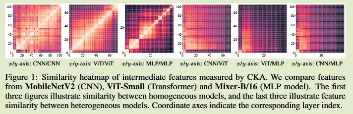
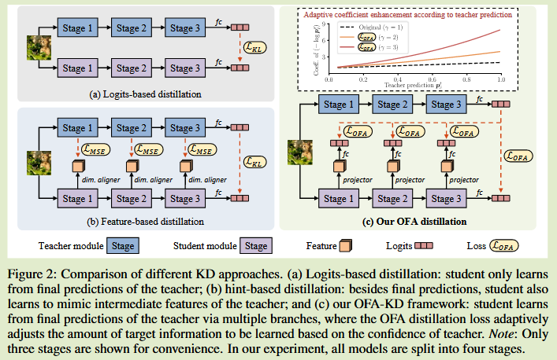

# One-for-All: Bridge the Gap Between Heterogeneous Architectures in Knowledge Distillation

[2024 NeurIPS](https://proceedings.neurips.cc/paper_files/paper/2023/hash/fb8e5f198c7a5dcd48860354e38c0edc-Abstract-Conference.html)	[code in github](https://github.com/Hao840/OFAKD)	ImageNet CIFAR	20250107

本文针对异构架构模型蒸馏做出改进，将学生模型划分阶段，利用投影层和分类层将特征转换到logits空间来去除架构信息，并通过解耦蒸馏损失来增强目标类的损失来缓解不同架构模型预测分布不同的问题。

## Introduction

现有基于中间层的蒸馏方法主要集中在同质架构之间的蒸馏，而对于跨架构模型的蒸馏没有得到探索，在实际应用中并不总是能够找到与学生架构相匹配的同质模型。

异构模型的情况下不能保证学习到的特征能够对齐，直接匹配这些信息意义不大，甚至会阻碍学生模型的性能。

因此本文提出一个one-for-all 的知识蒸馏框架，用于异构模型之间的蒸馏。

## Method

#### 针对异构架构的特征蒸馏

异质模型由于存在明显的归纳偏差而学习到不同的特征，这种情况下直接强迫学生模仿教师特征可能会损害学生模型的性能；ViT以及相关方法引入了额外的分类token，加剧了特征不匹配问题。

我们通过中心核对齐CKA来分析异构模型提取的特征标识，CKA是一种允许跨架构比较特征相似性的度量。

$X\in\R^{n\times d_1} , Y\in\R^{n\times d_2}$是n个样本在两种不同模型中提取的特征，其中d1，d2为他们的维度，CKA度量他们的相似性：
$$
CKA(K, L) = \frac{D_{HSIC}(K, L)}{\sqrt{D_{HSIC}(K, K) D_{HSIC}(L, L)}}
$$
其中$L = XX^T, K = YY^T$表示特征的Gram矩阵，$D_{HSIC}$为希尔伯特-施密特独立性度量：
$$
D_{HSIC}(K, L) = \frac{1}{(n-1)^2} tr(KHLH)
$$
H表示中心矩阵$H_n = I_n - \frac{1}{n}11^T$

[HSIC](https://blog.csdn.net/asybk/article/details/124414997)

同质架构模型倾向于在相似位置图层进行学习，异构模型特征存在显著差异，因此直接使用基于中间特征的方法是不合理的，仅使用logits进行蒸馏虽然可行，但缺少中间层的监督可能会导致次优的结果，需要新的中间层蒸馏设计来改善异构模型之间的差异。

#### 通用异构架构知识蒸馏

为了弥合异构架构之间的差异，我们提出了one-for-all的蒸馏框架，能够适应任何框架（CNN ViT MLP）

##### 在logits空间中学习

异构模型的蒸馏关键在于对齐不匹配的特征表示，现有方法直接通过卷积层来对齐并不是所有异构架构模型的通用解决方案

- 学生模型通过特征投影层和分类器层来构建每个阶段的输出
- 教师模型利用最终的logits作为知识
- logits空间中冗余的架构相关信息被去除，对于任何架构之间的蒸馏都可用
- 训练时额外的分支一同训练，推理时额外分支被移除，不引入额外推理开销

##### 自适应目标信息增强

尽管不同模型在logits空间中学习相同的目标，但是不同的归纳偏差可能导致他们具有不同的预测分布输出，例如ViT就更倾向于捕获全局特征而CNN倾向于捕获两类目标的共享局部特征。这种差异导致了师生模型对暗知识的理解不一致。

我们提出增强目标类信息方法来弥补这一缺陷，我们解耦原始蒸馏损失来获取目标类的信息：
$$
\begin{aligned}
L_{KD} &= -log\ p^s_{\hat{c}} - \mathbb{E}_{c\sim \mathcal{Y}}[p^t_clog\ p_c^s] \\
&= -(1+p^t_{\hat{c}})log\ p^s_{\hat{c}} - \mathbb{E}_{c\sim \mathcal{Y}/\{\hat{c}\}}[p^t_clog\ p_c^s]
\end{aligned}
$$
由于KL散度中的分布对于梯度没有贡献，我们这里忽略了来简化计算，c表示预测类，${\hat{c}}$表示目标类，添加一个超参数来增强目标类的信息：
$$
L_{OFA} = -(1+p^t_{\hat{c}})^\gamma log\ p^s_{\hat{c}} - \mathbb{E}_{c\sim \mathcal{Y}/\{\hat{c}\}}[p^t_clog\ p_c^s]
$$

##### 讨论

针对gamma的取值，当gamma=1时为标准的蒸馏损失，从gamma>1开始，取gamma=2，损失函数中会增加一项仅与目标类有关的正项：
$$
L_{OFA, \gamma=2} = L_{KD} + [-(p^t_{\hat{c}} + (p^t_{\hat{c}})^2)log\ p^s_{\hat{c}}]
$$
如果教师对于目标类别预测置信度高，高阶项衰减缓慢，否则高阶项衰减更快来组织学生向置信度较低的教师学习。