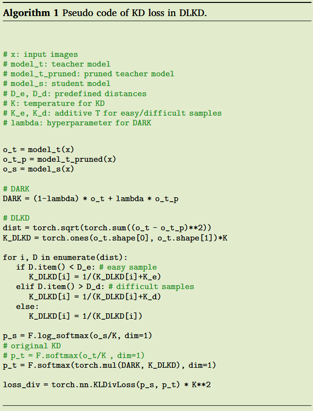

# Difficulty level-based knowledge distillation

Neurocomputing 2024	no code	CIFAR100  ImageNet  FGVR  20240911

*Gyeongdo Ham, Yucheol Cho, Jae-Hyeok Lee, Minchan Kang, Gyuwon Choi, Daeshik Kim*

本文针对温度系数进行调整，受网络剪枝的启发，通过剪枝后网络与未剪枝网络输出分布的差异来筛选困难样本、正常样本和简单样本，作者认为困难样本要想学好更多依赖于非目标类别的暗知识，调整这三类样本的温度系数来对困难样本更多的传递非目标类的暗知识，并且引入了semCKD方法考虑师生模型之间特征层的语义信息来匹配师生层，降低师生能力差异的影响。

## Introduction

现有方法通过固定的温度系数来避免softmax输出过度自信的情况，然而这会导致对困难样本中非目标类的暗知识的抑制，也容易过度平滑较容易样本的置信度。

先前的研究证明，从网络中移除最小的网络权重，不会平等的影响每一个类别。因此通过网络剪枝在数据集训练过程中，可以区分容易和困难样本。受此启发本文通过剪枝来定义样本难度，要想在样本困难的情况下学好，需要**将非目标类别的暗知识从教师模型中迁移的丰富一点**。

本文提出的DLKD提供了一个自适应的挖掘过程，通过修剪预训练的教师模型和将困难样本提取到学生模型中。

## Method

#### 基于难度感知的知识精炼

先前的KD方法知识表示为：
$$
t = f_t(x;\theta_t) \\
s = f_s(x;\theta_s)
$$
我们提出一个辅助知识：
$$
t^P = f^P_t(x;\theta^P_t)
$$
我们通过剪枝去掉教师模型中的小权重得到$f^P_t$，修建后的网络会忘记难以记忆的困难样本，因此我们获得了具有难度感知的精炼知识（DARK）$t^r$，他降低了困难样本预测的置信度，同时保留了简单样本的预测：
$$
t^r = \lambda \cdot t + (1-\lambda)\cdot t^P
$$
$\lambda$我们设置为0.5。我们利用了**剪枝模型比非剪枝模型具有不同分布这一特性**，可以**保持对简单样本较高置信度评分并降低困难样本的置信度评分**。教师模型预测错误时，DARK可以降低将错误知识蒸馏给学生模型的风险。

#### 基于难度等级的知识蒸馏

直接将上述的DARK知识应用到KL散度中会被softmax函数所压制，因此提出了基于难度等级的知识蒸馏框架，我们可以根据样本的难易程度对温度系数K进行调整。

我们认为教师知识和修建后的教师知识之间的距离越大，则样本难度越大，通过欧氏距离来衡量：
$$
D = \sqrt{\sum_i(x_i^t - x_i^P)^2}
$$
其中t和P分别表示正常教师和剪枝后的教师，我们只需要相对关系即可。**根据D设置超参数比率将样本分为简单样本、正常样本和困难样本**。

例如将比率设置为20%时，将距离D**最近的20%样本标记为简单样本，最远的20%标记为困难样本**。我们在困难样本组的温度系数K中添加一个正值来平滑softmax输出，在容易样本组中添加一个负值来锐化softmax输出（我认为这里容易样本没必要处理）：
$$
K_{DLKD} = 
\begin{cases}
\begin{aligned}
&K + K_d &&,if\ D_d < D \\
&K &&,if\ D_e \leq D \leq D_q \\
&K + K_e &&,if\ D < D_e

\end{aligned}
\end{cases}
$$
蒸馏损失表示为：
$$
L_{DLKD} = (x;s,t^r.K_{DLKD}) = D_{KL}(p(\frac{t^r}{K}) || p(\frac{s}{K_{DLKD}}))
$$
通过DKD的思想来对损失解耦为目标类和非目标类，简单样本会提供更高的目标类置信度，而困难样本进行了平滑会减少目标类的置信度而增加非目标类中的暗知识，更丰富的暗知识有助于困难样本的学习。

#### 特征图蒸馏

教师的特征图能提升学生模型的性能，将对应层固定成对，但是这种方式没有考虑到师生模型之间的能力差异而导致价值细节丢失。因此引用semCKD[2021 AAAI]的方法，通过注意力机制来匹配师生特征图之间的语义关系：
$$
L_F(W, F^t_{t_n}, F^{s'}_{t_n}) = \sum^{s_N}_{s_n = 1}\sum^{t_N}_{t_n=1}\sum^b_{i=1}W^i_{(s_n, t_n)}MSE(F^t_{t_n}[i], F^{s'}_{t_n}[i])
$$
$s_n, t_n$表示学生和教师模型d，$F^t_{t_n}, F^{s'}_{t_n}$分别表示教师层的特征图和经过投射层维度对齐的学生层特征图，W表示批量样本b中每个特整层对之间的权重

#### 总体损失

$$
L_{Total}(x,y;\theta_s,\theta_t,K) = L_{DLKD}(x;s,t^r,K_{DLKD}) + L_{CE}(x,y;\theta_s) + L_F(x;\theta_s,\theta_t)
$$

