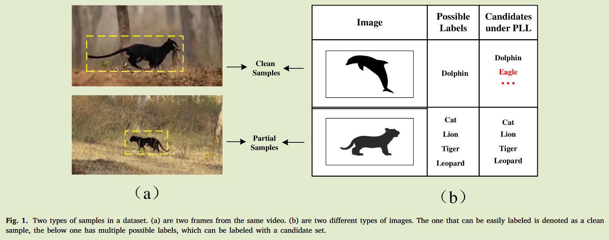
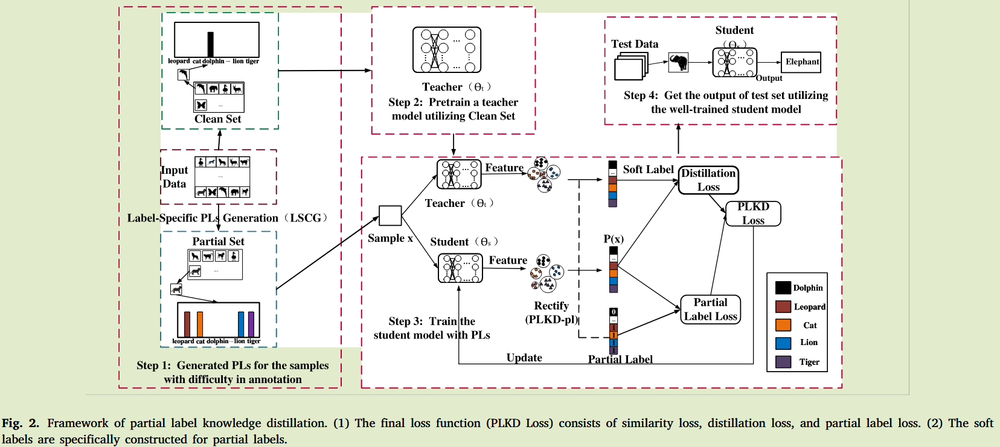
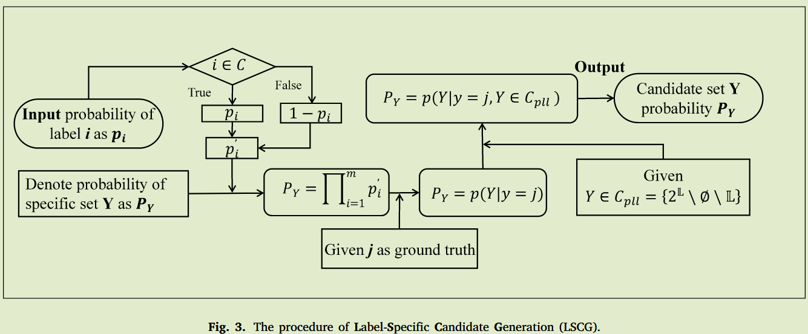
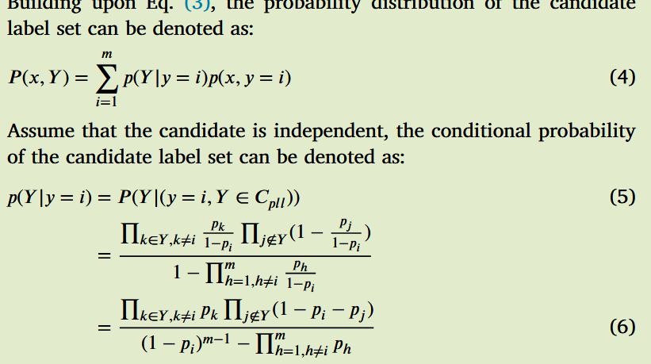

# Dealing with partial labels by knowledge distillation

这片的重点不是蒸馏，有点看不懂

## Introduction

由于样本标注费时费力，很多时候无法获得大量的精确标注样本，由此产生了部分标记学习PLL的弱监督学习框架，现有PLL策略：

- 消歧策略，通过区分单个候选标签相关的置信度来导出真实标签信息。
- 转化策略，将PLL转化为其他成熟的学习问题
- 理论导向策略，专注于PLL的算法的统一一致性和可学习性

PLL的总体目标可以简化为通过拟合部分标签来推断一个最优的多分类器，但是现有方法有一些问题：

- 由于其生成没有先验知识或具体的指导，候选标签提供的信息本质上是模糊的
- 他们的真实标签是必须包含在标注器候选标签中，若标注器不是该领域专家则其标注是不可靠的

当遇到某些样本是易于标记的时，PLL的策略不会考虑提取有用信息的难度，如何有效的利用这些简单样本是一个难题

首此启发，引入了KD策略，小规模的干净简单样本可以训练调整教师模型，这个教师模型获得的知识可以用来指导PLL模型

- PLL框架以KD为基础，以便更好地利用干净的样本
- 针对不平衡场景设计了新的候选生成方法
- 提出了一种新的软标签重构方法，以降低过度自信风险

## Method

### 标签特异性候选生成( Label-Specific Candidate Generation，LSCG)

先前研究在进行候选样本生成时会采用均匀分布，他们假设每个标签成为候选标签的概率是随机的，然而在现实世界实例往往是不平衡的（某张生物的图像更可能的标签是一只狮子而不是汽车），为了解决这个问题，我们用其使用频率作为候选标签的概率：
$$
p_i \in [0,1],\ p_1+p_2 + ...+ p_m =1\\
p'_i = \begin{cases}
\begin{aligned}
&p_i, &&if\ i\in C \\
&1-p_i, &&otherwise

\end{aligned}
\end{cases}
$$
