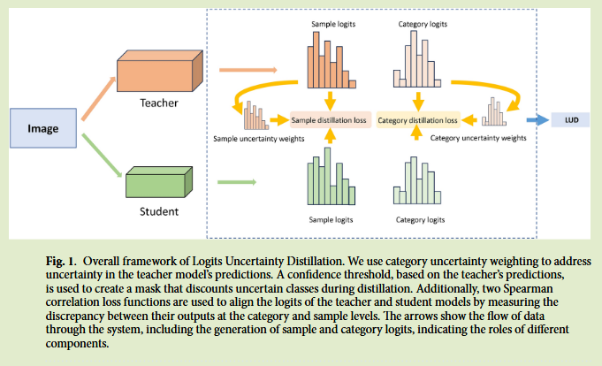

# Leveraging logit uncertainty for better knowledge distillation

2024 Scientific Reports	[code in github](https://anonymous.4open.science/r/lud-B36B/)	CIFAR ImageNet	20250224

## Introduction

- 由于师生模型的架构差异，给知识蒸馏带来很大挑战
- 教师和学生模型之间的预测置信度差异是另一大挑战

我们提出一种称为Logits不确定性蒸馏LUD的方法，引入类别不确定性加权的概念，使得能够解释教师模型预测中固有的不确定性，通过量化教师模型预测的置信度计算置信度阈值，构建一个掩码，这使得学生模型能够专注于更可靠的预测，来提高学习表现。

集成两个基于斯皮尔曼相关系数的损失函数，类别蒸馏损失CDL和样本蒸馏损失SDL，考虑logit之间的相关性，确保学生模型准确的从教师模型中捕获基本信息。

引入自适应动态温度银子，温度矩阵根据教师和学生logit之间的斯皮尔曼相关系数计算，将相似值映射到预定义的温度范围，使得蒸馏过程中可以自适应的调整温度，促进模型之间更有效的知识传递。

总结如下：

- 引入类别不确定性加权解释教师模型预测中的不确定性，专注于蒸馏过程中更可靠的知识
- 提出基于斯皮尔曼相关系数的损失函数，在类别和样本水平上对齐师生模型的logit
- 引入自适应动态温度因子，根据师生模型的logit相似性调整温度系数优化蒸馏过程。

## Method

#### Uncertainty in knowledge distillation  知识蒸馏的不确定性

神经网络不提供置信度估计，可能会出现过度自信或者置信度不足的问题，每个训练样本的信息量都不同，通过不确定性来衡量每个样本的信息量：
$$
U_c(x) = -\underset{i}{max}\ p_i(x)
$$
教师模型预测的置信度提供了关于类别不确定性的信息，具有C类的分类任务，教师对样本x的标准化softmax输出表示为：
$$
p^T(c|x) = \frac{e^{z_c^T(x)/\tau}}{\sum^C_{c=1}e^{z^T_c(x)/\tau}}
$$
教师模型对于某个样本的置信度可以表示为：
$$
Conf(p^T(x)) = max_c\{p^T(c|x)\}
$$
通过置信度加权对不确定的类别降低权重来改善蒸馏，教师能够有选择的引导学生做出高置信度的预测。

#### Adaptive uncertainty distillation  自适应不确定蒸馏

通过一组数据使用教师模型计算置信度向量，并通过去其中位数作为阈值，构建相应的掩码：
$$
mask_i = 
\begin{aligned}
\begin{cases}
1\ (Conf_i > med_i\{Conf_i\}) \\
0\ otherwise
\end{cases}
\end{aligned}
$$
我们还结合了基于斯皮尔曼相关系数的损失函数，来度量师生模型logit之间的差异，斯皮尔曼相关系数损失计算为：
$$
D_{scc} = \frac{\sum^B_{i=1}(R(x_i) - \bar{R}(x))(R(y_i) - \bar{R}(y))}{\sqrt{\sum^B_{i=1}(R(x_i) - \bar{R}(x))^2}\sqrt{\sum^B_{i=1}(R(y_i) - \bar{R}(y))^2}}
$$
其中$R(x_i), R(y_i)$表示$x_i, y_i$的秩，$\bar{R}(x), \bar{R}(y)$表示其平均秩。

类别蒸馏损失CDL：
$$
L_{CDL} = mask_c \times D_{scc}(P^T(x)^Tp^T(x), p^S(x)^Tp^S(x))
$$
样本蒸馏损失SDL:
$$
L_{SDL} = mask_s \times D_{scc}(P^T(x)^Tp^T(x), p^S(x)^Tp^S(x))
$$
为防止不确定的教师预测对学生模型产生负面影响，当教师模型预测表现出低置信度时，通过mask来屏蔽掉这部分知识。

我们还引入了自适应动态温度系数，温度矩阵根据教师和学生模型logit之间的斯皮尔曼相关性计算，使用非线性函数映射到预定义温度范围：
$$
T_{ij} = T_{min} + (T_{max} - T_{min}) * (1-exp(-\rho_{ij}))
$$
其中$\rho_{ij}$是类别i和样本j的斯皮尔曼相关系数，总体损失表示为：
$$
L_{LUD} = L_{CE} + \lambda_{CDL}L_{CDL} + \lambda_{SDL}L_{SDL}
$$
