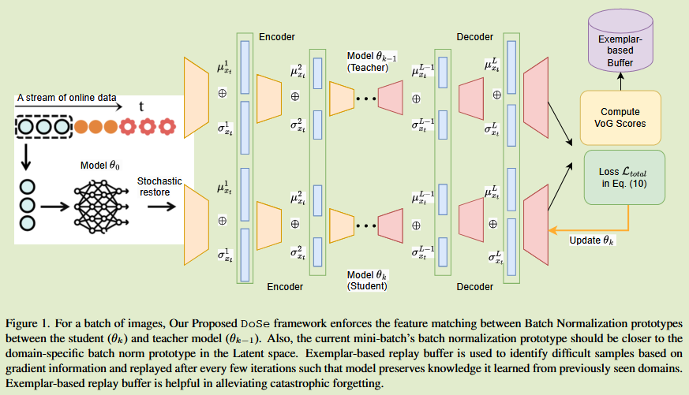

# Towards Domain-Aware Knowledge Distillation for  Continual Model Generalization

[2024 WACV](https://openaccess.thecvf.com/content/WACV2024/html/Reddy_Towards_Domain-Aware_Knowledge_Distillation_for_Continual_Model_Generalization_WACV_2024_paper.html)	no code	ACDC C-Driving SHIFT Cityscapes	20250217

提出了一种域感知自蒸馏方法，对批标准化原型之间的潜在空间进行特征对齐来提高变化域中的泛化能力；并提出一种基于样本的缓冲区策略，来缓解灾难性遗忘问题。

## Introduction

现有领域泛化DG和无监督领域自适应UDA语义分割方法由于存在灾难性以往现象，在不断变化的目标环境中表现不佳。

现有的连续域自适应方法CDA慕白哦是不断的将模型适应到未见过的域中，但现有的方法都需要访问源数据集，受限于存储和隐私问题，限制了其适用性。

我们提出一种面向领域增量语义分割的在线持续学习方法，任何预训练的模型都能适应不断变化的目标域而无需在训练过程中访问目标域数据。

- 提出一个领域感知知识自蒸馏框架，通过领域感知的批次标准化原型来提高任何预训练模型的城市场景语义分割任务的连续模型泛化能力
- 提出一种基于样本的缓冲区策略来缓解灾难性遗忘，将困难样本存储在缓冲区中，每隔几次迭代后重放来保留先前领域中的知识

## Method

给定的预训练模型$f_{\theta_S}$，在源数据集$D_S={(x^S, y^S)}$上训练，源模型网络参数$\theta_S$，连续测试时间自适应的目的是使$f_{\theta_S}$适应不断变化的目标域。

BN是一种稳定训练过程和提高收敛速度的常用手段，但是在推理过程中存在着域便宜，计算得到的全局统计量对目标特征进行了错误的归一化处理，导致性能的显著下降。

#### 通过批范数原型进行自蒸馏 Self-Distillation Using Batch Norm Prototypes

每次迭代记为$k=1, 2, ...$，$\theta_0$记为在源数据上训练的预训练模型，$S_k, S_{k-1}$表示模型$\theta_k, \theta_{k-1}$分割预测的概率，$A(x_t)$表示批次xt的增强，对当前批次xt中的每一幅图像xt，进行**b-1**次增强，将增强后图像与原图像一起传递到模型$\theta_{k-1}$中来获得对该批次的稳健预测。*（b-1不知道怎么来的，也不知道是怎么做的）*

自蒸馏中模型$\theta_{k-1}$充当了模型$\theta_k$的教师，在推理的过程中使用**领域感知的BN模型**来改善给定任何预训练模型的连续模型自适应性。
$$
L^{layer}_{distill} = \frac{1}{L}\sum_{l\in\{1, ..., L\}}||b^l_{\theta_k}(x_t) - b^l_{\theta_{k-1}}(x_t)||^2_F
$$
并通过BN域原型定义了域保留相似性蒸馏损失：
$$
L^{domain}_{distill} = \frac{1}{L}\sum^{x_t\in d}_{l\in \{ 1, ..., L\}}||b^l_{\theta_k}(x_t) - P^l_{\theta_{k-1}}(x_t)||^2_F
$$
$P_{\theta_{k-1}}$表示域d的批次原型。我们通过伯努利分布来选择一个权重子集，用于从源预训练模型中恢复参数子集，p设置为0.1
$$
M \sim BernoulliDistribution(p) \\
\theta_k = M \odot \theta_0 + (1-M) \odot \theta_{k-1}
$$
利用$\theta_{k-1}$对图像的增强预测均值来提供鲁棒性的伪标签.
$$
\tilde{y_t} = \frac{1}{B}\sum^{B-1}_{i=0}f_{\theta_{k-1}}(A(x_t))
$$
用$y'_t$表示$\tilde{y_t}$来作为真值标签来知道学生模型($\theta_k$)训练:
$$
L_{CE} = -\frac{1}{B}\sum^{B-1}_{i=0}y'_tlog(f_{\theta_k}(x_t))
$$
总体损失表示为：
$$
L_{total} = L_{CE} + \lambda_1L^{layer}_{distill} + \lambda_2L^{domain}_{distill}
$$

#### 基于样本的回放缓冲区 Exemplar-based Replay Buffer

回放缓冲区用于缓解灾难性以往，通过将样本回放到神经网络中是模型不会遗忘过去的知识。

我们的方法扩展了***梯度方差方法 （Variance of Gradients）***

为了限制计算开销，我们使用学生和教师模型权重$\theta_k, \theta_{k-1}$来计算梯度，而不是k次迭代中的所有模型，较高的VoG评分意味着样本难度较高*（方差高意味着预测结果具有更高的不确定性，模型对该样本的置信度低）*，将困难样本保存到缓冲区中，每隔100个样本重新传递到网络中训练，这样模型就不会忘记从以前领域学习到的知识。
$$
G = \nabla_{x_t}f_{\theta_k}(x_t) \\
VoG_p = \sqrt{\frac{1}{2}}\sum^k_{t = k-1}(G_t - \mu)^2, where \ \mu=\frac{1}{2}\sum^k_{t=k-1}G_t \\
VoG(x_t) = \frac{1}{N}\sum^N_{t=1}(VoG_p)
$$
其中p表示图像中的一个像素，N表示像素的总数。