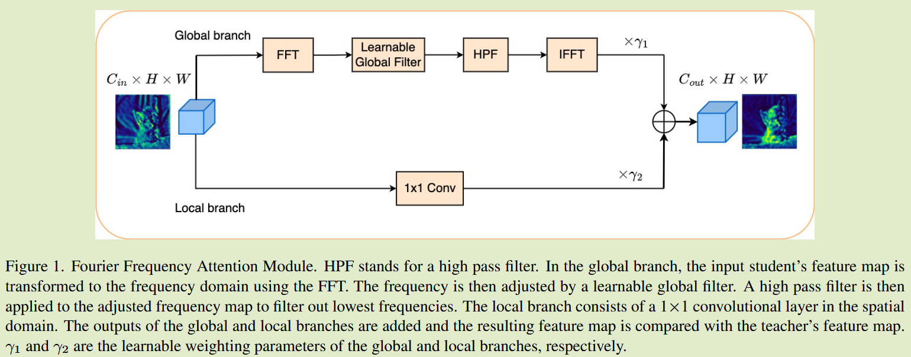

# Frequency Attention for Knowledge Distillation

[2024WACV](https://openaccess.thecvf.com/content/WACV2024/html/Pham_Frequency_Attention_for_Knowledge_Distillation_WACV_2024_paper.html)	[code in githubn](https://github.com/cuong-pv/FAM-KD)	CIFAR ImageNet	20250215

本文提出了从频率域来捕获详细信息和更高层次信息的FAM模块，频率域的每个频率点都是来自于空间域中的所有像素，可以看作是一种全局注意力，通过FFT转换到频率域后经过全局滤波器进行特征的提取，并通过一个高通滤波器来抑制低频区域的信息来让学生模型更关注显著区域，最后通过IFFT将特征转换为空间域。

## Introduction

- 目标： 鼓励学生模型从教师模型捕获详细和更高层次的信息
- 可以通过在频率域而不是空间域对学生特征进行处理来完成
- 频率域对于理解具有重复或周期模式的图像是有效的，而这些模式是传统的空间技术难以发现的

基于此我们提出频率注意力模块(Frequency Attention Module, FAM)，该模块在频率域中具有可学习的全局滤波器，全局滤波器可以看作是频率注意力的一种形式，可以调整学生特征图中的频率，然后将频率域中的注意力特征反转回空间域，并将其与教师特征一起最小化。	

**主要贡献：**

- 提出一个新的模块FAM，探索傅里叶频率域用于知识蒸馏，由一个可学习的全局滤波器组成，可以调节学生特征频率，鼓励学生特征模仿教师特征中的模式。
- 利用提出的FAM模块，提出增强的逐层知识蒸馏模型和一个增强的基于knowledge review[2021 CVPR]的蒸馏模型

## Method

#### Frequency Attention Module

FAM模块由全局分支和局部分支组成：

在全局分支中，首先进行快速傅里叶变换FFT将其变换到频率域，FFT分别应用到每个通道，对于特征图X的第i个通道：
$$
X_i(u, v) = \sum^{H-1}_{k=0}\sum^{W-1}_{l=0}X_i(k, l)e^{-i2\pi(\frac{uk}{H}+\frac{vl}{W})}
$$
引入一个可学习的全局滤波器K来调整Xi的频率，可以看作是对Xi的一种注意力形式。

#### 全局滤波器

由FAM产生的特征图要与教师特征图具有相同的维度，全局滤波器K的维数为$C_{out} \times C_{in} \times H \times W$，其中$C_{out}$为教师模型特征图的通道数，经过FFT的频率域特征图X维数为$C_{in} \times H \times W$，该核K与输入X逐元素相乘，得到与输入特征图大小相同的3D特征图，然后进行逐通道求和得到大小为$H\times W$的2D输出，最终全局滤波器K的输出为$C_{out} \times H \times W$的3D特征图。

#### HPF

频率域中的每个频率都由空间域中的所有像素决定，尽管每个核都关注特定的频率，但滤波器实现了全局效果。

我们进一步抑制低频，来降低学生对非显著区域的关注，我们在可学习的全局滤波器后加入高通滤波器(High Pass Filter, HPF)，HPF应用于每个通道，来抑制低频区域。

#### IFFT

然后通过快速傅里叶逆变换IFFT将频率域转换回空间域，$\bar{X}$表示经过高通滤波器的特征图：
$$
\bar{X}_i(k, l) = \frac{1}{HW}\sum^{H-1}_{u=0}\sum^{W-1}_{v=0}\bar{X}_i(u, v)e^{i2\pi(\frac{uk}{H} + \frac{vl}{W})}
$$
令$g(X,K)$为全局滤波器的输出，h表示高通滤波器，$F,F^{-1}$分别表示FFT和IFFT，则全局分支表示为：
$$
F_{global}(X) = F^{-1}(h(g(F(X), K)))
$$
FAM模块还包含一个局部分支，由空间域的$1\times 1$卷积层，因此整体上FAM模块输出：
$$
F_{out} = \gamma_1 * F_{global} + \gamma_2 * F_{local}
$$
其中$\gamma_1 \gamma_2$为可学习的权重参数