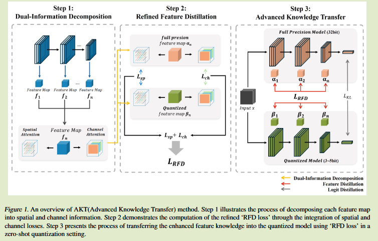
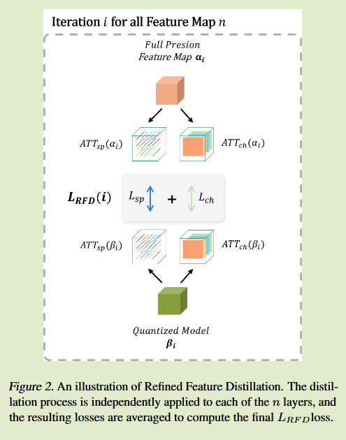

# Advanced Knowledge Transfer: Refined Feature Distillation for Zero-Shot Quantization in Edge Computing

2024arXiv	[code in github](code in github)	-	20250227

提出一种应用通道注意力和空间注意力两种特征知识的方法，通过结合这两种特征与基础蒸馏配合，有效改善了量化模型蒸馏的性能。

## Introduction 

量化作为一种模型压缩策略可以最大限度的提高DNN的效率，减少延迟和计算资源的消耗，

量化技术根据量化的时间分为量化感知训练(Quantization-aware training QAT)和训练后量化(post-training quantization PTQ)，尽管QAT在训练中应用量化来保持高性能，但他需要充分访问训练数据集；PTQ实现较为简单，但存在性能下降的风险。

为了解决这些限制，提出了零样本学习ZSQ的无数据量化，但低比特量化性能会有损失，我们对其进行了深入研究，低比特量化模型容量有限，降低了传统蒸馏的方法效率，这种低效率可能导致梯度爆炸问题；目前在ZSQ中使用知识蒸馏效率对于低比特量化模型训练并不是最优的，其容量有限

基于此我们提出AKT高级知识转移，旨在提升低比特量化模型的训练效率，AKT有效的从全精度模型中捕获通道和空间注意力信息，确保关键特征被有效的纳入训练过程中。

- 确定了通道和空间信息在训练零样本量化模型的关键作用，使用二阶曲率的分析表明在量化过程中保留这些成分对保持性能至关重要
- 整合信道和空间信息显著提高了量化模型的性能
- 提出高级知识转移方法，证明对训练低比特量化模型非常有效，尤其是在3bit和5bit的零样本量化背景下

## Method

#### Dual-Information Decomposition  双重信息分解

从模型的各个层提取特征图，从特征图同时应用空间和通道注意力来提取关键信息：
$$
ATT_{sp}(x) = \frac{\frac{1}{C}\sum^C_{c=1}x^2_c}{||\frac{1}{C}\sum^C_{c=1}x^2_c||},\ where\ x_c \in \R^{H\times W} \\
ATT_{ch}(x) = \sigma(\frac{1}{HW}\sum^H_{h=1}\sum^W_{w=1}x^2_{h,w}), \ where\ x_{h,w}\in\R^C
$$
L2标准化来强调空间像素信息，通道注意力通过平均空间维度HW来保留通道信息，这允许计算每个通道的相对重要性，然后通过softmax函数归一化。

通过从不同的角度对特征图进行细化，使得高质量信息能有效传递给容量有限的量化模型

#### Refined Feature Distillation  精炼特征蒸馏

在上一步基础上，提出精化特征蒸馏损失，来整合特征信息：
$$
L_{RFD} = \lambda \times \frac{1}{N}\sum^N_{i=1}(KL(ATT_{sp}(\alpha_i) || ATT_{sp}(\beta_i)) + KL(ATT_{ch}(\alpha_i) || ATT_{ch}(\beta_i)))
$$
其中$\alpha_i \beta_i$分别表示全精度模型和量化模型的特征图

其中N表示进行蒸馏的特征图个数，为了节约计算资源，对模型内进行分组，将每一个模块的最后一层进行蒸馏。

#### Advanced Knowledge Transfer  高级知识转移

AKT建立在常用的logit蒸馏的基础上，结合上提出的蒸馏精炼损失：
$$
L_{AKT} = \alpha L_{RFD} + (1-\alpha) L_{KL}
$$
