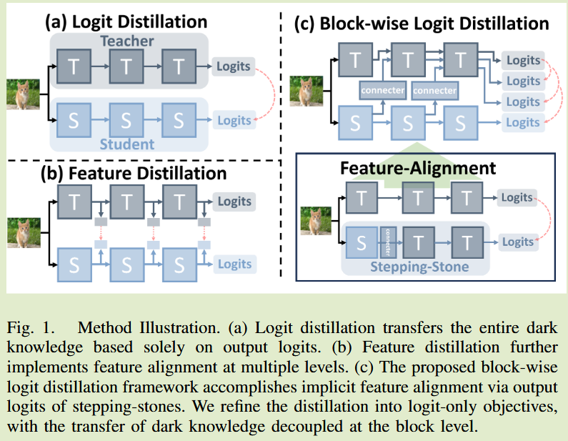
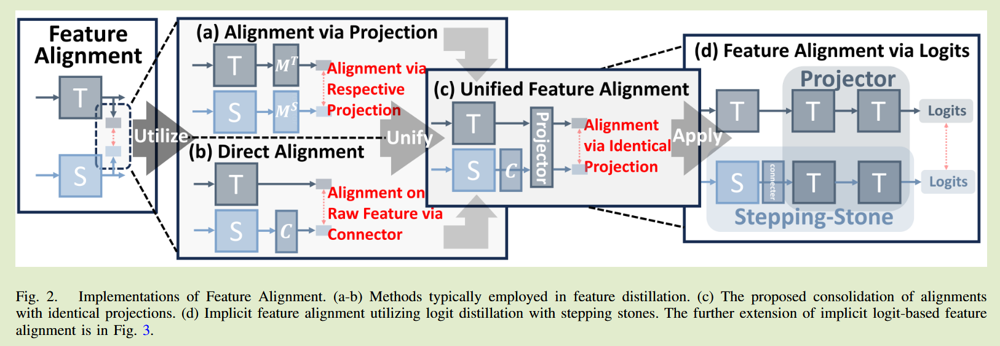
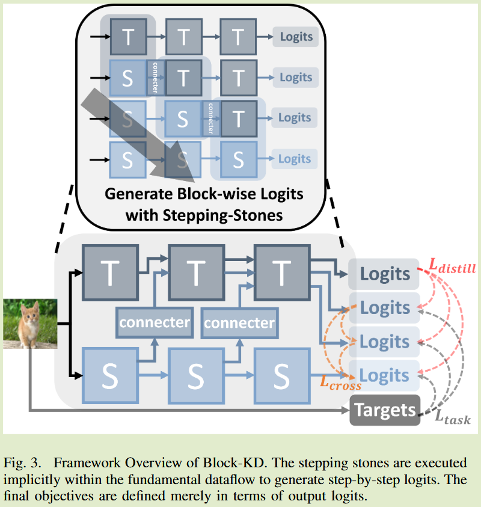
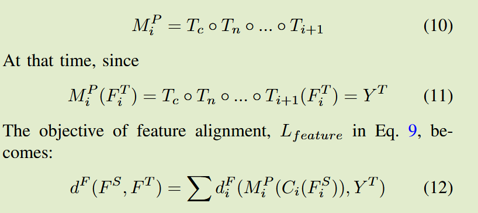

# Decoupling Dark Knowledge via Block-wise Logit  Distillation for Feature-level Alignment

**[arXiv2411](https://arxiv.org/abs/2411.01547)	no code 	CIFAR ImageNet COCO	20241109**	蒸馏过程

Chengting Yu, Fengzhao Zhang, Ruizhe Chen, Zuozhu Liu, Shurun Tan, Er-Ping Li, Aili Wang

本文综合了特征蒸馏和logits蒸馏，提出了一种新的师生模型特征对齐方案，将学生模型块中间特征与教师模型对齐后推理得到logits，利用这些logits进行蒸馏学习，从教师模型中提取知识，并且提出了将不同块之间进行交叉蒸馏来进行过程的优化，并针对这一过程进行了理论分析。

## Introduction

logits蒸馏和Feature蒸馏对于暗知识的看法截然不同，基于logits的方法认为暗知识全部	包含在logits中，因此对齐logits足以将暗知识传递给学生模型；对于基于特征的方法，要求扩展到不同块级别的隐藏特征，来努力通过对齐块级特征来传递不同级别的暗知识。

我们综合了两种蒸馏方式，提出了块级的logits蒸馏

## Method

#### 特征对齐：弥补Logits蒸馏法缺失的部分

这两种类型的蒸馏主要区别在于T和S之间的距离测量，基于特征的方法聚焦于特征图中提取信息，而基于logits的方法集中于最终输出上。

对师生特征的对齐方式通常有两种方案：

- 通过引入新的投射层来进行对齐
  $$
  d^F(F^S, F^T) = \sum d^F_i(M_i^S(F^S_i), M_i^T(F^T_i))
  $$
  但是有研究表名这种从高维空间投影到低维空间的过程本身就会导致大量的信息损失

- 定义从学生空间到教师空间的映射函数：
  $$
  d^F(F^S, F^T) = \sum d^F_i(C_i(F_i^S), F^T_i)
  $$
  C表示向教师空间转换的函数，这种方式能够减轻信息丢失，但这种方式可能会导致对于任务无关噪声的刚性对齐，这会降低模型的泛化能力增加过拟合的风险。

#### 通过Logits实现特征对齐

从现有的特征对齐出发，以上两种方式可以统一为一种对齐方式：
$$
d^F(F^S, F^T) = \sum d^F_i(M^P_i(C_i(F^S_i)), M^P_i(F^T_i))
$$
C表示向教师空间转换的函数，来对齐师生模型的通道数，我们的设计旨在实现过滤高级特征，提取相对干净的任务相关信息，以及通过潜在空间的暗知识进行特征对齐的预测结果，训练有素的教师模块作用于投影层会出现清晰的画面。

该结构比较新颖的地方在于将特征蒸馏集成到Logits蒸馏上。产生里一系列中间模型以及其输出：
$$
N_i = T_c \circ T_n \circ ... \circ C_i \circ S_i \circ ... \circ S_1 \\
Y^{N_i} = N_i(X)
$$
训练损失表示为：
$$
\begin{aligned}
L' &= (L^S_{task} + L^S_{distill}) + \sum(L^{N_i}_{task} + L^{N_i}_{distill}) \\
& = (L^S_{task} + \sum L^{N_i}_{task}) + (L^S_{distill} + \sum L^{N_i}_{distill}) \\
& = L_{task} + L_{distill}
\end{aligned}
$$
还需要引入中间块的特征损失，我们通过集成模型来优化这一过程：
$$
Y^{ensemble} = \frac{\sum^{i\leq n}_{i=1}Y^{N_i}}{n} \\
L_{cross} = d^L(Y^S, Y^{ensemble}) + \sum d^L(Y^{N_i}， Y^{ensemble})
$$
总体损失表示为：
$$
L = \alpha L_{task} + \beta L_{distill} + \gamma L_{cross}
$$
