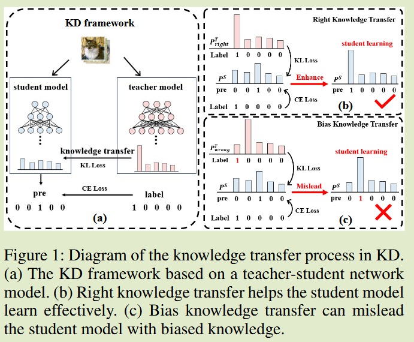
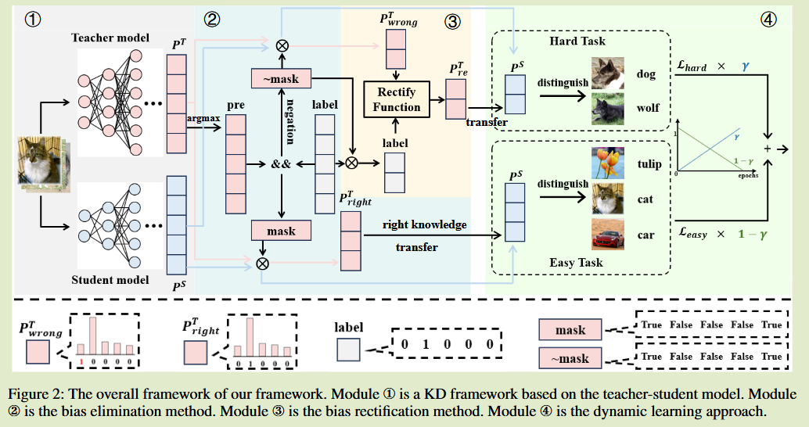
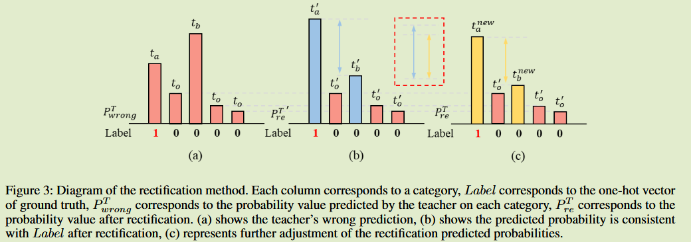

# Can Students Beyond The Teacher?  Distilling Knowledge from Teacher's Bias

2024arXiv	no code	CIFAR ImageNet MS-COCO	20250220

本文给出了一种教师模型的知识矫正方法，将教师模型预测正确的部分定义为简单任务，预测错误的部分定义为困难任务，给出了一套错误预测矫正方案，并提出了动态学习的过程，先专注于简单任务的学习，在训练后期专注于困难任务来进一步提升模型性能，最终学生模型的性能甚至能够超过教师模型。

## Introduction 

先前的蒸馏方法学生始终没有超越教师模型的性能，原因之一是其忽视了教师模型传递的知识不一定都是正确的，教师的错误预测可能会误导学生，从而限制学生模型的表现。

我们将教师传递的知识分为正确知识和错误知识，设计了一种错误知识消除方法，只保留正确知识。

- 证明了KD中存在错误知识对学生模型产生不利影响
- 提出一种错误知识纠正策略，我们纠正错误知识来减轻错误知识对学生模型的误导
- 提出一种动态学习方法，允许学生模型在训练早期阶段基于正确的知识快速掌握简单任务，在后期解决与错误预测相关的困难任务

## Method

我们将教师模型能够做出正确预测的任务认定是简单任务，教师传授的是正确知识；教师做出错误预测的任务认为是困难任务，转移的知识是有偏见的知识。

#### Eliminating Biased Knowledge from Teacher  消除教师的错误知识

我们设计了一个错误知识消除模块，如图模块2区域

- 将教师模型输出的预测值转换为相应的预测概率，记录为$P^T$，通过argmax函数将预测概率转换为0-1向量pre
- 通过逻辑与运算与真值标签运算，如果匹配标记为True否则标记为False，存储到掩码表中，记录教师预测的正确性
- 通过该掩码可以筛选出教师知识中的正确知识和有错误的知识

#### Rectifying Biased Knowledge from Teacher  纠正教师的错误知识

消除教师的错误知识可以一定程度上提升学生模型的性能，但是这并不会提升学生模型预测这些困难任务的性能。我们提出错误矫正方法，如图模块3区域

假设$t_a$表示对应标签$y_a = 1$的值（真实类别，但教师预测错误），$t_b$表示教师的最大概率预测值（教师的输出，但这是错的）其标签为$y_b$，$t_o = \{t_{oi}\}$表示其他类别，对应标签为$y_o = \{y_{oi}\}$，其满足关系：
$$
t_a + t_b + t_o = 1\\
\begin{cases}
\begin{aligned}
&y_a = 1, t_a \rightarrow 0 \\
&y_b = 0, t_b \rightarrow 1 \\
&y_o = \{0\}, t_o \rightarrow \{0\}
\end{aligned}
\end{cases}
$$
首先使用相应标签$y_a, y_b$对$t_a, t_b$进行加权，取其平均值获得新的概率$t'$:
$$
\begin{cases}
\begin{aligned}
&t'_a = \frac{t_a + y_a}{2} = \frac{t_a +1}{2} > 0.5 \\
&t'_b = \frac{t_b + y_b}{2} = \frac{t_b}{2} < 0.5 \\
&t'_o = t_o
\end{aligned}
\end{cases}
$$
此时已经矫正了教师的错误预测，但：
$$
t'_a + t'_b = \frac{t_a + t_b + y_a + y_b}{2} =  \frac{t_a + t_b + 1}{2} \\ 
t_a + t_b < 1 \\
s.t.\ \frac{t_a + t_b + 1}{2} > t_a + t_b \rightarrow t'_a + t'_b + t'_o >1
$$
需要矫正其概率和为1，$t^{new}$表示调整后的值：
$$
t^{new}_a = t'_a\times \frac{t_a + t_b}{t'_a + t'_b}, t^{new}_b = t'_b \times \frac{t_a + t_b}{t'_a + t'_b}
$$
此时获得了修正的概率值，其概率和为1，并且不会改变其他类的概率。

#### Dynamic Learning Approach  动态学习方法

我们希望在训练前期学生模型专注于简单任务，在训练后期来处理更加困难的任务，我们定义了两个约束函数，分别约束对于简单和困难知识的学习：
$$
L_{easy} = L_{KL}(P^{S_r} || P^{T_r}) \\
L_{hard} = L_{KL}(P^{S_{re}} || P^{T_{re}})
$$
其中$P^{S_r}, P^{T_r}, P^{S_{re}}, P^{T_{re}}$分别表示为学生模型的输出、教师模型的正确知识、学生模型的输出、教师模型的矫正知识，总体损失总结为：
$$
L_{all} = (1-\gamma)(L_{CE} + L_{easy}) + \gamma L_{hard}
$$
为了进行调整，我们取$\gamma = \frac{e}{E}$，其中e表示当前迭代轮次，E表示总轮次，随着训练的进行，蒸馏越来越侧重于矫正后的教师输出，即侧重于困难任务。