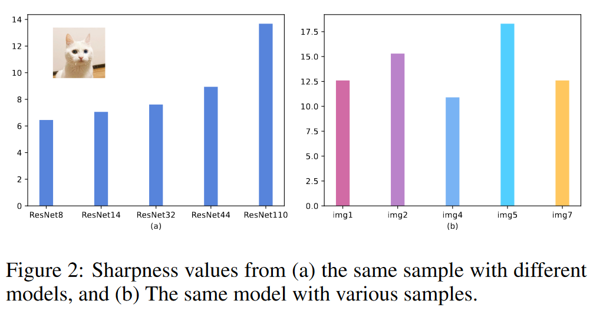
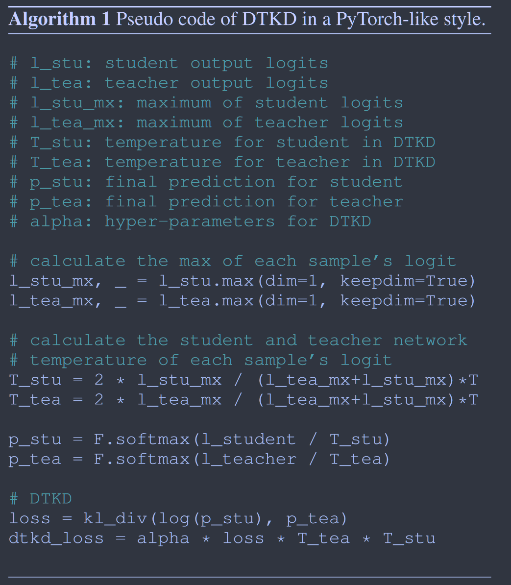

# Dynamic Temperature Knowledge Distillation

**[arXiv2024](https://arxiv.org/abs/2404.12711)	[code in github 暂未上传](https://github.com/JinYu1998/DTKD)	CIFAR100 ImageNet	20240503**

Yukang Wei, Yu Bai

这项工作从两个角度考虑了温度系数的影响，从模型的角度来看调节温度能缓解师生模型之间的能力差距，从任务的角度来看调节温度有助于设置合适的任务难度等级，提出了logsumexp来评价师生模型logits输出的平滑度，并提出通过调节温度系数来优化使得师生模型之间的平滑度差异最小，来缓解KD对任务带来的负优化问题。

## Introduction

固定的温度可能会阻碍KD的优化，先前工作认为调节温度可以弥合师生网络的容量差距，以及调控任务的难度，但是先前工作都忽视了师生模型输出的平滑度，且都需要增加额外的模块增加了开销。

我们的工作基于以下观察：如果师生模型共享同一个温度系数，他们的logits平滑度可能会存在差异，这会阻碍KD的过程，且在学生能力有限时表现更明显。

因此提出使用logsumexp函数来评价logits的尖锐程度并引入动态温度蒸馏。

> 考察了师生模型logits对KD的影响，这种差异普遍存在于每个样本的logits中，阻碍了KD的过程
>
> 提出了logsumexp来量化logit的尖锐程度，并引入基于尖锐度差异最小化的动态温度蒸馏
>
> 与先前的方法相比，我们协同教师和学生找到合适的温度而避免了额外的计算
>
> 我们的算法可以很好的与KD和DKD[2022CVPR]结合，达到SOTA

## Method

### Background 

对于输入x，其gt标签为y，师生模型的输出分别为u, v，其中$u=[u_1, u_2, ..., u_K] \in \R^{1\times K}, u_i$表示第i个类别的概率，K表示类别数，对于v同理。经过softmax后的概率输出为p, q，且被温度系数$\tau$修正：
$$
p_i= \frac{exp(u_i/\tau)}{\sum^K_{i=1}exp(u_i/\tau)}\ \ q_i= \frac{exp(v_i/\tau)}{\sum^K_{i=1}exp(v_i/\tau)} \tag{1}
$$
最终损失由交叉熵和KL散度组成

### Sharpness as a Unified Metric

一些工作发现蒸馏过程温度系数恒定并不总是最优的，从模型的角度来看调节温度能缓解师生模型之间的能力差距，从任务的角度来看调节温度有助于设置合适的任务难度等级，因此一个综合的温度调节机制应该理想的兼顾这两个角度。

我们发现一个模型输出的logits的形状代表了该模型对其预测的置信度，该置信度受预测能力和任务难度的双重影响。一个共同的温度能够减少logits之间的形状差距但不能消除这种差异。我们提出使用logsumexp函数量化输出的平滑度，称之为锐度，对于logits $z = [z_1, z_2,...,z_K]$：
$$
sharpness(z) = log\sum^K_{i=1}e^{z_i} \tag{2}
$$
高的锐度表示输出的logits具有较小的平滑度，低的锐度表示输出具有较大的平滑度。

能力强的教师对于预测更有信息，因此其输出也就更尖锐，同一个模型不同样本的输出也会表现出不同的预测难度，影响着其锐度。

### Dynamic Temperature Knowledge Distillation

相同的温度系数不能平衡两组不同的logits，因此一个自然的想法对尖锐度较大的教师网络一个较高的温度，尖锐度较低的学生网络施加一个较低的温度。因此我们同时调节教师和学生的温度，我们从一个相同的温度$\tau$出发，教师温度设为$\tau+\delta$， 学生温度设为$\tau-\delta$，我们通过最小化师生模型输出的logits之间的平滑程度来找到一个合适的$\delta$，即：
$$
arg\ \underset{\delta}{min} |sharpness(\frac{u}{\tau+\delta}) - sharpness(\frac{v}{\tau-\delta})| \tag{3}
$$

#### Proposition 1

假设u，v是$\R^n$中的向量，$\tau_1, \tau_2$是两个非零的标量实数，我们有：
$$
0 \leq |logsumexp(\frac{u}{\tau_1}) - logsumexp(\frac{v}{\tau_2})| \leq |\frac{u}{\tau_1} - \frac{v}{\tau_2}|_{max}
$$
因此要优化Eq3. 令$\tau_1 =\tau+\delta, \tau_2 = \tau-\delta$:
$$
|\frac{u}{\tau+\delta} - \frac{v}{\tau-\delta}|_{max} = 0 \tag{4}
$$
令$|u|_{max}=x, |v|_{max}=y$，有：**(WHY? 为什么这里直接取u v的最大值计算$\delta$)**
$$
\delta = \frac{x-y}{x+y} \tau \tag{5}
$$
因此$T_{tea} = \tau+\delta = \frac{2x}{x+y}\tau, T_{stu} = \tau-\delta = \frac{2y}{x+y}\tau$，DTKD损失为：
$$
\mathcal{L}_{DTKD} = \frac{1}{N}\sum^N_{i=1}T_{tea}·T_{stu}·KL(p_{T_{tea}}, q_{T_{stu}})
$$

$$
\mathcal{L}_{KD} = \alpha\mathcal{L}_{DTKD} + \beta\mathcal{L}_{KL} + \gamma\mathcal{L}_{CE}
$$

## Limitation

仍然需要设置一个参考温度，未来应进一步研究温度的自适应选择，另一个有待探究的方向是分别研究动态温度调节中能力差距和任务差距的影响。
