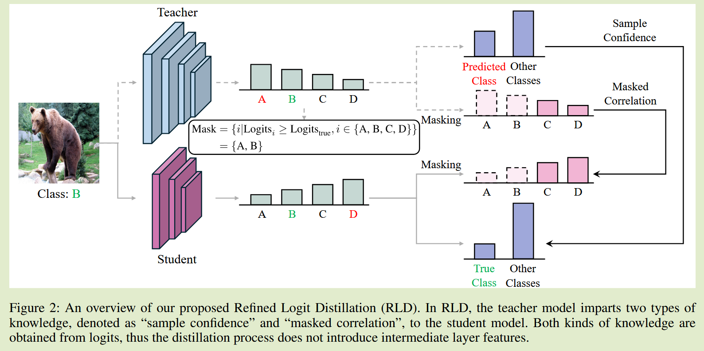
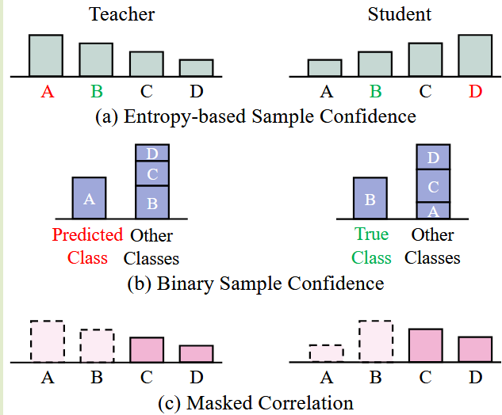
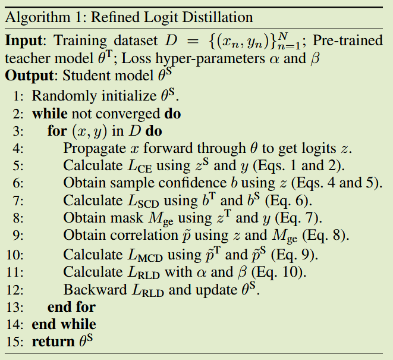

# Knowledge Distillation with Refined Logits

**[arXiv 2408](https://www.arxiv.org/abs/2408.07703)	[code in github](https://github.com/zju-SWJ/RLD)	CIFAR100 ImageNet	20240904**	知识结构

*Wujie Sun, Defang Chen, Siwei Lyu, Genlang Chen, Chun Chen, Can Wang*

本文认为现有的logits蒸馏方法忽略了教师模型错误预测带来的影响，现有的校正方法会破坏类别之间的相关性，针对该问题提出一种基于掩码的方法来屏蔽到错误分类来减少教师错误预测对学生模型的负面影响。

## Introduction 

现有的logits蒸馏方法忽视了教师模型预测结果对训练过程的影响。高性能教师模型也会产生错误预测，引发蒸馏损失和交叉熵损失的冲突，导致学生学习目标的不一致性。现有的校正方法我们认为会破坏类间的相关性，我们提出精炼Logits蒸馏RLD来防止过拟合，减轻错误教师知识的影响并保留基本的类间相关性。	

## Method

### 样本置信度蒸馏  Sample Confidence Distillation

样本置信度SC表示为由logits得到的二元分布b，它封装了每个样本的模型置信度，可以表示为：
$$
b^T = \{ \hat{p}^T_{max}, 1-\hat{p}^T_{max} \} \\
b^S = \{ \hat{p}^S_{true}, 1-\hat{p}^S_{true} \}
$$
通过KL散度来传递这些知识：
$$
L_{SCD} = \tau^2KL(b^T, b^S)
$$
但是通过KL散度迁移并没有对真实类施加约束

### 掩蔽相关蒸馏 Masked Correlation Distillation

掩蔽相关MC指对某些类别进行动态掩蔽后得到的概率分布，这种掩码操作解除了学生模型对不正确的类别的对齐，掩码由教师logits输出和标签动态导出，

屏蔽掉所有大于等于真实类的类别：
$$
M_{ge} = \{ i|z^T_i \geq z^T_{true}, 1\leq i \leq C \}
$$
输出的概率分布计算为：
$$
\widetilde{p}_i = \frac{exp(z_i/\tau)}{\sum^C_{c=1, c\notin M_{ge}}exp(z_c/\tau)}
$$
这部分损失总结为：
$$
L_{MCD} = \tau^2 KL(\widetilde{p}^T, \widetilde{p}^S)
$$
教师预测较为准确时只有少量类别被隐蔽，能够保留大部分类相关性，而当预测不准确时，大部分信息会被隐蔽，减少对学生模型的误导。

### Refined Logit Distillation

最终损失：
$$
L_{RLD} = L_{CE} + \alpha L_{SCD} + \beta L_{MCD}
$$

- $L_{CE}$鼓励学生模型为真实类生成最高概率，但独立部署时可能会造成过拟合。
- $L_{SCD}$期望学生模型对真实班级达到合理的置信水平，从而避免过拟合。然而，当单独使用时，它可能会导致分配给剩余类之一的概率超过真实类的概率。当$L_{CE}$与$L_{SCD}$合并时，真类保留了最高和最合适的概率。但是，这种组合在传递关于剩余类的知识方面存在不足。
- $L_{MCD}$缺乏关于真实类(由于真实类的一致掩蔽性)的信息，但它有能力消除错误信息，并将有价值的类相关性传递给学生模型。通过将$L_{CE}$和$L_{SCD}$与$L_{MCD}$集成，我们可以确保大量有价值的知识的传递。

