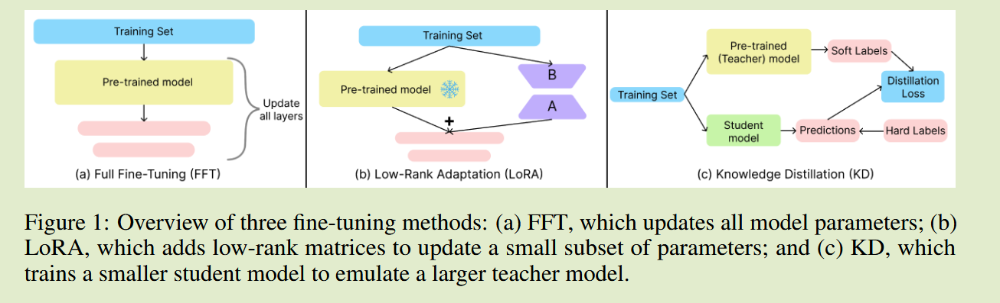

# KD-LoRA: A Hybrid Approach to Efficient Fine-Tuning with LoRA and Knowledge Distillation

arXiv2410	no code	BERT RoB Deb  GLUE	20241113

本文将LoRA与KD相结合，获得更小的学生模型，其中将学生模型预训练参数冻结后加入LoRA模块，通过蒸馏学习微调LoRA模块使之来模仿教师模型的性能。

## Introduction 

本文提出将LoRA与KD相结合来降低计算成本，使其成为在资源有限的环境下的理想选择。我们将LoRA矩阵合并到学生模型中，然后更新学生模型的LoRA矩阵的同时应用蒸馏过程来实现。我们利用了两种方法的优势：LoRA可以减少可训练参数方面的效率，KD将知识有效的转移到更紧凑的学生模型。

- KD-LoRA 达到97%FFT的性能，但参数却少得多
- KD-LoRA 达到98%的LoRA性能，也比LoRA有着更少的参数。
- KD-LoRA 采用更小的学生模型，比FFT和LoRA紧凑40%，并且GPU使用量减少了75%，相比于LoRA减少了30%
- KD-LoRA 将推理时间缩减了30%，同时保持了与FFT与LoRA相同的收敛效率

## Method

- 选择和微调教师模型
- 用LoRA模块初始化较小的学生模型
- 进行蒸馏将知识转移到学生模型

学生模型S是与教师模型T相同家族的较小型号模型，将LoRA注入到架构中来修改学生模型，LoRA应用于注意力层，权重矩阵分解如下：
$$
W_q = W^{base}_{q} + A_qB_q; \ W_v = W^{base}_{v} + A_vB_v
$$
其中W为预训练模型的权重矩阵，A B表示LoRA的低秩矩阵，训练时同时使用蒸馏损失和任务损失进行训练：
$$
L^S_{total} = \alpha L^{S}_{task} + (1-\alpha)L_{KD}(z^S, z^T)
$$
