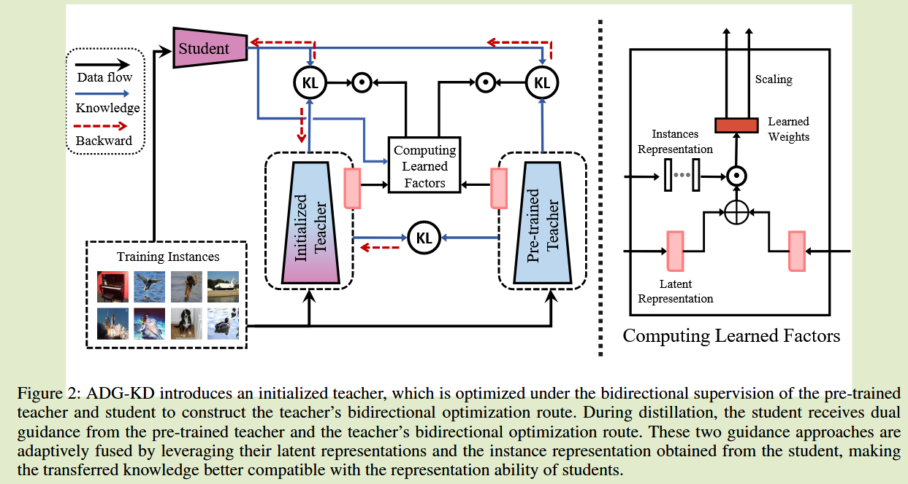
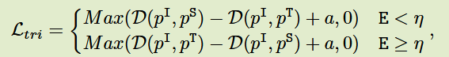
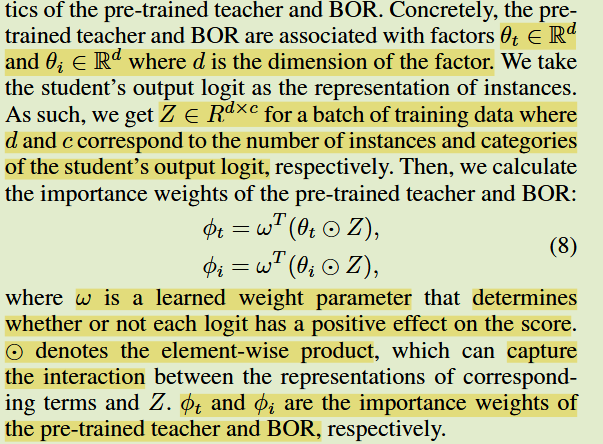
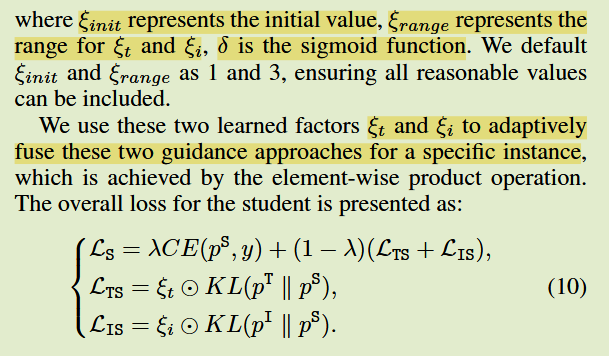

# Adaptive Dual Guidance Knowledge Distillation

2025 AAAI

## Introduction

背景：师生之间的较大差距限制了蒸馏的收益

关键问题： 现有方法大多数会降低预训练教师的表现，阻碍学生达到更好的性能；现有方法未能动态调整转移的知识以适应学生的表征能力，这在弥合能力差距方便效果较差；

主要贡献：

- 提出一种新型自适应双重指导知识蒸馏，利用自适应双向指导来训练学生模型，弥合能力差距，促进学生实现与预训练教师模型相当的表现；
- ADG-KD引入了初始化教师。通过双向监督优化构建BOR，并设计了一种计算方法，将与培训的教师指导与BOR结合，使转移的知识更好的兼容学生的表征能力

## Method

### Teacher's Bidirectional Optimization Route

ADG-KD引入初始化教师，并通过对预训练教师模型和学生模型进行双向监督优化，在蒸馏过程中，学生在早期阶段具备有限的表征能力，在后期逐渐发展出更合适的表征能力，因此初始化教师的预测分布更接近学生在早期蒸馏阶段的分布，而在后期阶段应接近与预训练教师模型的分布：

$p^I, p^S, p^T$分别表示初始化教师、学生模型、教师模型的预测分布，E表示训练epoch。

早期阶段，$p^I$接近于$p^S$，以确保传授的知识易于理解且与学生兼容；在后续蒸馏阶段，应扩大$p^I$与$p^S$之间的距离，同时缩短$p^I$与$p^T$之间的距离，以更好的适应学生日益提升的表征能力，$\eta$为超参数控制这两个函数的偏移

### Adaptive Dual Guidance Approaches 

不同的训练实力对学生来说会带来不同程度的学习难度，对于复杂或易出错的情况，BOR的指导可以缓解学习困难，弥合能力差距；而对于简单样本，教师的指导可以进一步完善学生的学习，因此我们使用两个自动学习因子来融合他们

