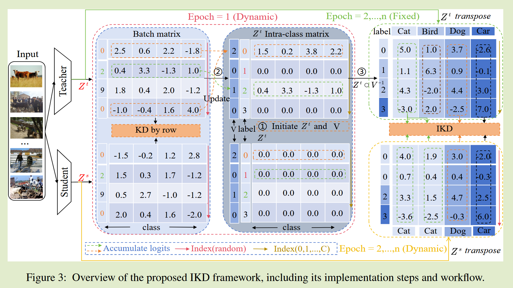
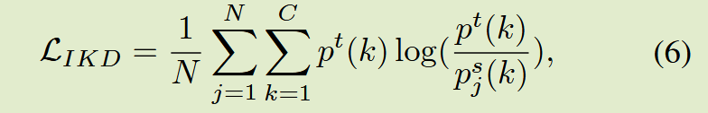

# Debiased Distillation for Consistency Regularization

AAAI 2025

## Introduction

背景： 现有研究使用更大的温度系数进行知识蒸馏，这些方法可能降低目标类别的置信度，导致相似样本识别模糊，相关研究引入批内蒸馏来减少预测差异；

关键问题：这些方法忽视了背景信息与目标类被之间的不一致，可能因噪声而增加预测偏差；随机抽样和批次大小带来的标签不平衡也可能削弱网络泛化的可靠性。

贡献：

- 提出一种类内知识蒸馏方法，作为正则化技术，以确保预测一致性同时减少噪声干扰
- 我们证明了我们的方法通过理论证明有效减少了预测偏差，且有效降低了复杂性

## Method

### Motivation

基于Logits的KD方法通过最小化师生间的类别差异提升学生表现，然而这些方法可能因噪声干扰而增加边界不确定性，此外同一类别的样本再姿态、光纤、角度和比例上可能存在显著差异。忽视类别内部差异可能导致性能下降，因此我们提出一种类别内知识蒸馏方法，能够有效减少噪声并减轻性能下降

### Intra-class Knowledge Distillation

构造一个类别内矩阵，利用整个epoch的信息打破batch偏差，：

修改后来自教师的知识从第一轮迭代结束之后就固定，教师知识来自整个数据集，从而消除批次的影响