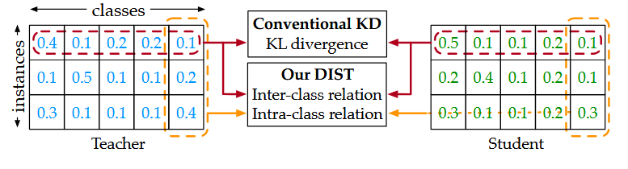
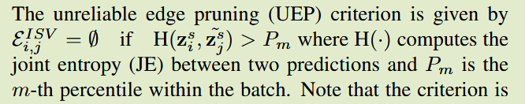
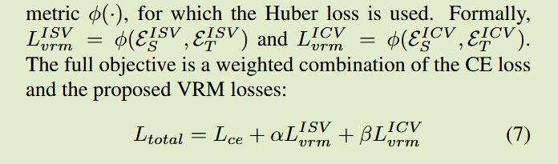
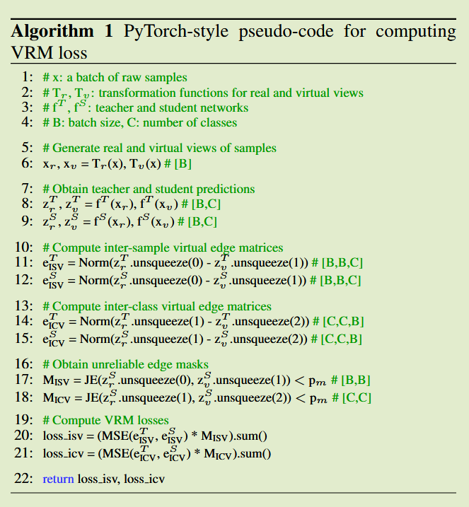

# VRM: Knowledge Distillation via Virtual Relation Matching

## Introduction

背景：基于关系的KD方法逐渐落后，因为实例匹配方法在性能上占据主导地位

关键问题：基于关系的KD方法容易过拟合且容易受到错误预测的影响

贡献：

- 从训练动力学和样本梯度的角度分析过拟合和虚假梯度扩散问题
- 提出通过虚拟视图，构建虚拟关系图来构建真实-虚拟关系，提炼出更丰富的关系知识，修剪冗余和不可靠的边来减小开销

Findings:

- **C1: 关系匹配方法相较于实例匹配方法更容易过拟合**
- 注入错误样本实验发现，一个恶性预测产生的虚假信号会传播并影响同一批次所有样本，这意味着其他样本会被大幅更新，仅为了适应恶意预测，即使他们已经相对良好，即**C2: 关系匹配方法更容易受到虚假样本的不利影响**

Solutions:

- C1: 对抗过拟合常见方法包括引入更丰富的学习信号和正则化，对基于关系匹配的KD来说这意味着构建和传递的关系更丰富
- C2: 识别并抑制虚假预测或关系的影响，或放宽匹配准则

## Method

### Constructing Inter-Sample Relations

我们首先构建关系图$G^{IS}$编码样本批次中的相似性关系，我们的关系由样本logits构建，这些预测编码了更紧凑的范式和知识

现有方法利用格拉姆矩阵编码样本间关系，我们发现这会因为内积运算导致类间知识崩溃，而我们的logits预测保持了类维度上的类间知识，使得这些信息可以作为辅助知识在样本间关系时显式传递

图$G^{IS}=(V^{IS}, E^{IS})$包含B个顶点和B*B条边，批次B中的每个样本预测都是一个顶点，$z_i\in\R^C$，连接顶点i和j的边$E^{IS}_{i,j}$描述了实例i和j之间的类别关系：
$$
E^{IS}_{i,j}=\frac{z_i - z_j}{||z_i - z_j||_2} \in \R^C for \ i,j\in[1,B]
$$

### Constructing Inter-Class Relations

我们构建一个类间批次关系图$G^{IC}=(V^{IC}, E^{IC})$，利用样本类间的logits $w_i\in\R^B$：
$$
E^{IC}_{i,j}=\frac{w_i - w_j}{||w_i-w_j||_2}\in \R^B \ for\ i,j\in[1, C]
$$
类间关系通过将批次之间的差异视为额外知识维度，这与以往任何方法都不同，显著犹豫gram矩阵的编码方案

### Constructing Virtual Relations

对于每一个预测$z_i \in \{z_i\}^B_{i=1}$，创建一个虚拟视图${\tilde{z}_i}$，我们选择RandAugment对其原始图像做随即变换，针对一个批次的变换，$\{z_i, \tilde{z}_i\}_{i=1}^{B}$

可以得到样本内边矩阵$E^{IS}\in\R^{2B\times 2B\times C}$和类内边矩阵$E^{IC}\in\R^{C\times C\times 2B}$，从样本的角度来看，这两组矩阵捕捉了三种知识类型：true-true, virtual-virtual, true-vitrual，如：
$$
E^{IS}_{m,n}=\frac{z_m - \tilde{z}_n}{||z_m - \tilde{z}_n||_2} \in \R^C
$$

### Pruning into Sparse Graphs

#### Pruning redundant edges

为了提高效率，将$G^{IS}$修剪为稀疏图，$E^{IS}$沿对角线对称，去掉半边来节省50%的边数，（后续没看懂他要剪枝哪一部分？）

#### Pruning unreliable edges

进一步识别修剪不可靠的边，以往工作通常利用两个顶点之间的确定性来确定一条边的可靠性，但我们认为这可能会使学习偏向于简单样本，我们转而测量两种预测之间的差异，差异越大则关系越不可靠

这种动态的，自适应的剪枝，提升了学习效果

### Full Objective

完整损失用huber损失来对齐师生类内关系图和类间关系图的知识，从伪代码中可以看出这里huber损失的应用是直接抛弃掉超出阈值的部分，其实退化为带掩码的MSE，这与上一章节不可靠边的剪枝部分描述一致

