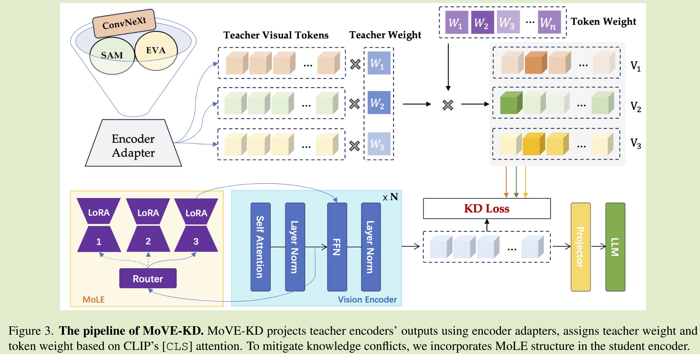

# MoVE-KD: Knowledge Distillation for VLMs with Mixture of Visual Encoders

## Introduction

- 提出多视觉编码器融合的MoVE-KD框架，是第一种从知识蒸馏的角度为大型语言模型集成不通编码器的方法
- 引入注意力引导的KD正则化，增强关键视觉表征的蒸馏，并为每个教师分配自适应权重，此外为了防止知识混淆，我们加入LoRA-Experts混合模型（MoLE）

## Method

为了减少学习多个知识源的潜在冲突，我们在学生编码器中加入LoRA-Experts (MoLE)混合结构，最终目标是最小化文本损失和KD损失。

#### Learning from multiple encoders 从多个编码器中学习

##### Encoder adapter

给定一个视觉输入，由不同的视觉编码器教师对其进行处理，得到视觉token，由于不同来源的视觉编码器表征空间不一致，这些视觉标记不能直接与学生标记对对齐，并且不同的编码器很难通过线性层桥接到学生友好的空间中，因此为每个教师编码器引入适配器，每个适配器通过两层MLP实现，根据各自教师的输出定制，独立使用并利用知识蒸馏损失进行优化。

##### Mixture-of-LoRA-experts MoLE

由混合专家模型和低秩适应模型专家组成，遵循先前MoE的典型设计，根据输入选择性地激活特定的专家，对于学生编码器中每一层的FFN和输入特征$x\in \R^{n\times d}$，MoE输出$F^*(x)$可以表示为：
$$
F^*(x) = F(x) + E_i(x) \\
with \ i = argmax(Softmax(f(x)))
$$
$F(x), E_i$分别表示FFN的输出和第i个专家模型，该方法通过激活相关专家来增强模型对不同知识领域的适应。

我们的方法为了为了提升参数的有效性，使用LoRA作为专家毛线哦ing，通过将一个大的参数矩阵替换为两个低秩矩阵，LoRA在保持性能的同时显著减少了可训练参数的数量。并且LoRA还被证明具有更好的可推广性和可以移植性，使得使用有限数据对编码器进行微调的情况下非常有效。

LoRA促进了知识蒸馏的效率，使模型能捕捉每位教师的优势并且避免知识之间的冲突，参数开销很小。

#### Attention-guided KD regularization 注意力引导的KD正则化

将多位教师模型的知识提炼为一个模型的关键在于指导学生应该关注哪些功能，不同视觉编码器对一张图片的理解不同，且某些表示对于视觉语言识别毫无用户，过多关注这些表示会削弱对真正重要特征的学习，正确的方法是找到合适的约束来进行正则化蒸馏。

学生应以蒸馏损失为指导，他在细粒度标记级别和粗粒度教师级别上区分教师标记中有价值和冗余区域，理想的蒸馏损失可以表示为：
$$
L_{kd} = \sum^m_{i=1}W^{(tea)}_i\sum^n_{j=1}(W^{(tok)}_j + \frac{1}{n})MSE(V^{(t)}_{i, j}, v^{(s)}_j)
$$
其中m表示教师编码器的数量，n为视觉token序列的长度，$V^{(t)}\in \R^{m\times n \times c}, V^{(s)} \in \R^{n\times c}$，$W^{(tok)}, W^{(tea)}$表示token级别和教师级别的权重矩阵。

我们在CLIP中使用cls标记，cls标记和其他视觉标记之间的交叉注意力揭示了图像中的关键区域，且对重复和不重要的信息表现出较低的兴趣。我们使用CLIP的cls token注意力提供的权重来设计KD正则化。

##### Token weight

我们计算cls token与其他toekn之间的注意力，并使用归一化作为每个token的权重：
$$
W^{(tok)} = Softmax(\frac{(V^{(cls)}W^{(Q)})·(V^{(res)}W^{(V)})^T}{\sqrt{d}})
$$

##### Teacher weight

我们取cls token与第i个教师标记$V_i^{(t)}\in \R^{n\times d}$之间的交叉注意力平均值的softmax作为权重，这些权重表明了不同教师对特定图像的反应：
$$
W^{(tea)} = Softmax(mean(\frac{V^{(cls)}·V^{(t)^T}_i}{\sqrt{d}}))
$$

#### 总体损失

$$
L_{total} = L_{text} + \lambda_{kd}·L_{kd}
$$

