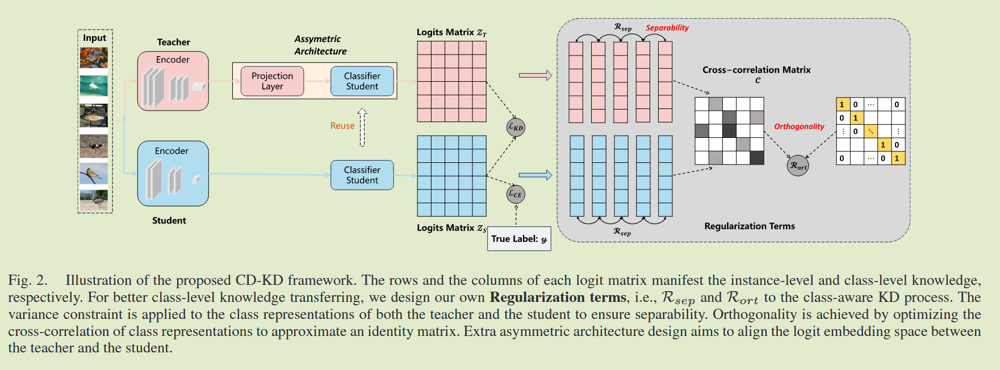

# Class Discriminative Knowledge Distillation

2025ETCI	no code 	-	20250508

## Introduction

我们认为仅将类别信息表示为类向量可能无法完全捕获其固有属性，基于logit的蒸馏应该提供与基于特征的方法相当的性能，因为logit在更高的语义级别上运行。我们认为logit矩阵的列向量应该在KD过程中表现出可分离性以传达于语义信息，且一个蒸馏良好的学生模型应该保留一个嵌入空间来捕捉教师的语义结构，所有类别表示都应该靠近其教师对应项并原理教师的不同类别嵌入。

DIST忽视了一个问题，即logit矩阵的列向量不能有效的反应类别语义，这可能会损害蒸馏，我们加入了两个额外的正则化：可分离性和正交性，以增强类感知的logit蒸馏。

我们将我们提出的方法命名为类判别性知识蒸馏CD-KD

- 在类感知知识蒸馏中提出两个正则化属于，利用可分离性和正交化技术，能够有效的从教师模型中传递语义类级知识
- 提出了不对称架构设计，包含一个额外的投影层，并为教师重新利用了学生分类器，logit空间中这种对齐有助于在类感知知识传递过程中增强语义理解

## Method

#### Class-Level Distillation

类表示中编码的信息，也具有相当大的意义。DIST是主要的baseline，引入了利用logit矩阵的列向量来传递类级知识概念，在实例级别和类别级别传递知识的蒸馏损失表示为：
$$
L_{KD}=L_{ins}+\lambda L_{cls} \\
L_{ins} = D(Z_S, Z_T) \\
L_{cls} = D(Z^T_S, Z^T_T)
$$
这个蒸馏过程包括两个基本组成部分，实例方面表示为$L_{ins}$. 我们从这个框架出发，丢弃传统的kl散度，并使用归一化均方误差N-MSE，来衡量师生模型之间预测对数的差异，考虑到师生模型大小和参数量方面的巨大差异，他们的输出范数不太可能具有可比的两级，因此我们计算了归一化后的师生模型分布的MSE损失，N-MSE不仅在量化师生logit差异优于MSE，并且在捕获师生模型之间的余弦相似性也优于MSE：
$$
D(p,z) = ||\frac{p}{||p||_2} - \frac{z}{||z||_2}||^2_2 = 2 - 2·\frac{<p,z>}{||p||_2, ||z||_2}
$$

#### Regularization Terms 

DIST使用列向量作为类表示来提取类级知识，此类表示不能确保类属性正确表示，师生类别之间的可分离性和正交性对于表示类别知识至关重要，为此我们设计了两个相应的正则化损失。

##### Separability Regularization 可分离性正则化

一个优化良好的模型应该具有类之间的区分能力，类嵌入需要表现出可分离性，简单将列向量视为类表示形式并不能保证可分离性，我们尝试通过添加可分离性正则化来正则化蒸馏过程。可分离性意味着所有类表示都应该彼此不同，从统计学的角度来看，logit矩阵中的每个列向量都应该表现出显著的方差，我们将logit矩阵z表示为$z = {z^1,...,z^C}$，C表示类别数量，z的标准差S度量表示为：
$$
S(z, \epsilon) = \sqrt{Var^C(z) + \epsilon}
$$
类别之间的标准差应该很大，但又需要在一个合适的范围，为了调节类嵌入的可分离性，我们采用hinge函数：
$$
R_{sep} = \sum^B_{i=1}max(0,\gamma-S(z_T, \epsilon))+\sum^B_{i=1}max(0,\gamma-S(z_S,\epsilon))
$$
由教师和学生的方差项组成，$\gamma$控制目标类方差的级别避免方差过大

##### Orthogonality 正交化

另一个需要强调的正则化术语是正交性，它要求教师和学生在同一类别中表现出高度相关的表示，同时对于其他类别去相关性，该过程对师生对之间的训练过程正则化：
$$
R_{ort} = (\mathcal{C-I})^T(\mathcal{C-I})
$$
其中$\mathcal{C}\in \R^{C\times C}$表示师生类嵌入之间的互相关矩阵，该正则化项鼓励互相关近似单位矩阵，$\mathcal{C}_{ij}$表示学生logit的第i个类和教师模型第j个类：
$$
\mathcal{C}_{i, j} = \frac{<z^i_S, z^j_T>}{\sqrt{\sum_B(z^i_S)^2} \sqrt{\sum_B(z^i_T)^2}}
$$
师生模型相同类别应当表现出相同的属性，因此i=j时正则化项鼓励互相关系数趋向于1，i≠j时则鼓励其趋向于0

总体损失表示为：
$$
L = L_{CE} + \alpha L_{KD} + \beta R_{sep} + \eta R_{ort}
$$

##### Assymetric Architecture 非对称架构

类别感知KD的另一个问题时来自预训练教师模型的固定性质，这意味这logit $z_T$ 的列向量本身可能无法捕获类级别信息，考虑到优化良好的教师特征的可表示性，我们只需要替换固定的教师分类器，并引入一个非对称的网络设计，有一个复用的学生分类器和一个额外的投影层组成，额外的投影层用于在学生和教师之间对齐特征图的尺寸。

我们的设计有两个优点，与固定分类器相比，我们的训练分类器还允许教师生成类感知的logit（通过正则化项）；与直接训练教师的普通分类器相比，我们的设计重用了学生分类器，使教师和学生都能将图像映射到相似的嵌入空间，从而缩小他们的知识差距。