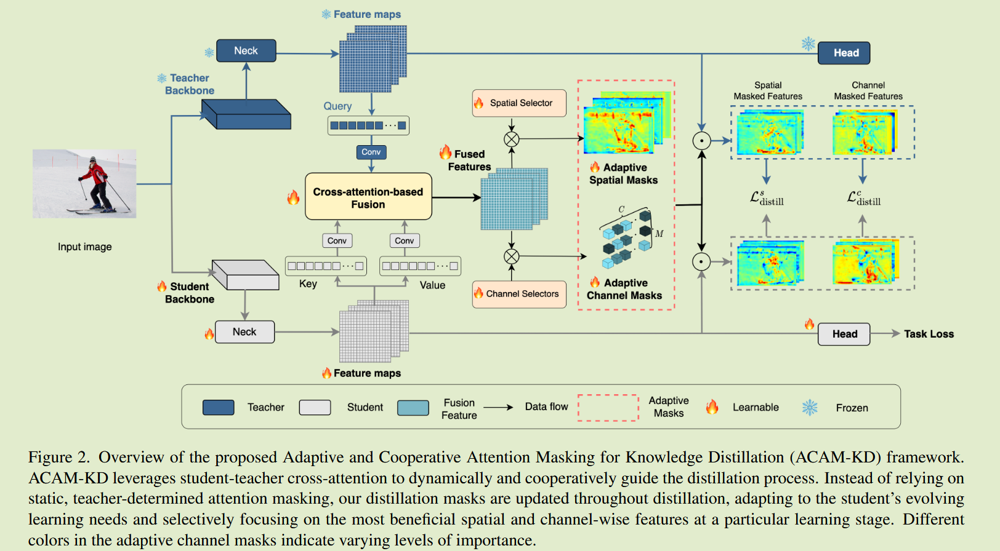
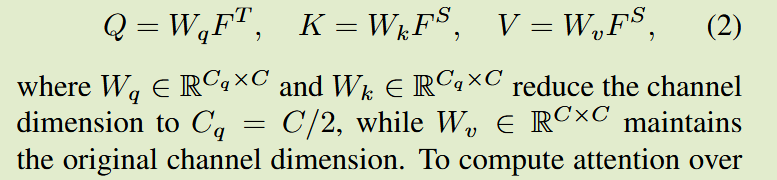
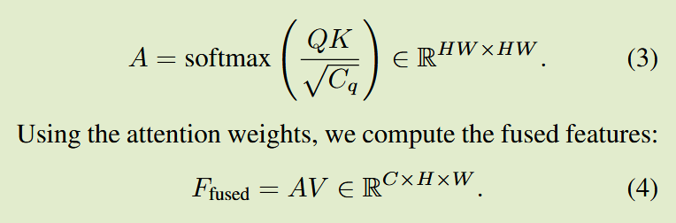
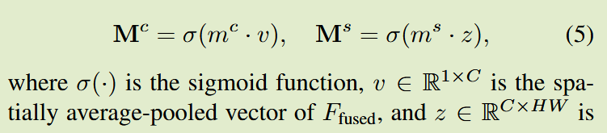
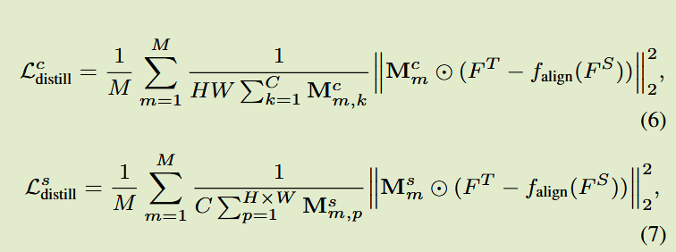
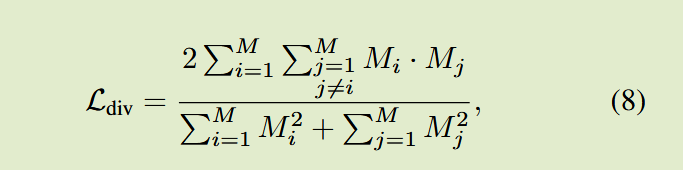
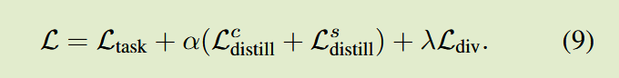

# ACAM-KD: Adaptive and Cooperative Attention Masking for Knowledge Distillation

ICCV 2025

## Introduction

背景：现有KD方法依赖于固定的或教师驱动的特征选择，未能适应学生不断发展的学习状态

关键问题：在每个epoch反复强调相同的区域是低效的，尤其是学生已经足够理解他们时，另外不准确的教师焦点可能会误导学生；现有方法忽略了通道功能选择的意义，没有考虑不同通道的不同贡献

本文方案：

- 提出一种基于自适应师生合作的注意力掩码的增强型特征知识蒸馏方法
- 师生交叉注意力特征融合模块集成来自预训练教师和动态演变的学生模型特征
- 自适应空间通道掩蔽模块自适应的生成跨空间和通道维度的重要性掩码，来实现更有效的提取

## Methodology

### Student-Teacher Cross-Attention Feature Fusion for Distillation Attention

学生不仅要被动的从教师那里吸收知识，还要根据自己不断发展的需求识别最有益的学习区域，因此引入了一种基于教师-学生交叉注意力的特征融合机制STCAAFF，教师特征图定义查询，学生特征图提供键和值

融合特征整合了来自教师和学生的信息，使蒸馏过程能够利用他们的联合交互，而不仅仅是依赖于教师激活。

### Adaptive Spatial-Channel Masking

我们引入了一种可学习的选择机制，该机制在蒸馏期间动态的生成特征重要性掩码，使得学生模型能够在某个学习阶段选择性的集中在最有益的空间和通道区域，设计了两种互补的选择单元，通道选择单元$m^c\in \R^M$ 和 空间选择单元$m^c\in\R^{M\times C}$，这些选择单元对动态演化的学生-教师融合特征进行操作，生成自适应的通道和空间掩码以增强提取，融合特征$F_{fused} \in \R^{C\times H\times W}$

z为$F_{fused}$沿着空间维度的扁平特征，因此给出针对通道和空间维度的中间层对齐损失

两种掩码可以动态的学习到教师模型中重要的通道和空间区域，同时适应不同阶段学生模型需求的变化

#### Mask Diversity 

为了防止所有掩码收敛到相似模式或退化为0，引入基于Dice系数的多样性损失，该损失通过惩罚掩码之间的过度相似性来促进变化，给定一组可学习的掩码$ \{M_i\}^M_{i=1}$

两个掩码越相似，分子越大，损失越大

总体损失：

