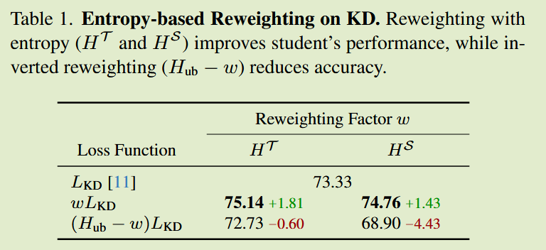
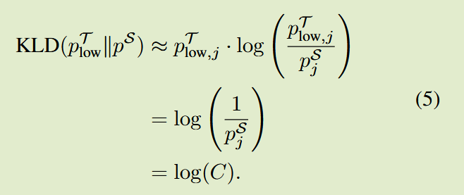
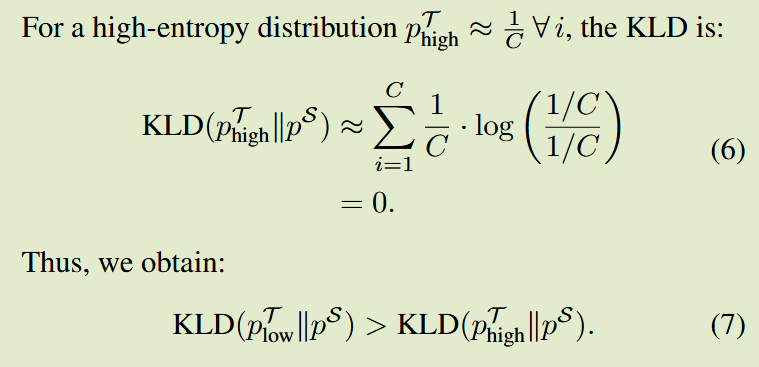
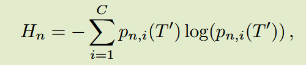
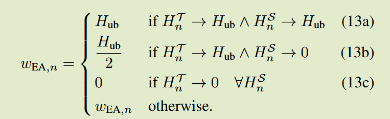
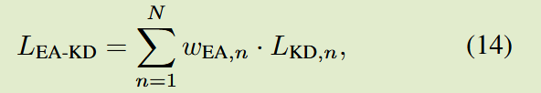

# EA-KD: Entropy-based Adaptive Knowledge Distillation

2025 ICCV

## Introduction

关键问题：大多数蒸馏方法都是均匀蒸馏，忽略了关键样本的作用，从而限制了知识转移的效率

如何识别最有价值的学习样本？熵是信息论的核心概念，量化了随机变量的不确定性或信息，非常适合这个角色

利用熵进行加权验证，并进行反向验证，对高熵施加高权重提高了KD的准确性，施加低权重则导致性能下降，支持了先前的假设。

EAKD解决了标准蒸馏框架的一个基本缺陷，即忽略每个样本的价值而倾向于更简单的知识

主要贡献：

- 在KD中高熵样本携带了关键知识，并提出一个基于熵的加权因子，整合师生模型的熵，提供一个动态的量身定制的学习重点
- 提出EAKD，一种即插即用的KD方法，自适应的重新加权蒸馏损失，优先考虑有价值的样本，来实现更有效和更高效的知识转移

## Method

#### Limitations in Standard KDs

先前方法都统一处理所有样本，忽略它们独特的学习价值，这可能导致模型牺牲更有价值的高熵样本为代价，优先考虑简单样本，让简单样本在损失中占据主导地位

#### Entropy-based Reweighting

我们使用温度$T'$来软化熵，来更好的反映样本的价值

$P_{n, i}(T')$是样本$x_n$类别i的概率分布

为了动态强调有价值的样本，EA-KD的重新加权因子使用两个分量，基本项$w_{base}$和交互项$w_{interact}$，基本项基于教师输出熵捕获每个样本的固有值：
$$
w_{base, n}=H^T_n, H^T_n\in[0, H_{ub}]
$$
$H_{ub}=log(C)$是C个类别的上限

交互熵通过熵归一化乘积来捕获教师和学生之间的相互作用：
$$
w_{interact, n}=\frac{H^T_n·H^S_n}{H_{ub}}, w_{interact, n} \in [0, H_{ub}]
$$
最终重加权因子$w_{EA}$定义为：
$$
w_{EA, n} = \frac{w_{base, n} + w_{interact, n}}{2}, w_{EA, n}\in[0, H_{ub}]
$$

$$
w_{EA, n} = \frac{H_n^T + \frac{H^T_n·H^S_n}{H_{ub}}}{2} = \frac{1}{2}H^T_n(1+\frac{H^S_n}{H_{ub}})
$$

加权因子表示为教师熵和取决于学生熵的缩放因子，可以视为教师对样本的评估，并基于学生的观点进行自适应调整

当教师发现一个高价值样本，即$H^T_n \rightarrow H_{ub}$，如果学生表现不自信，则最大化强调该样本，而学生表现自信时则权重减小一半来保留适度关注，当教师认定样本知识简单，则直接维持较低的权重，因为教师认为该样本缺乏知识。损失定义为：

