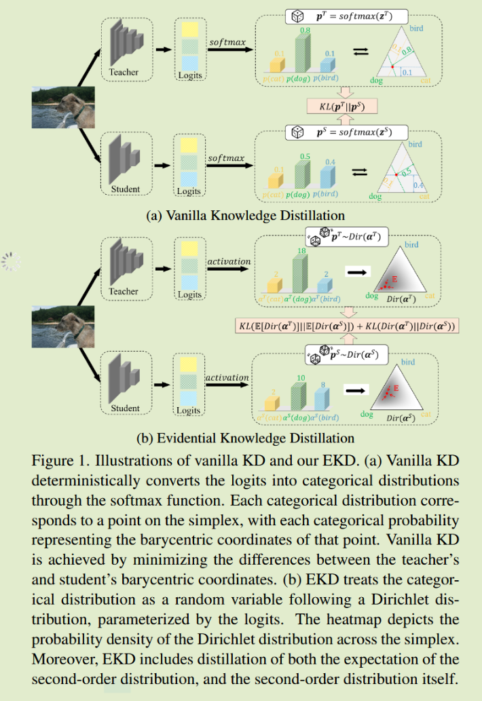
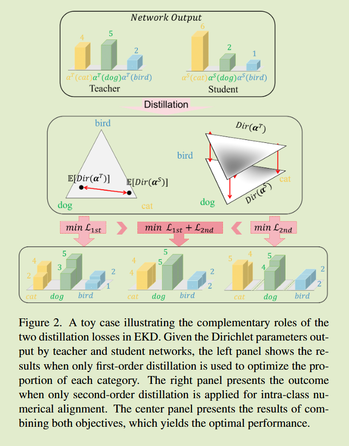
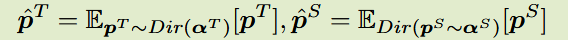
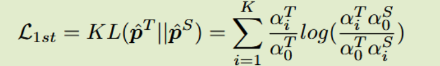
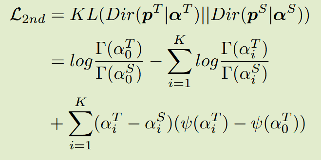

# Evidential Knowledge Distillation 

2025 ICCV   ？

## Introduction

背景与问题：基于logits的蒸馏方法通常采用单确定性分类分布，消除了网络预测中固有的不确定性，限制了知识的有效传递

引入基于分布的概率建模作为网络知识的更全面表示，将分类分布视为随机变量，利用深度神经网络预测分布，将其表示为证据二阶分布

将教师的分布的期望和分布本身提炼给学生，期望捕获分布的宏观特征，分布本身传递分类边界的微观信息

贡献：

- 通过基于分布的概率建模重新定制知识蒸馏中的网络预测，提出EKD，将教师的二阶分布蒸馏到宏观和微观层面上的学生模型中

- 在贝叶斯理论的帮助下，当教师网络的输出视为基本事实时，EKD中的蒸馏目标可以作为学生网络预期风险的上

  

## Method

先前的蒸馏方法通常遵循统一的范式，他们将分类概率视为单一的确定性值，这种假设护士了网络预测的不确定性，限制了更精细信息的共享

我们使用神经网络预测分类分布的分布，作为更稳健的替代方案，特别是将其建模为二阶狄利克雷分布，我们同时对齐一阶分布和二阶分布本身

我们的目标是提取二阶分布的整体特征，以捕获在整个概率分布空间中的一般分布趋势，并实现网络间在最终预测类别上的对齐，给定师生预测的二阶分布$Dir(\alpha^T),Dir(\alpha^S)$, 计算他们的期望，所有可能的分类分布在二阶分布指定权重下相加

上述期望作为教师和学生的最终预测结果，等价于二阶分布的重心，使得通过一阶蒸馏在宏观层面传递全面的概率密度信息成为可能

一阶蒸馏目标仅为学生的二阶分布提供宏观指导，未能准确全面的表示每个类别分布的权重，给定固定的教师分布，最小化上式的学生狄利克雷分布并非唯一，因此我们提出微观二阶蒸馏作为一阶蒸馏的补充，旨在整个概率分布中为学生模型提供细粒度的教师监督信号，我们直接在两个狄利克雷分布之间应用kl散度来实现这一点

这种细致的数值对齐为学生二阶分布中每个点提供相应的教师标签，确保知识在整个分布空间中精确映射，力求在更细微、微观层面复制教师的二阶预测，捕捉教师输出的不确定性

