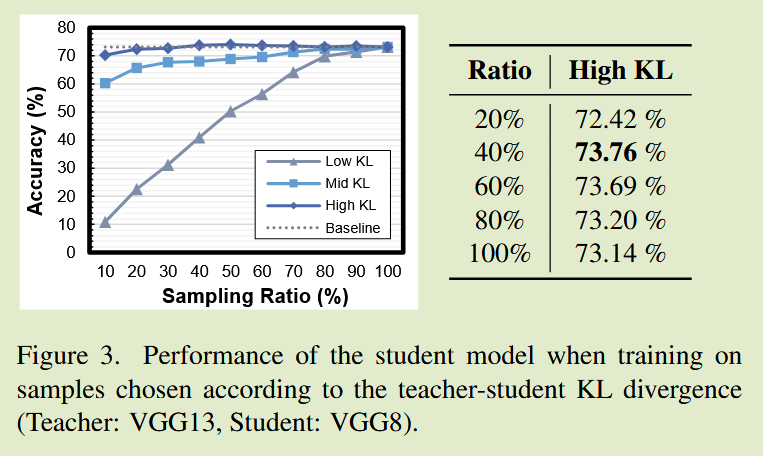
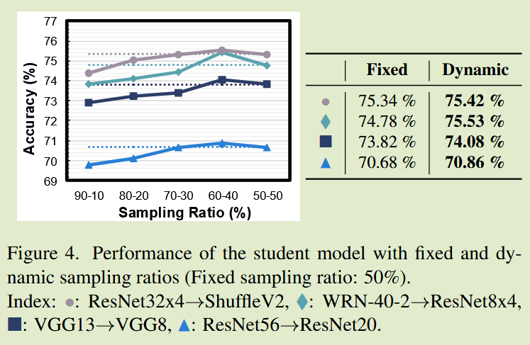
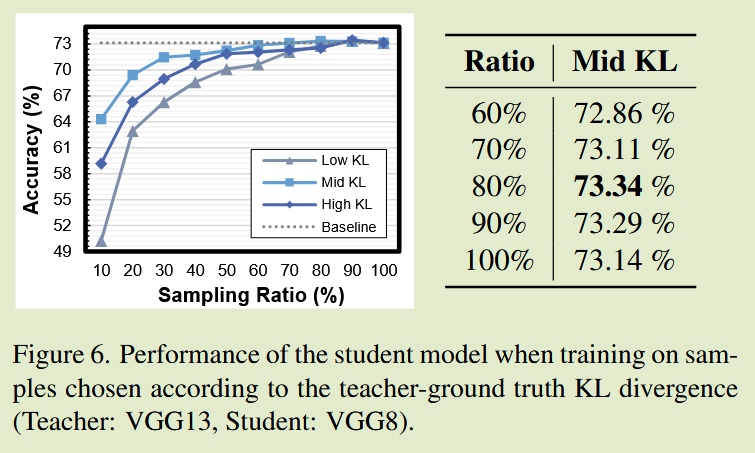
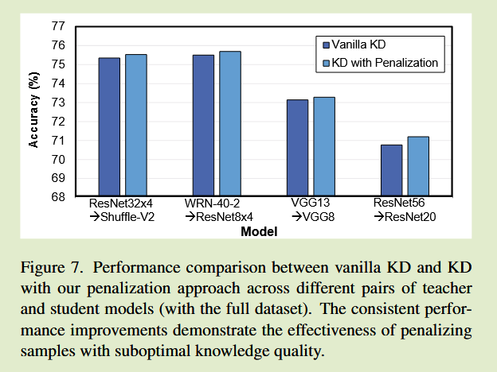
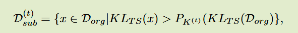
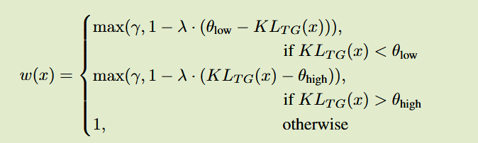
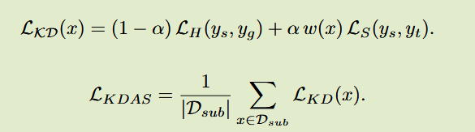
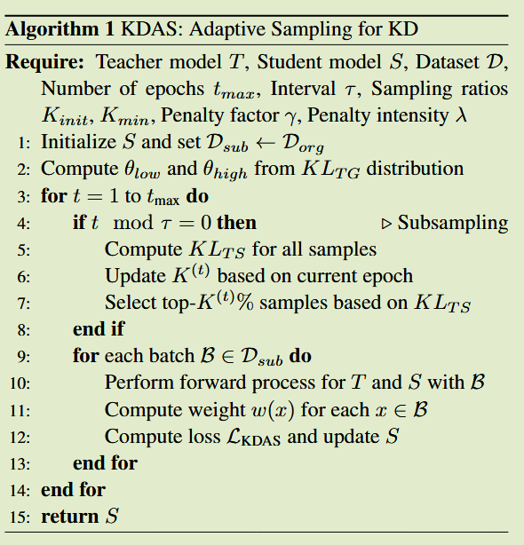

# What to Distill? Fast Knowledge Distillation with Adaptive Sampling

2025ICCV

## Introduction

背景：先前工作研究了如何更好的提取教师模型知识，但是忽略了数据对提取结果的影响

关键问题：没有充分考虑数据在蒸馏过程中的作用，数据的选择很大程度上影响KD的有效性和效率

贡献：

- 从知识数量和质量两个角度分析数据对知识蒸馏的影响
- 设计了一种新的自适应抽样方法，可以结合现有蒸馏方法实现有效和高效的知识蒸馏

## Distillation Efficiency Analysis

知识的数量：如果教师模型和学生模型之间的KL散度差异较大，则意味这教师有更多的知识要转移到学生模型中
$$
KL_{TS} = D_{KL}(P_S || P_T)
$$
知识的质量：如果教师模型和真实标签之间的KL散度太小或太大，则意味着教师模型对学生模型的知识质量较低
$$
KL_{TG} = D_{KL}(P_T||P_G)
$$

- Finding 1: 数量影响。只使用具有高师生KL散度差异的样本能实现相当甚至更好的性能；

KL散度为P相对于Q的相对熵（用学生分布去近似教师分布需要的额外编码代价），反映的是师生之间的信息差：
$$
D_{KL}(P||Q) = H(P, Q) - H(Q)
$$

- Finding 2：课程抽样。KD可以通过渐进的改变采样率来实现更好的性能，而不是使用固定的采样率。
  动态降低采样率能更好的训练学生模型，在早期阶段选择更多的样本是好的，更多的样本具有大量的知识

采样率从60%降到40%，学生模型获得最佳性能

Finding 3: 质量影响。与使用全部样本相比，KD只使用具有中等教师-真实标签KL散度的样本能实现相当或更好的性能

我们假设的是，如果教师与真实标签之间的KL散度太大或太小，知识质量就会降低，太低说明教师与真实标签很相似，很难给出足够的暗知识，太高则说明与真实标签差异太大，可能给出错误知识

结果表明使用具有中间值的$KL_{TG}$的样本进行蒸馏是最有效的，这一发现同样说明了为什么尽管使用了高性能的教授模型，知识蒸馏有时也会失败，问题可能不是教师的绝对准确性，而是其概率分布与真实标签之间的差异，教师分布与真实标签具有一定差异能够提供丰富的额外信息。

Finding 4：惩罚影响。KD可以根据其知识质量惩罚损失函数中的样本，来获得更高的性能

对知识质量高的样本附加更高的权重，能够获得更有效的训练，设定一个阈值范围，通过缩放因子来调整KL损失

四个发现指出，一个理想的蒸馏过程，不仅要选择知识量大的样本，还要根据知识质量来对样本进行校准，本文设计一个自适应的采样过程来加强知识蒸馏的过程。

## Method

### Quantity-based Subsampling 基于数量的子采样

基于Finding 1 2，KDAS根据师生的$KL_{TS}$选择具有高知识量的样本，每$\tau$个epoch，KDAS选择topk%的样本：

$D^{(t)}_{sub}$表示第t个轮次采样的子数据集，$P_{K^{(t)}}$表示 $100-K^{(t)}$的百分数，$K^{(t)} = max(K_{min}, K_{init} -\alpha t)$，实现渐进下降的采样率

这种采样策略需要在每个epoch计算$KL_{TS}$, 为了降低开销每$\tau$轮次计算一次进行二次采样

### Quality-calibrated Loss Weighting 质量校准损失加权

基于Finding 3 4，KDAS基于$KL_{TG}$对每个样本进行加权，设定两个阈值，对低于阈值和高于阈值的样本进行惩罚：

$\lambda, \gamma$分别控制惩罚强度和最小贡献比例，这种损失惩罚次优质量的知识，为了允许逐渐适应，在初期设定一个较小的惩罚系数，在训练期间逐步增加

$L_H,L_S$分别表示应标签和软标签的监督

