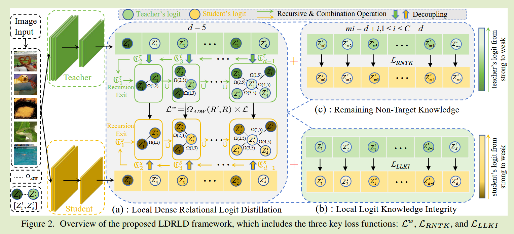
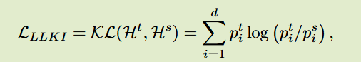
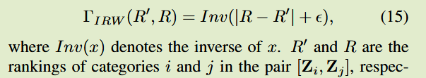
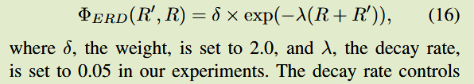
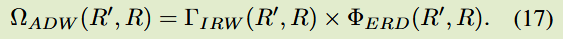
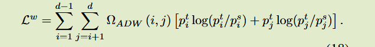
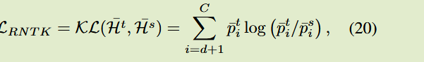
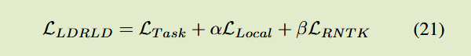

# Local Dense Logit Relations for Enhanced Knowledge Distillation

ICCV 2025

### Introduction

背景：基于Logit的KD方法尽管取得不错的性能，但可能无法充分捕获细粒度的类间关系

关键问题：softmax函数专注于高概率类，会限制捕捉学生捕捉细粒度logits关系的能力；KD建模类关系时会引入来自其他类的冗余信息，这些不相关的冗余信息可能会削弱他们之间的类区分度

本文方案：

- 提出局部稠密关系Logits提取方法LDRLD，递归解耦充足logit知识，为学生模型提供更丰富的信息；
- 我们观察到语义较近的类别更难区分，引入自适应权重衰减策略，给语义相近的类别分配更大的权重促进其学习

## Method

### Local Dense Relational Logit Distillation

我们递归的重组logit知识，定义递归深度d，根据给定样本学生的logit排列选择前d个logit

构建logits对，（最大，次大）（次大，第三大）... 构建相似类别之间的关系

### Local Logit Knowledge Integrity

选择出来的前d个logit构成的特征作蒸馏

### Adaptive Decay Weight Strategy

ADW基于人类对类别相似性感知的策略，继承逆秩加权和指数秩衰减，动态调整权重，为模型更难区分的类别分配更大的权重如$(Z^t_1, Z^t_2)$，而给相关性较低的类别分配更小的权重如$(Z^t_1, Z^t_4)$

#### Inverse Rank Weighting

R为logits大小排名，logits对差距越小的组合，其排名差就越小，常数的逆为倒数，对应的权重值则就越大

#### Exponential Rank Decay

根据上面的公式$(Z^t_1, Z^t_2)$ 与 $(Z^t_{12}, Z^t_{13})$这两组会被分配相同的权重，但是直观上前者要更难区分，因此我们希望前者权重大于后者，提出一种指数排名衰减策略ERD

通过这两种策略的组合，越靠后的组合会得到更小的权重，应用到eq13：

### Remaining Non-Target Knowledge

针对剩余的非目标类别，同样得以利用，对他们计算KL散度损失

总损失表示为：

