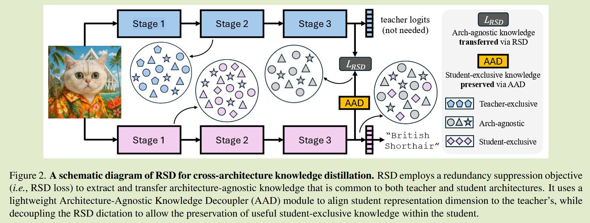
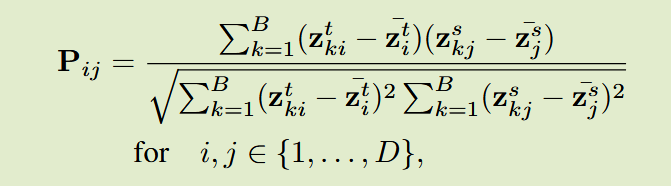
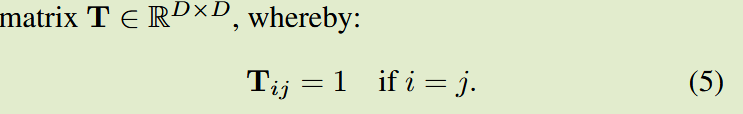
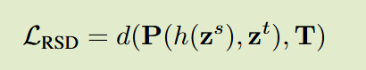

# Cross-Architecture Distillation Made Simple with Redundancy Suppression

 ICCV 2025

## Introduction

背景：先前针对同构设计的蒸馏算法应用到异构师生模型架构中效果欠佳

关键问题：OFA将特征投射到logits空间会丢失关键信息；OFA引入的额外参数非常庞大，远超于轻量学生模型

本文贡献：

- 提出一个基于信息最大化和特征去相关目标的冗余抑制准则；
- 适度保留学生的固有特征有利于跨架构蒸馏；
- 相较于OFA，极大减小了额外参数的数量

## Method

#### A redundancy suppression prespective to CAKD

当输入相同的训练数据时，教师和学生产生的表征虽然相差很大，但也编码了相同数据对应的语义信息。

我们期望这些信息只与输入有关而独立于模型架构。然而这些潜在的架构无关知识是与架构相关知识混合在各自表示中的

我们希望学生模型能够掌握这些架构无关的知识，这样在推广到任意的异构教师模型时，不会被其特定的模式所干扰。

因此我们通过抑制冗余的架构特征或不相关的信息来提取他们的共性。

#### Extracting common knowledge between teacher and student

我们利用异构表示的特征单元之间的相关性来学习架构无关的表示，构建教师表征和学生表征的特征单元对之间的皮尔森相关系数矩阵：

P捕捉到了教师模型和学生模型特征对在批次中的激活模式相似性，我们希望相同特征单元其相似性趋向于1，引入一个目标矩阵T

同时我们通过去相关来进一步去除冗余，我们最小化么个学生特征单元与其他教师特征单元之间的互信息，来抑制空间中的冗余表达，这会促使P中非对焦元素为0

注意这里师生维度是相同的，下一个模块会处理学生特征维度与教师对齐

#### Retaining exclusive knowledge of the student

理想情况下我们描述的冗余抑制机制将抑制任何教师或学生模型的专有知识，而我们希望适度保留一些学生的独特表示模式，例如卷积模型中针对局部特征的显著激活，这种归纳偏差在ViT等教师中是没有的，保留学生模型的这种能力将会是有益的

因此我们设计了一个缓冲器h，AAD模块用于从架构无关的信息提取中缓冲学生模型的内部表示，防止学生模型完全由RSD控制，AAD模块由两个FC层组成，第一个将学生模型特征扩展到更高维度，第二个将扩展后的特征对齐到教师特征维度

AAD对齐了师生模型特征维度；并将学生内部表示与RSD提取的不变表示进行了合并，以保留了学生专有知识

