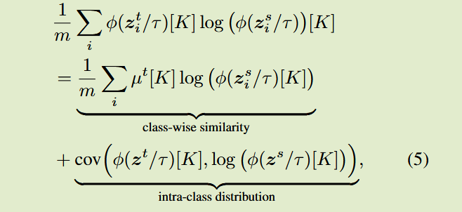
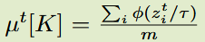
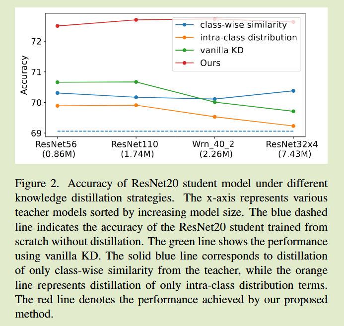
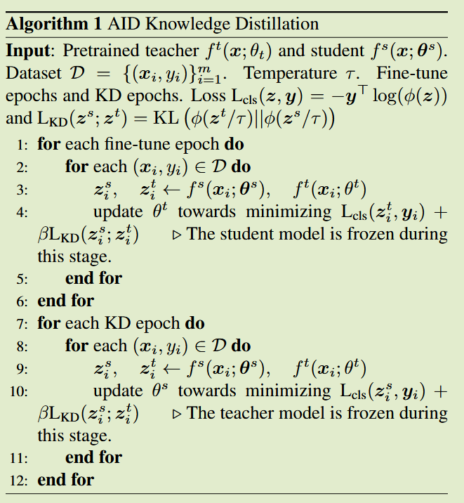

# A Good Teacher Adapts Their Knowledge for Distillation

ICCV 2025

## Introduction

**背景：**师生模型之间的性能差距会影响蒸馏的效果，先前方法引入了中等大小的辅助模型；

**关键问题：**引入辅助模型会带来额外的计算开销；

**本文解决方案：**

- 教师模型自适应的调整知识来迎合轻量的学生模型的分布；
- 分析了KL散度传递暗知识本质，将蒸馏损失分为类间相似度和类内分布；
- 在训练前微调教师模型以生成更适宜的类内差异分布，促进学生模型学习

## Method 

#### class-wise similarity

均值预测$\mu^t[K]$在训练过程中为常量，可以看作是针对每一个类别的标签平滑，不同于标准的标签平滑，会给相似类别一个更高的权重，例如针对汽车类别，分配给摩托车的概率会比狗等无关类别更高。

#### Intra-class distribution

类内分布揭示模型如何将预测概率分配给同一类内样本，有效表明了每个样本的相对难度；例如猫的清晰图像，和带着狗头的猫图像，尽管教师模型能够将两者都分类为猫，但是对前者教师会表现出更高的信心

一个大型教师，能捕获更广泛的特征，其中包括有助于区分噪声图像的方法；而中等大小的辅助模型，可能会与这些图像斗争，由于噪声而分配较低的概率；学生模型是一个小模型，从一个大老师那里学到的高概率预测可能会误导训练，他们可能会试图模仿这些教师过度自信但学生模型本身看起来不太可靠的预测。

#### The contribution of each term

分别利用解耦后的KD损失进行分别训练来进行验证

根据消融的结果可以看出，模型差距与class-wise项无关，在模型规模增加时其仍保持平稳，而intra-class distribution则在模型规模增加时性能表现出下降。

更大的教师模型由于其提取多样化特征的能力更强，往往在具有挑战性的样本上表现出更高的置信度，而这些样本往往会误导更小的模型。这些高性能教师指导学生模型时会鼓励其模仿不适合他们能力的类别内分布，从而导致了其性能缺口。

先前方法为了更好的让学生模型匹配而重新训练了教师模型，这引入了巨大的计算开销。我们引入了一种不需要大量重训练的情况下微调教师输出分布的方法，提供了一种新的思路。

### Adjust Teacher Intra-class Distribution

我们在进行KD之前对预训练的教师模型进行微调，以调整其类内分布，来适应小规模的学生模型。

利用一个经过训练的学生模型，对教师模型进行微调，来产生更合适的类内分布，应用标准蒸馏损失+交叉熵作为损失函数；此过程观察到师生预测的互协方差提升。

