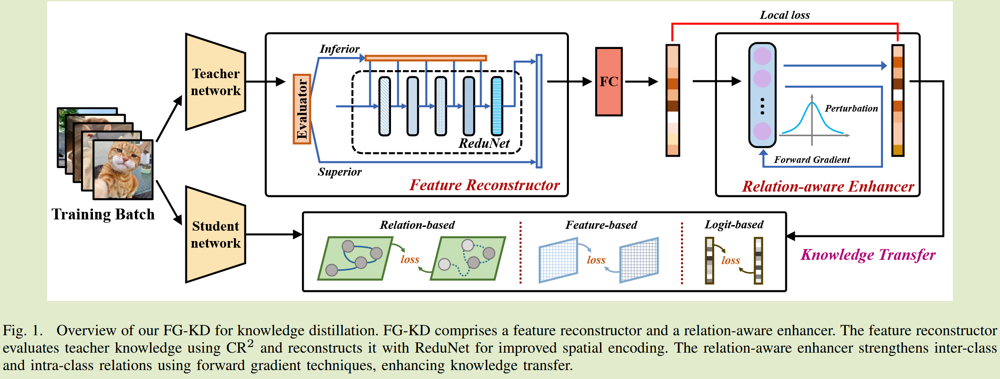

# FG-KD: A Novel Forward Gradient-Based Framework for Teacher Knowledge Augmentation

## Introduction

先前工作致力于对齐教师和学生的知识和提高教师知识的质量；我们提出一种基于正向梯度的新型蒸馏框架，旨在释放教师知识的潜在潜力，FG-KD包括两个基于前向梯度的过程，以增强教师在特征和logit级别的知识。

特征级别使用一个特征重构器，使用CR2指标评估教师的知识质量，然后使用ReduNet重建教师知识，完善其空间编码表示，提高教师知识的整体质量；在logit级别，引入一个关系感知增强算子，应用权重扰动的正向梯度技术和局部损失函数，加强类别之间的关系，同时最大限度的减少同类别内的关系，从而改善了教师知识的类间和类内关系，通过结合这些，FG-KD提高了教师的知识质量和有效性

FG-KD的一个关键特征是他专注于从空间编码和数据关系角度优化教师知识表示，从而提高其质量，这种方法增强了教师的可转移知识，独立于教师模型设计活知识转移的过程，因此FG-KD与任何现有的蒸馏算法无缝集成，确保与各种蒸馏技术的兼容性。

- 提出FG-KD，基于前向梯度的方法，通过从空间编码和数据关系角度改进数据表示来增强教师知识；
- 引入了功能重构器和关系感知增强器，精炼教师知识以获得更好的蒸馏；
- FG-KD可以在各种蒸馏算法和模型架构中无缝集成

### Method

