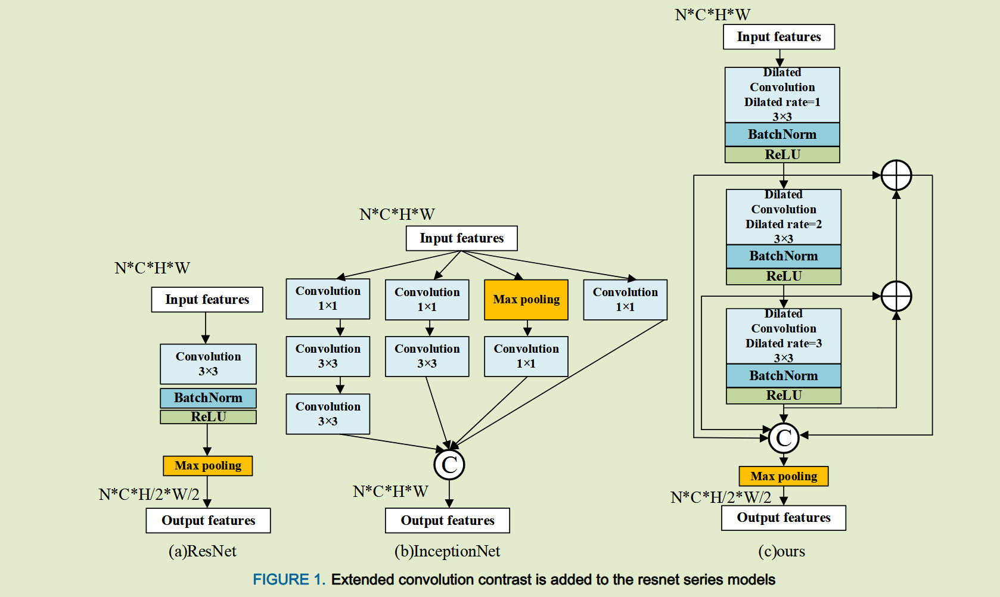
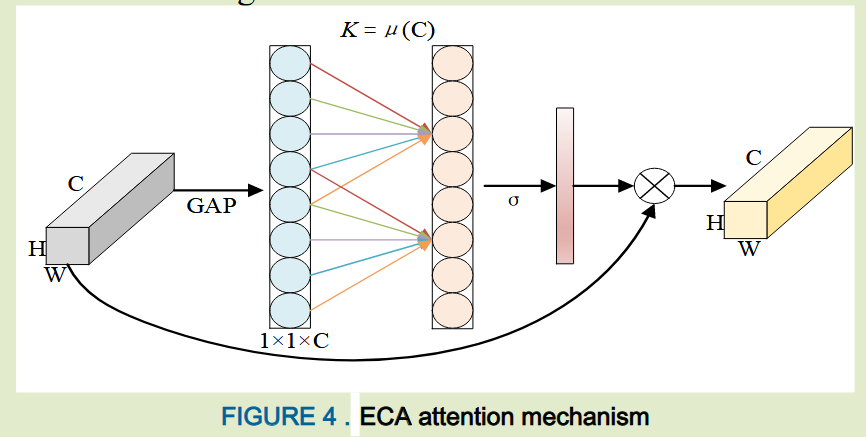

# The impact of integrating shallow and deep information on knowledge distillation

这篇写的很垃圾 没啥东西

## Introduction 

我们发现ResNet在从图像中提取浅层信息方面存在不足，这会影响相应学生模型的性能， 浅层信息通过帮助模型更好的理解图像的局部结构，在神经网络特征提取中起到至关重要的作用；虽然ResNet在通过残差连接处理高级语义特征方面取得重大成功，但是他们缺乏主动关注特征图中重要特征的能力。

- 引入一种浅层特征提取模块，增强了对浅层信息的多尺度关注，从而促进了从特征图中提取更细微的浅层特征
- 为了增强ResNet模型关注重要信息和解决与现有注意力机制相关的普遍问题的能力，我们提出了全维感知FDP注意力模块，旨在感知特征映射各个维度的信息，并从每个维度显示建模特征，提高特征利用率

### Method

#### Shallow Feature Extraction

我们利用空洞卷积来获得特征图，其通过扩张率来控制感受野的大小而无需增加参数数量，相比之下标注卷积需要更大的核来获得更大的感受野，这会导致参数数量增加。（引入空洞卷积替换原来的卷积来增大感受野）

#### The Full-Dimensional Perception Attention Mechanism

ECA efficient channel attention, 高效的通道注意力块，采用一维卷积来确定通道之间的交互。

我们基于ECA注意力构建全维感知注意力机制，利用ECA来感知通道维度信息，与使用全连接层来学习跨通道交互的SE注意力机制不同，ECA利用一维卷积对输入特征图的通道维度进行建模，这样不仅减少了计算开销，而且在卷积期间计算量通道注意力，最大限度的减少了冗余信息提高了计算效率

