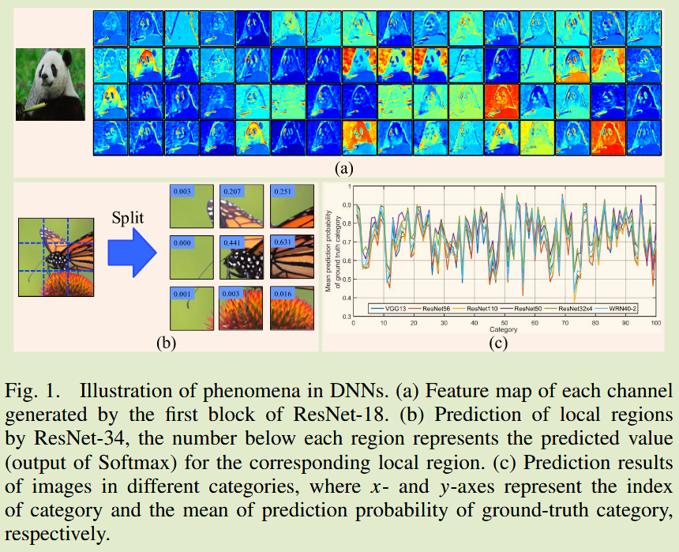
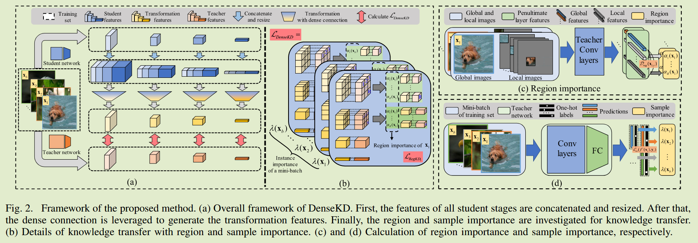
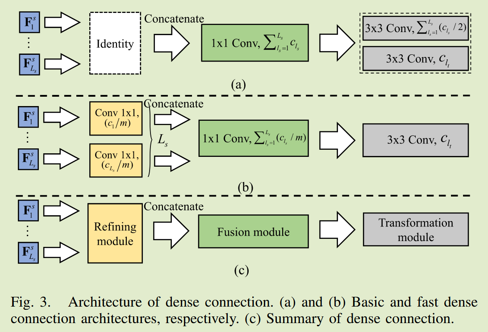
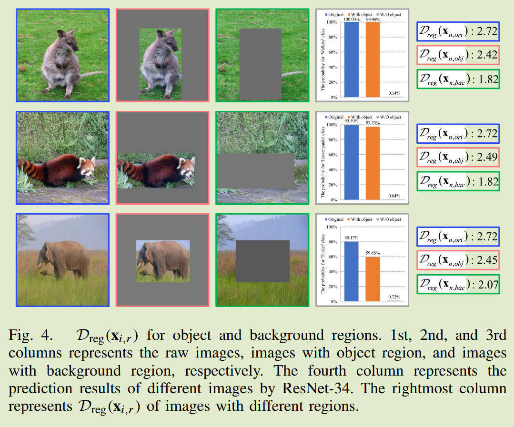
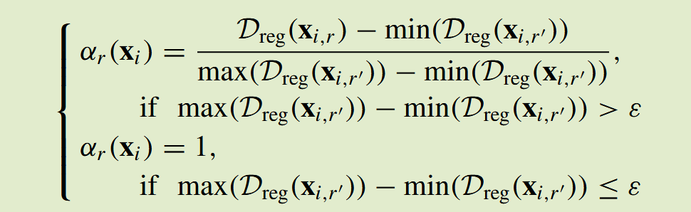
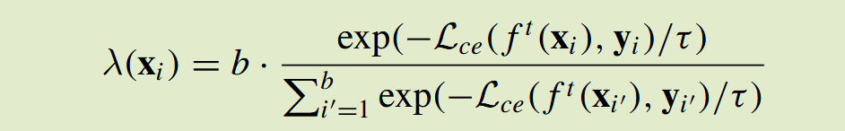

# DenseKD: Dense Knowledge Distillation by Exploiting Region and Sample Importance

密集蒸馏策略：每个学生模型特征图通道都能灵活的从教师模型特征图中学习；

区域重要性选择策略：倒数第二层特征与gt比较

样本重要性选择策略：利用交叉熵判断模型对样本的置信度计算重要性

## Introduction

跨层蒸馏CKD先前方法通过选择教师的粗粒度阶段特征来教授学生，导致通道对齐不当，这些方法中的大多数对所有知识进行统一蒸馏，限制了学生更多关注重要知识。

我们构建了可学习的密集框架，是每个学生的每个通道都能灵活的从教师那里捕获更多元的通道特征

问题：

- 粗粒度蒸馏位置选择：先前跨层蒸馏方法进行阶段性选择，以匹配具有单个教师特征的多个学生特征，然而，如上图a所示，DNN中每个阶段的通道特征是多种多样的，倾向于灵活的捕捉教师模型中不同阶段的通道特征。分阶段选择对同一阶段中的所有特征执行相同的操作，然后任何通道的知识传递都会收到同阶段其他通道的限制，导致特征对齐不准确；
- 所有区域均匀蒸馏：一些方法忽略了不同局部区域对知识转移的影响，如上图b所示，同一样本中的不同区域在对象识别中骑着不同的作用，因此他们往往具有不同的潜力来指导学生模型的学习，并且所有区域的统一蒸馏使学生模型无法捕捉到不同区域的差异；
- 所有样本均匀蒸馏：对于分类任务中的KD，大量方法认为所有样本对特招生转移的影响相同，然而如上图c所示，DNN表现出对不同类别的样本进行分类的不同能力，这表明网络对不同样本具有不同的特征提取能力，因此数据集中的不同样本具有不同的蒸馏指导潜力，以统一的方式传输所有样本会限制学生网络从重要样本中获取信息

为解决上述问题，本文提出一种细粒度密集跨层知识蒸馏DenseKD，并研究了特征对齐过程中的区域和样本的重要性：

- 提出一种可学习的密集连接，以在自适应和细粒度的方案中准确执行跨层蒸馏；
- 通过教师特征的变化计算区域重要性用于研究不同区域对蒸馏的指导潜力；
- 利用教师损失计算样本的重要性来说明不同样本的蒸馏指导潜力

## Method

#### Distillation with Dense Connection  密集连接蒸馏

CKD方法选择教师的多阶段特征来监督学生模型的每个阶段的学习，CKD损失可以表示为：
$$
L_{CKD_i} = \sum^{L_s}_{l_s=1}\sum^{L_t}_{l_t=1}D(T^t_{l_t}(F^t_{l_t}(x_i)), T^s_{l_s}(F^s_{l_s}(x_i)))
$$
交换师生模型求和顺序，重写上式：
$$
L_{CKD_i} = \sum^{L_t}_{l_t=1}\sum^{L_s}_{l_s=1}D(T^t_{l_t}(F^t_{l_t}(x_i)), T^s_{l_s}(F^s_{l_s}(x_i)))
$$
上式表明每个教师阶段的特征可以指导学生的多阶段学习，学生同一阶段的通道性特征可以被教师不同阶段的通道性特征所监督，因此先前的阶段性选择忽略了同一阶段特征的多样性，导致师生对之间的蒸馏路径不一致。因此我们构建了可学习的密集架构，以细粒度的方式将学生的多个阶段与每个阶段的教师相匹配。

构建的连接需要对不同学生阶段每个频道的特征进行选择、融合和变换，以匹配第l层教师特征，利用1x1卷积来选择和融合学生特征，该层的输入和输出$\sum^{L_s}_{l_s=1}c_{l_s}$,使用3x3卷积层来转换特征，这种架构对于各阶段通道较少的学生模型很有帮助，如图a；但是对于具有大量通道的复杂模型，训练非常耗时。

为了减少这种蒸馏组合知识对齐凯西奥，在选择和融合层之前为每个阶段特征插入一个1x1的卷积层，以减少每个阶段输出的通道数，阶段$l_t$的输入和输出通道为$c_{l_s}, c_{l_s}/m$，转换层之前的参数数量变为$(1/m)·(\sum^{L_s}_{l_s=1}c^2_{l_s}/(\sum^{L_s}_{l_s=1}c_{l_s})^2 + (1/m^2))$,另外还通过使用一层3x3卷积在快速密集连接中进行转换，进一步减少了计算量，如图b

图c总结了密集连接架构，归纳为三部分。精炼模块由多组1x1卷积组成，降低了输出维度，并提纯了每个学生阶段的特征；融合模块包含单层1x1卷积，用于选择和融合所有层的特征；具有3x3卷积的转换模块将融合的多阶段学生特征与教师特征对齐，具有密集连接的蒸馏损失可以表示为：
$$
L_{DKD_i}=\sum^{L_t}_{l_t=1}D(F^t_{l_t}(x_i), \widehat{F^s_{l_t}(x_i)})\\
\widehat{F^s_{l_t}(x_i)}=T^s_{l_t}(F^s_1(x_i);...;F^s_{L_s}(x_i))
$$

#### Distillation by Exploiting Region Importance 利用区域重要性进行蒸馏

上式研究每层特征的多样性，并进行细粒度的跨层蒸馏，他仍然平等的转移特征的所有局部区域，然而特征的不同区域在分类中起着不同的作用，因此往往具有不同的知识转移指导潜力，我们考虑了不同区域的重要性，蒸馏损失表示为：
$$
L_{RegKD_i} = \sum^L_{l_t=1}\sum^R_{r=1}\alpha_r(x_i)·D(F^t_{l_t, r}(x_i), \widehat{F^s_{l_t, r}(x_i)})
$$
其中$F^t_{l_t, r}(x_i), \widehat{F^s_{l_t, r}(x_i)}$表示由xi生成的特征图的第r个局部区域，$\alpha_r(x_i)$表示其重要性。

为了计算重要性，使用教师模型分别生成局部区域和原始图像的倒数第二层特征，计算局部区域特征和图像特征之间的差异来展示不同区域的影响，当局部区域的倒数第二层特征与gt编码相差很大时，对应局部区域几乎不会影响网络性能，可以减少该区域的知识转移，当局部区域和原始图像获得相似的倒数第二层特征时，相应区域包含有用的特征，因此这部分更为重要：
$$
D_{reg}(x_i, r)=exp(<\overline{F^t_{L_t}(x_{i, r})}, \overline{F^t_{L_t}(x_{i})}>)
$$

对象区域包含更多有用的功能，因此Dreg值更大，如上图所示，区域重要性计算如下：

#### Distillation by Exploiting Sample Importance 利用样本重要性进行蒸馏

预测概率可以代表模型能力，并且模型在讲样本分为不同类别时表现出不同的能力，推断不同样本的置信度是可变的导致对不同样本蒸馏指导能力不同。

我们改写了均匀蒸馏损失，表示为：
$$
L_{InsKD} = \sum^b_{i=1}\lambda(x_i) ·L_{RegKD_i}
$$
其中$\lambda(x_i)$表示为minibatch中样本xi的重要性，我们对教师模型中置信度较高的样本进行更强的迁移，样本重要性计算如下：

### 总体损失

$$
L= L_{task} + \beta\sum^b_{i=1}\lambda(i)\sum^{L_t}_{l_t=1}D(MF^t_{l_t}(i), MF^s_{l_t}(i)) \\
MF^t_{l_t}(i) = M_{l_t}(i) \odot F^t_{l_t}(i) \\
MF^s_{l_t}(i) = M_{l_t}(i) \odot \widehat{F^s_{l_t}(i)}
$$

