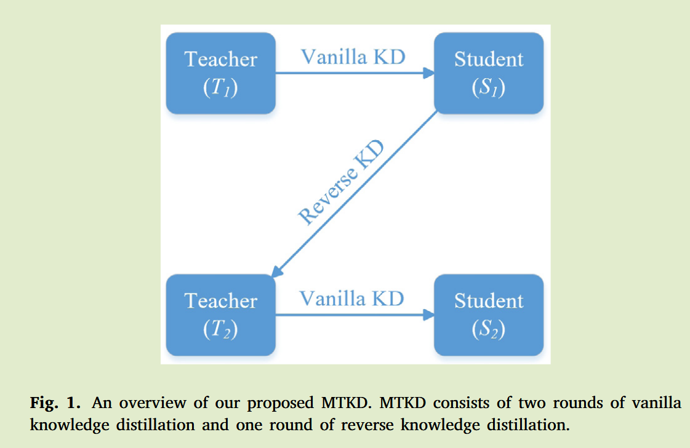
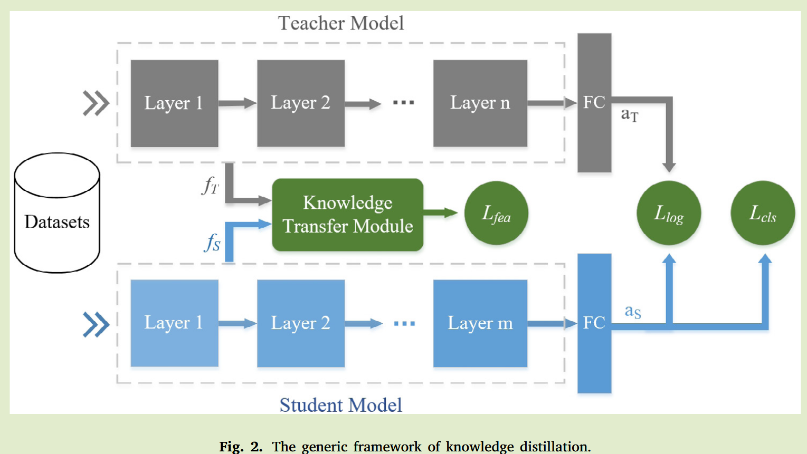
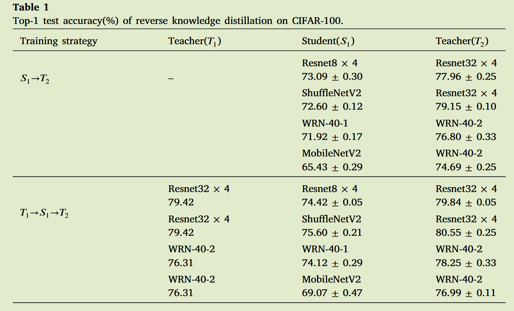
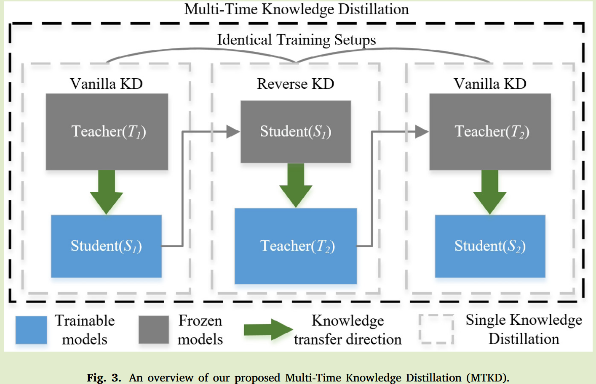

# Mulit-Time Knowledge Distillation

2025 Neurocomputing	no code	-	20250512

## Introduction

先前工作中，知识流向始终是从教师到学生，整个蒸馏过程中只执行一次，基于上述现象，我们提出两个想法，首先是反转知识的转移方向，不在局限于使用大型模型来指导小模型训练。这种修改使小模型能够辅助大模型的训练，本质上时将知识蒸馏视为一种辅助训练方法；第二种是将知识蒸馏从一次迭代扩展到多次迭代，其中教师和学生模型交替作为被训练的模型，这种多次蒸馏可能会进一步探索知识蒸馏的潜在性能。

- 我们探索了反向知识蒸馏，发现通过原版知识蒸馏获得的学生模型可以在不调整超参数的情况下提高教师模型的泛化性能
- 我们通过将原版知识蒸馏与反向知识蒸馏相结合来设计MTKD，将知识蒸馏扩展到多次

### Method

#### Reverse knowledge distillation

 知识蒸馏不会像模型剪枝或网络量化那样压缩模型，利用教师模型帮助训练学生模型，使学生模型能够获得比单独直接训练更好的性能。这启发我们设计采用学生模型来指导教师模型的实验，这被称为反向知识蒸馏（reverse KD）。

人们可能会直觉的认为使用学生模型来指导教师模型会导致性能下降，但现实并不完全符合这种预期，实验表明通过预训练的学生模型指导教师模型学习，教师模型会表现出性能下降，而通过蒸馏获得的学生模型来指导教师模型，教师模型性能会得到提高。

#### Multi-time knowledge distillation

反向KD的相关实验证明了学生模型为教师模型提供反向指导的可行性，这意味着学生模型和教师模型都可以作为知识传递器，即知识蒸馏中的知识转移不受模型大小的限制，因此提出多次知识蒸馏MTKD：

1. 使用预训练的教师模型T1来指导学生模型S1训练，与经典KD一致
2. S1被冻结用于为教师模型T2提供反向指导，从而产生更鲁棒的教师模型，对应于反向KD部分
3. 利用T2指导学生模型S2的训练，与经典KD一致

MTKD中S1与S2，T1与T2的结构是一致的，为了将经典KD算法复杂度低的优势扩展到MTKD中，我们为反向KD和经典KD设置相同的训练设置。因此在训练时在原有框架的基础上不需要调整，也不需要调参和额外的模块。

MTKD以增加训练时间为代价换取的低算法复杂度，由于教师模型通常比学生模型拥有更多的参数，因此反向蒸馏通常比经典蒸馏耗时更长，MTKD比KD训练时间至少是3倍.