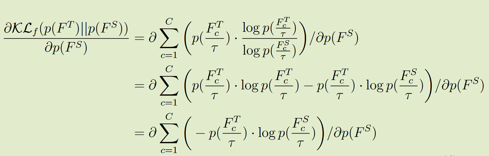
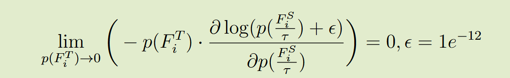
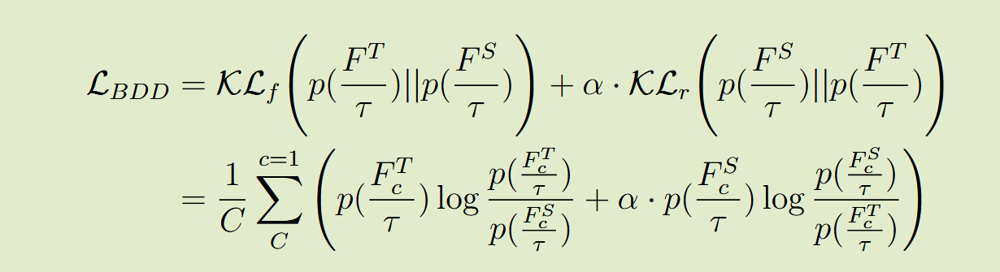
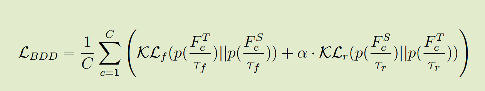
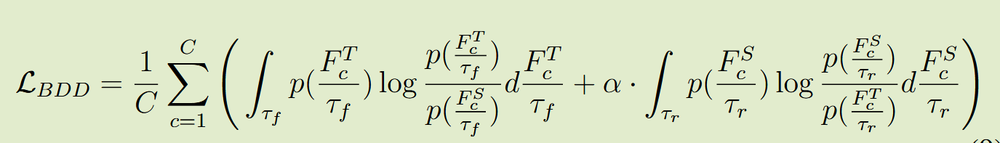

# Balance Divergence for Knowledge Distillation

2025 arXiv	no code	-	20250507

提出了通过正反KL散度来加强暗知识中极小概率类别的计算。

## Introduction 

现有蒸馏方法可能会忽略教师暗知识的负面部分，因为kl散度差异计算可能会忽略教师模型logit输出的微小的概率影响，这些微小的负面下过可能导致学生模型获得的知识失衡，我们研究了这种不平衡的影响，并提出了一种称之为平衡散度蒸馏的框架，使用反向KL散度引入补偿性操作，能够改善对负值极小值的建模能力并保留正值的学习能力。

我们研究了KL散度的计算过程，发现KL散度计算往往更关注教师的较高概率输出而忽略了极小值的计算，这种潜在的偏差可能会阻碍学生网络准确捕获教师的所有输出信息的能力。

- 证明了KL散度中存在不平衡问题，提出正向和反向的BDD方法，有效解决不平衡问题。
- 进一步探索正向和反向KL散度之间的温度系数协调机制，并研究了不同注意力输出的改进，这些改进可能增强解决不平衡问题的能力

## Method

#### Balance Divergence Distillation 平衡散度蒸馏

 由于torch中存在0避免特性，会添加一个非常小的值（1e-12），这可能打破知识的平衡

正向KL散度的这种特点意味着学生网络可能会过度拟合教师的正样本而忽略负样本，从而导致正负样本学习不平衡，尤其是一个经过良好训练的预训练的教师网络可以准确预测，通常只会产生极小的负值，这可能会导致学生难以从负样本中学习。

为了解决这个不平衡的问题，我们的平衡散度蒸馏损失采用反向KL散度，来补充正向KL散度，解决正负样本之间的不平衡。损失函数定义为：

其中包含正样本和负样本的平衡损失，正向KL散度侧重于大概率，而反向更侧重于极小的概率（教师输出处于log中，会被放大成很大的值），因此当教师模型输出概率非常小时，学生的概率在反向KL散度中不受影响，因此BDD解决了在正向KL散度中观察到的正样本和负样本之间的不平衡问题。

#### Balance of Temperature Between Forward and Reverse 正向和反向之间的温度平衡

我们实验发现，正向和反向的KL散度简单求和并没有产生最佳结果。我们发现尽管反向KL会促进负样本的采样，但当师生模型输出都很高时，正样本的计算值也可能会增加。

受温度系数的启发，如果不需要额外的监控信息，可以通过调整温度系数来实现正样本和负样本之间的平衡，因此我们使用不同温度作为增强平衡的一种形式来增强BDD损失：

正向KL温度高而反向KL温度低时会，会进一步减弱对正样本的惩罚而加强对负样本的惩罚；反之正向KL温度低而反向KL温度高则会减少对负样本的惩罚而加强对正样本的惩罚，通过不同的温度系数能够实现更精细的平衡，为了简化计算，温度在散度计算中累计为积分项：

实验表明，在resnet这种容量更大的模型中，教师网络实现了更高的准确性，需要在正向过程进行更温和的监督，强调反向过程的最小值学习，因此将正向温度设置为较小值而反向温度设置为较大值；而对于vgg这种简单结构，教师准确率相对较低，因此选择较大的正向温度和较小的反向温度来强调正样本。