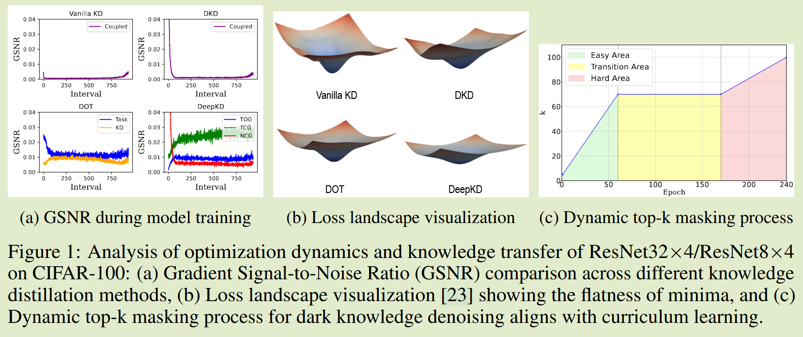
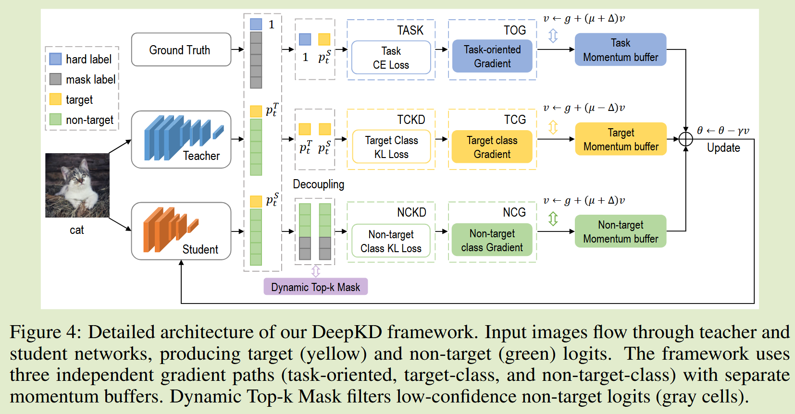
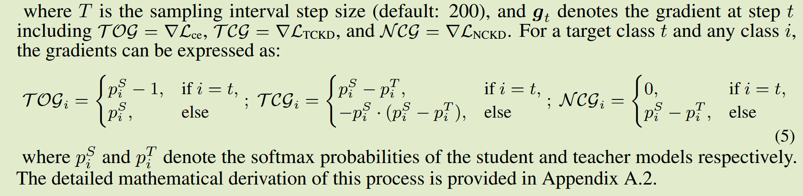
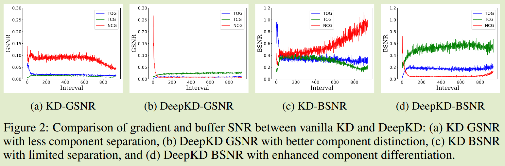
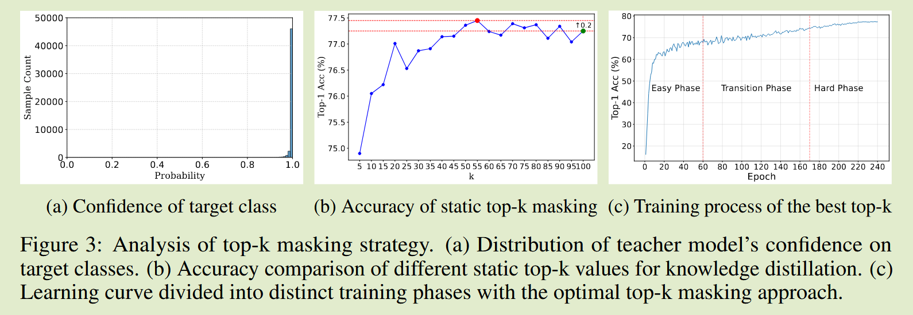
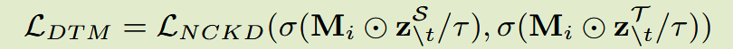
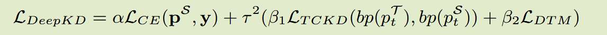

# DeepKD: A Deeply Decoupled and Denoised Knowledge Distillation Trainer

arXiv 25.05

## Introduction 

现有方法缺乏对两个基本问题的系统分析：知识转移的哪些部分有助于学生的表现？在优化过程中如何以最佳方式协调不同的知识组件？

先前工作DKD通过损失函数重新参数化将KD损失解耦为目标类知识蒸馏TCKD和非目标类知识蒸馏NCKD，揭示NCKD在暗知识转移的关键作用；DOT引入任务和蒸馏损失之间的梯度栋梁解耦。

现有工作无法解决解耦损失以及其相应梯度动量联合优化问题，其次栋梁分类的理论基础缺乏严格的论证，而是依赖于对损失函数的观察。

因此我们提出DeepKD，这是一个具备理论基础特征的知识蒸馏框架，我们发现具有动量的随机梯度嘉奖优化器，面向任务的梯度、目标类梯度和非目标类梯度与他们梯度的信噪比呈正相关，这样可以跨不同知识类型对优化动力学进行深度解耦。

我们提出两个关键见解：

- 只有语义上与目标类相邻的非目标类才能提供有意义且名副其实的黑暗知识；
- 低置信度logit可能会引入超过其价值的噪声

## Method

#### GSNR驱动的动量分配

我们引入双级解耦策略，进一步将学生模型的训练损失梯度分解为三部分：面向任务的梯度TOG、目标类梯度TCG和非目标类梯度NCG，梯度信噪比GSNR定义为：
$$
GSNR = \frac{||E[\nabla L]||^2_2}{VAR[\nabla L]}=\frac{||E[g]||^2_2}{E[||g-E[g]||^2]}\approx\frac{||\frac{1}{T}\sum^T_{t=1}g_t||^2_2}{\frac{1}{T}\sum^T_{t=1}||g_t - \frac{1}{T}\sum^T_{t=1}g_t||^2}
$$

SGD动量表示为：
$$
v_{t+1}=g_t+\mu v_t;\ \theta_{t+1}=\theta_t - \gamma v_t
$$
其中$v_t,\theta_t$表示动量缓冲区和模型在时间步t的可训练参数，$g_t, \mu$分别为当前梯度和基本动量系数，$\gamma$是学习率，我们发现与TCG相比，NCG和TOG有更高的GSNR，因此：
$$
v_{TOG} = TOG + (\mu+\Delta)v_{TOG};\ v_{TCG} = TCG + (\mu - \Delta)v_{TCG}; \ v_{NCG} + (\mu + \Delta)v_{NCG}
$$

$\Delta$为超参数，控制动量差。我们的GSNR驱动方法可以确保每个知识组件都遵循最佳优化路径，同时保持组件独立性。

#### 动态top-k掩码

- 教师模型表现出极高的置信度，而非目标类总体表现出低置信度，但包含有价值的暗知识；
- 来自非目标类的暗指是表现出不同程度的可同化性

为了解决上述问题，开发了一种静态topk掩码方法，通过固定的k值永久过滤具有极端语义差异的类，得到了b的结果，进而设计了更复杂的机制，在课程学习的启发下实现分阶段k值，通过准确度曲线区分三个不同的阶段

- 简单学习阶段：K从课程总数的5%线性增加到最佳静态K值；
- 过度阶段：保持最佳静态K值；
- 困难阶段：线性扩展K以包含整个课程数量

最佳静态K值利用20%训练数据来降低训练成本，通过消融实验获得，掩码计算：
$$
M_i = I(rank(z^T_{ \textbackslash t}) \leq K_i )
$$

#### DeepKD Framework

如框架图所示，损失表示为：

