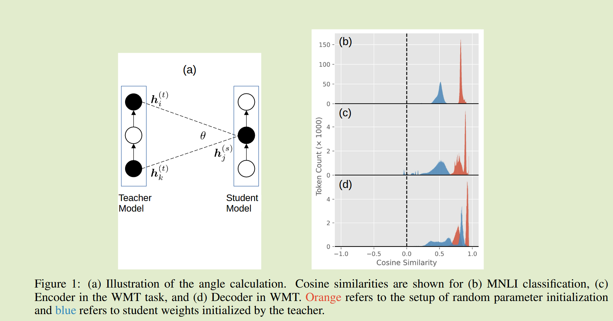

# Revisiting Intermediate-Layer Matching in Knowledge Distillation: Layer-Selection Strategy Doesn't Matter (Much)

## Introduction

在中间层蒸馏中，看似荒谬的匹配策略，例如反向匹配教师模型的特征图，仍能够产生良好的表现。对于图层选择的最佳策略缺乏共识，不同的策略通常会导致出乎意料的相似性能。

我们观察到一个有趣的现象，层选择策略对KD的中间层匹配没有很大影响，即使是相反顺序的匹配，也会产生与正相匹配相似的性能；同时我们也观察到，与没有中间层特征相比，具有中间层匹配的蒸馏对KD更有帮助。

### Method

#### Layer-Selection Strategies

中间层匹配需要一种策略来选择哪些教师层与哪些学生层匹配，我们研究了以下选择策略：

- 正向匹配：较低的学生层与较低的教师层匹配，选择均匀的分布的教师特征层匹配；
- All-to-one 匹配：所有学生层与同一个教师层进行匹配；
- 反向匹配：较低的学生层与较高的教师层进行匹配；
- 随机匹配：选择与正向匹配相同的教师层，然后打乱顺序进行匹配

### Result

我们的结果表明，学生模型在不同策略中取得了相似的结果。反向匹配和随机匹配看似没有任何意义，但是其达到了与正向匹配相似的性能，均优于无匹配的情况，层的选择策略对结果出乎意料的小，层选择方法并不重要

为什么中间层匹配会对KD有帮助，而不同层选择策略性能相似？

我们测量了两个教师层和一个学生层之间的角度，随机初始化和权重复制的设定下，其余弦相似度均为正值，这表明角度大多数是尖锐的，换句话说，无论学生和教师层如何匹配，他们都会被拉到相同的大致方向。