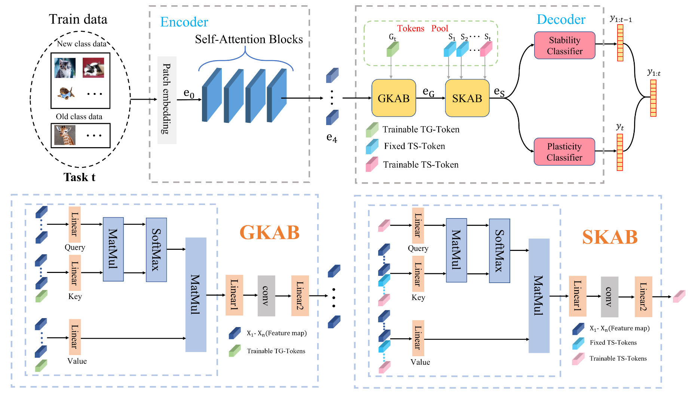

# DKT: Diverse Knowledge Transfer Transformer for Class Incremental Learning

[CVPR 2023](https://openaccess.thecvf.com/content/CVPR2023/html/Gao_DKT_Diverse_Knowledge_Transfer_Transformer_for_Class_Incremental_Learning_CVPR_2023_paper.html)	[code in github](https://github.com/MIV-XJTU/DKT)

*Xinyuan Gao, Yuhang He, Songlin Dong, Jie Cheng, Xing Wei, Yihong Gong*

这项工作介绍了一种增量学习的方法，设计了一个token pool，包括通用知识token和特定任务token，分别用来存储任务的一般知识和任务专有的知识，并设计了两个自注意力模块GKAB和SKAB，分别用来维护通用知识和专用知识，引入两个分类器可塑性分类器和稳定性分类器，分别用来识别新类和旧类，并且提出一个聚类分离损失来帮助其进行训练。

## Introduction 

在实际应用场景中，模型经常被用于不断变化和动态的环境中，这就需要使他们能够学习和识别不断出现的新类，这个问题称为类别增量学习。

现有的工作存在一定的问题，知识蒸馏会出现显著的知识退化问题，当将知识从旧任务迁移到新任务时会导致性能下降；网络必须足够稳定来保存现有的知识，同时还要表现出可塑性以获得新的知识，创建一个兼具稳定性可塑性是一个困难的问题；动态可扩展网络需要大量的计算资源，阻碍了其在实际场景中的实际应用。

为了应对上述挑战，我们提出了多样化知识转移转化器DKT，DKT包含两个新的注意力模块：通用知识转移注意力模块GKAB和特定知识转移注意力模块SKAB。这些注意力块可以通过使用一个统一的任务通用token和一组来自token池的任务专用token来传递先前的知识，对每个任务，token池初始化一个新的任务专用的token来累计任务特定的知识，并更新统一的任务通用token来存储先前任务的通用知识。

> 我们提出一个新的框架DKT，包括GKAB和SKAB，以促进不同的知识转移，并减轻连续学习场景中的灾难性遗忘
>
> 我们引入了双重分类器，使模型在识别旧类时保持稳定性，同时在学习新类别时保持可塑性
>
> 我们开发了一个聚类分离损失，将属于相同类别的特征聚类，并区分新旧任务之间的特征，以鼓励模型学习多样化的任务特定知识

## Method

类增量学习范式中，我们目标是将一个统一的模型增量的适应新获得的类，对于一个数据集，我们定义一组任务$\{ T_1, T_2, ..., Tt \}$,其中$T_t=\{ (x_i^t, y_i^t)\}^N_{i=1}$是第t个任务，有N个样本，$x_i^t, y_i^t$是第i张图象及其标签，$C_t$是任务t的一个类别集合，不同任务之间的类别不存在重叠，即$\forall \ i, j,\ C_i \cap C_j = \varnothing$，模型在测试集$Z^{1 \sim t} = Z^1 \cup ...\cup Z^t$上进行测试，并期望能够识别所有类别$C_{1\sim t} = C_1\cup ... \cup C_t$

### Overall Framework

我们的模型由两个主要部分组成，用于特征提取的编码器和用于缓解灾难性遗忘的解码器，在任务t中，给定一个输入$x_i^t$，patch embedding输出$e_0\in R^{M\times D}$，其中M表示块个数，D表示维度，将e0送到自注意力块中提取特征。
$$
e_l' = e_l + SA(LN(e_l)) \\
e_{l+1} = e_l' + MLP_l(LN(e_l'))
$$
其中SA是self-attention层，MLP是多层感知器层，最终SAB输出为e4，e4被输入到GKAB中，e4来混合任务通用token中的任务通用知识和当前知识，GKAB的输出$e_G\in R^{M\times D}$被输入到SKAB中，通过特定任务token来训练获取特定任务的知识，SKAB的输出$e_S\in R^{1\times D}$，然后分别用作稳定性分类器和可塑性分类器的输入。
$$
y_{1:t-1}=s\_clf(e_S)\\
y_t = p\_clf(e_S)
$$
在最终输出$y_{1:t-1}, y_t$合并为一个$y_{1:t}$作为最终输出

### Diverse Knowledge Transfer

#### Token Pool

我们引入了一个token池来存储特定于任务的token和通用任务token，任务通用token$\in R^{1\times 1 \times D}$用来捕获一般知识，并在第一个任务之前就随机初始化，在每个任务中他都会更新来适应任务一般知识的新变化；我们为每个任务建立了一个新的特定于任务的token$\in R^{1\times 1 \times D}$来存储每个任务中的特定知识。

#### General Knowledge Transfer

为了将一般知识转移到当前任务中，我们定义了一个新的注意力块GKAB，我们在第一个任务中初始化一个通用任务token G0，然后再后续任务中不断更新$(G_0 \rightarrow G_1 \rightarrow ...)$. GKAB专注于将任务通用token中的一般知识转移到当前任务中来减轻灾难性遗忘。

对于新任务的输入e4，我们将其与通用任务token拼接起来：$z_t = [e_4, G_t]$，然后将zt作为kv再在注意力模块GKAB中进行计算:
$$
Q_i = W_qe_4 \\
K_i = W_kz_t \\
V_i = W_vz_t \\
A_i = Softmax(Q_i·K^T_i/\sqrt{D/h}) \\
O_i = W_oA_iV_i+b_o
$$
D表示嵌入层的维度，h是注意力头的数量，ei需要计算与Gt的交叉注意力，将之前任务中的一般知识转移到当前任务中。任务通用token是可训练的，在每个任务中更新一般知识。

#### Specific Knowledge Transfer

SKAB专注于转移先前任务中的特定知识，以减少遗忘。SKAB仅使用新的特定于任务的token St，而不是特征图作为查询对象，输出的es从当前数据流的其他特定于任务的token中收集知识，对于新任务t，我们将eG与特定任务token$S_1...S_t$进行拼接：$z_t' = [S_1, ..., S_t, e_G]$,在注意力模块SKAB中:
$$
Q_i = W_qS_t \\
K_i = W_kz_t' \\
V_i = W_vz_t' \\
A_i = Softmax(Q_i·K^T_i/\sqrt{d/h}) \\
O_i = W_oA_iV_i+b_o
$$
d表示嵌入层维度，h表示注意力头数目，SKAB使用新的特定于任务的token作为查询，计算与所有特定于任务token和特征图的交叉注意力，因此$e_S\in R^{1\times 1\times D}$混合了所有先前任务的特定知识和当前任务的知识。

### Duplex Classifier 

为了在可塑性和稳定性之间取得平衡，我们提出了一种简单而有效的分类器，称为双工分类器，由稳定分类器和可塑分类器组成，稳定分类器由线性投影$\{ W_{t-1}, b_{t-1}\}$组成，其中$W_{t-1}\in R^{C_{1:t-1}\times D}, b_{t-1}\in R^{C_{1:t-1}}$, 塑性分类器由线性投影$\{ W_{t}, b_{t}\}$组成，其中$W_{t}\in R^{C_{t}\times D}, b_{t}\in R^{C_{t}}$:
$$
y_{1:t-1} = \sigma(W_{t-1}LN(e_S) + b_{t-1}) \\
y_t = \sigma(W_tLN(e_S) + b_t)
$$
对于任务t>0，在训练期间稳定分类器冻结参数，来保持旧类别的性能；塑性分类器可以学习新的类别以保持模型的可塑性。将两个输出$y_{1:t-1},y_t$合并为一个输出，作为模型的最终输出。该任务完成后将两个分类器组合在一起，创建新的稳定分类器。

### Loss Function

损失函数由三个不同部分组成：分类损失$L_{clf}$，为二元交叉熵来区分新旧数据；蒸馏损失$L_{kd}$和我们提出的聚类分离损失$L_cs$:
$$
L = (1-\alpha)L_{clf}+\alpha L_{kd} + \mu L_{cs}
$$
其中$\alpha = \frac{C_{1:t-1}}{C_{1:t}}$是旧类与新类的比，$\mu$为超参数，我们设置为0.003。

聚类分离损失强调新旧任务之间的差异，以促进特定于任务的token，来保存多样化的知识。从当前数据中随机选择样本xi xj，xi被输入到先前的模型中，xj被输入到当前模型中，我们将先前模型的特征提取器定义为$F^{t-1}$，当前的为$F^t$，$A_{ij}$表示xi 与 xj之间的关系。
$$
L_{cs} = \frac{1}{B}\sum^B_{i=1}\sum^B_{j=1}(1-cos(F^t(x_i), F^{t-1}(x_j))) * A_{ij}
$$
xi xj之间的关系可以分为两个方面：xi xj属于同一类别时，Aij为4，该模型要最小化$F^t(x_i), F^{t-1}(x_j)$之间的余弦距离;若xi xj属于不同的类，当xi xj分别为旧任务和新任务时，Aij为-4，迫使模型最大化$F^t(x_i), F^{t-1}(x_j)$的余弦距离，xi xj都属于新任务或旧任务时，Aij为-1，用于分离不同类别特征以提高聚类性能。
$$
cosine \ similarity = cos(x, y) \\
cosine \ distance = 1-cos(x, y)
$$
