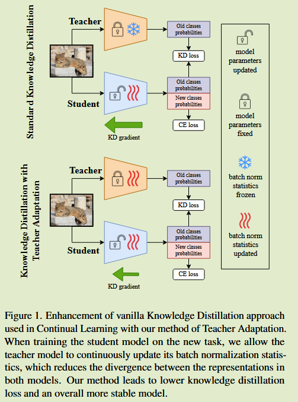
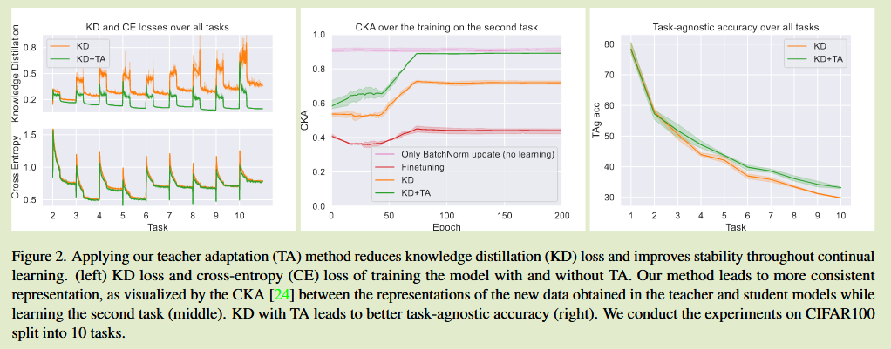

# Adapt Your Teacher: Improving Knowledge Distillation for Exemplar-free Continual Learning

[2024 WACV](https://openaccess.thecvf.com/content/WACV2024/html/Szatkowski_Adapt_Your_Teacher_Improving_Knowledge_Distillation_for_Exemplar-Free_Continual_Learning_WACV_2024_paper.html)	[code in github](https://github.com/fszatkowski/cl-teacher-adaptation)	CIFAR TinyImageNet	20250217

本文更新教师模型中的BN层而保持其他参数不变，来弥合增量学习不同任务的数据分布漂移带来的影响。通过这种方式能够显著降低不同任务时的KD损失，来提高整体的稳定性。并且该策略可以直接应用到现有的KD方法中

## Introduction

灾难性遗忘是持续学习的一大挑战，现有方法是通过重放旧样本或使用它们进行正则化，但这会在存储上和一些隐私保护的场景带来一些问题。因此有的工作提出了**无样本类增量方法**，利用知识蒸馏和固定的正则化项保证在新类上训练的结果仍保留教师模型（旧数据）的知识。

由于后续任务可能存在显著的分布漂移，这对无样本CIL具有一定的挑战，这种漂移可能会导致在利用KD损失训练时产生较大的误差，而损害整体的性能。因此**我们希望通过调整教师模式，来更好的从先前任务中迁移知识。**

由于数据分布漂移的影响，具有不同归一化统计量的模型之间的KD损失可能会引入不必要的模型更新。将教师模型的归一化统计量适应新的任务，可以在不影响CE损失的情况下显著降低KD损失，从而减少模型表征的变化。

- 利用分布外数据研究正则化的负面影响，我们强调在无样例的情况下调整教师模式的必要性
- 我们提出一种技术称为教师自适应TA，增强无样本CIL的KD
- TA可以与各种KD方法无缝集成

## Method

#### Knowledge Distillation in Continual Learning

采用知识蒸馏的连续学习方法将每次任务t后训练好的模型$\theta_{t}$(教师)保存下来，在学习新任务模型$\theta_{t+1}$(学生)时使用，则任务t+1的学习目标表示为：
$$
L = L_{CE} + \lambda L_{KD}
$$
在无样本CIL中，KD损失通常由当前模型和先前模型分辨返回的logit $y_o, \hat{y}_o$来计算，用下标o表示先前类对应的logit，几种典型的CIL损失：
$$
L_{GKD}(y_o, \hat{y}_o) = -\sum^{|C_t|}_{i=1}p_o^{(i)}log\ \hat{p}_o^{(i)}
$$
$|C_t|$表示先前类的数量
$$
L_{TKD}(y_o, \hat{y}_o) = -\sum^{t}_{i=1}D_{KL}(p_o^{(i)}log\ \hat{p}_o^{(i)})
$$

$$
L_{MKD}(y_o, \hat{y}_o) = -\sum^{|C_t|}_{i=1}\sigma(y_o^i)log\ \sigma(\hat{y}_o^i)
$$

#### Teacher Adaptation

随着新任务中数据分布的不断变化，学生模型和教师模型中的批量归一化统计量迅速发散，这导致了更高的KD损失，我们的方法在学习新任务的同时，在新数据上同时更新两个模型的批量归一化统计量，这会在CIL在学习任务序列时显著降低KD损失，从而来提高整体模型的稳定性。

