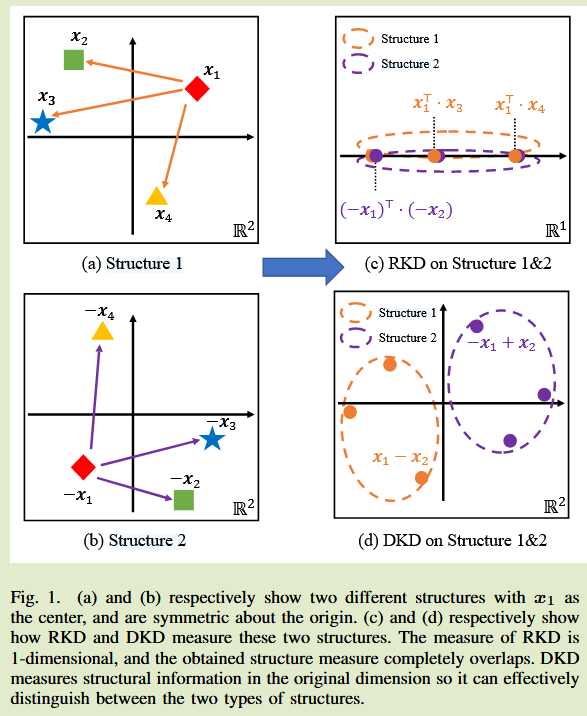
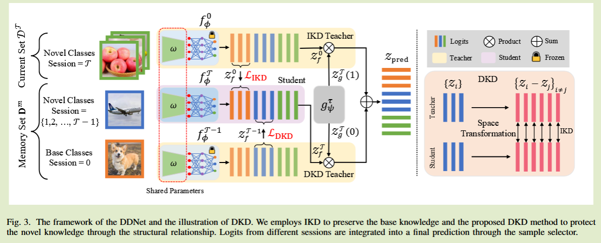
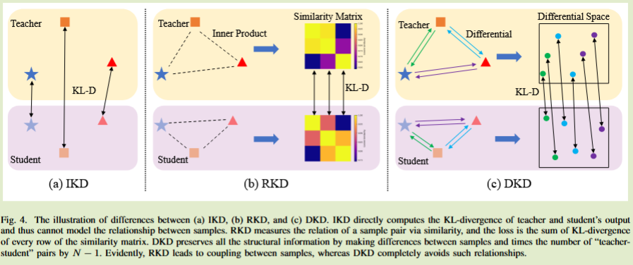

# On Distilling the Displacement Knowledge for Few-Shot Class-Incremental Learning

2024arXiv	-	-	20250220

增量学习蒸馏

## Introduction

先前工作提出通过关系蒸馏知识RKD来促进小样本类别增量学习FSCIL，然而RKD在蒸馏过程中，弱化了样本在特征空间中的坐标，不同结构的样本可能会产生相同的度量，从而导致结构建模不精确；其次这种关系蒸馏评估每个每个师生对的中心样本和附近样本的相似性，数据增强可能会破坏异常样本的稳健性，因为FSCIL有限的样本可能不足与纠正异常值带来的偏差。

- 提出用于结构知识保存的位移知识蒸馏DKD，将样本对之间的位移解释为概率分布，保持教师和学生网络之间的分布相似性，显著提高了新知识的保留
- 由于FSCIL中的数据稀缺性，设计了一个双重蒸馏网络DDNet框架，通过IKD（标准蒸馏）保留基础知识，通过DKD保留新知识

## Method

FSCIL中，训练任务集合表示为$\{ D^0, D^1, ..., D^\gamma\}$，其中$D^\gamma \in \{ (x_i, y_i) \}$，起类别集合表示为$C^\gamma$

在第一阶段，使用来自$D^0$的足够样本对模型进行训练，模型对基类具有很强的表示能力，给定一个样本x，初始模型输出一个d维特征向量$f^0_\phi(x) \in \R^d$，在后续任务中初始模型作为基础模型并保持冻结，在下一阶段，使用优先样本进行增量学习，使用当前训练集和记忆内存级$D^\gamma,D^m$，来对前一个阶段模型及逆行微调，得到模型$f^\gamma_\phi(·)$.

我们提出DDNet框架，将IKD（标准蒸馏）用于基类，将本文提出的DKD用于新类，为了确定样本属于基类还是新类，设计了一个样本选择器$g^\gamma_\psi(x) \in \R^2$

设$f^\gamma_\phi(·), g^\gamma_\psi(·)$的logit输出表示为$z^\gamma_f, z^\gamma_g$，根据样本选择器输出对齐进行加权：
$$
z_{pred} = z^\gamma_g(0) · z^\gamma_f + z^\gamma_g(1) · z^0_f
$$

#### Knowledge Preserving in FSCIL

令$z^0_f, z^\gamma_f$分别表示基类教师模型输出特征和学生输出特征，则IKD：
$$
L_{IKD} = E_{(x, y) \sim D^m \cap D^0} KD(z^\gamma_f || z^0_f)
$$
logit由原型分类获得：
$$
z^\gamma_f = \sigma([p^\gamma_1, p^\gamma_2,...,p^\gamma_N]^T·f^\gamma_\phi(x+))
$$
$\sigma$表示softmax函数，类原型计算为该类所有样本的特征平均值：
$$
p^\gamma_c = \frac{1}{n_c} \sum_{x_i\in D^\gamma, y_i=c}f^\gamma_\phi(x_i)
$$
$n_c$表示类C的实例数，通过IKD保留基类知识，可以直接保留预训练得到的最优特征，有利于保留基类的分类性能。

IKD并不是提炼新类别的最佳方案，从少样本中学到的表示能力很弱，最好保留实例关系，目前的研究将结构表示为矩阵，每行对应于以特定样本为中心的局部结构，这种方法建立了结构关系但也丢失了大量信息（例如方向关系）。

我们提出在蒸馏时，将任何一对样本之间的位移都用作指导，DKD损失如下：
$$
L_{DKD} = E_{(x, y) \sim D^m\cap D^p} DKD(z^\gamma_{f_i} || z^{\gamma -1}_{f_i}) \\
DKD(z^\gamma_{f_i} || z^{\gamma -1}_{f_i}) = \frac{1}{N-1}\sum_{j\neq i}KD(z^\gamma_{f_i} - z^\gamma_{f_j}|| z^{\gamma -1}_{f_i} - z^{\gamma -1}_{f_j})
$$
$z^\gamma_{f_j}$表示$x_j$的logit，位移矢量保留了样本对之间的结构信息，包括方向和距离，总体蒸馏损失表示为：
$$
L_{kd} = w_1 · L_{IKD} +  w_2 · L_{DKD}
$$
