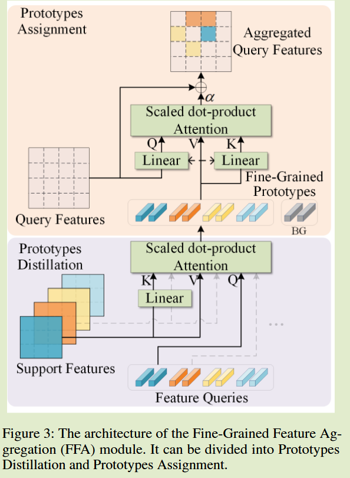

# Fine-Grained Prototypes Distillation for Few-Shot Object Detection

**[2024 AAAI](https://ojs.aaai.org/index.php/AAAI/article/view/28399)	[code in github](https://github.com/wangchen1801/FPD)	VOC  COCO	20241012**

*Zichen Wang  Bo Yang  Haonan Yue  Zhenghao Ma*

提出了一套小样本目标检测框架，构建了一组token学习新类的原型表示并提出一套细粒度融合模块来聚合到查询特征模块，这是针对低层特征的处理；对高层特征的聚合提出类别不确定抽样和非线性融合模块，来从基类中获得更多的知识提高检测性能。

## Introduction

小样本目标检测(Few Shot Object Detection)的关键问题是将从基类中学习到的知识迁移到新的类别中

基于迁移学习的方法侧重于更有效的对模型进行微调，使用与通用检测模型相同的架构，通过参数冻结和梯度解耦技术来提高性能

基于元学习的方法学习如何快速学习新任务，我们的方法基于此，增加了一个支撑分支，将支撑图像集编码成类级原型，作为动态参数与查询分支进行交互

本文主要针对DCNet的不足进行改进：

- 中间层特征错综复杂，模型难以捕获关键细节
- 直接在稠密特征之间进行匹配是低效的，且会消耗更多的计算资源
- 很难从训练阶段过度到测试阶段，因为不能整合不同支持样本的中间特征来提升性能

我们提出细粒度特征聚合模块FFA来聚合中间特征，提出B-CAS模块和NLF模块

## Method

#### 任务定义

给定数据集D，包含$C_{base},C_{noval}$两组类，每个$C_{base}$中的类有丰富的样本而$C_{noval}$中只有k-shot个标注样本，两组中类别没有重叠项

#### 模型架构

如图所示，使用骨干网络前三个阶段提取查询图像和支撑图像的中间特征，然后通过FFA模块提取细粒度原型并将其分配到查询中，然后再通过骨干网络的最后一阶段为两个分支提取高级特征，产生ROI特征和类级原型

#### 细粒度特征聚合FFA

该模块为一个类别无关的聚合器，将所有将支撑图像集特征匹配成查询特征，对类间关系进行建模，该部分特征拥有较多的细节，与直接匹配不同，我们将其提取到类别原型中，根据匹配结果将这些原型分配到查询特征图中。FFA可以帮助模型区分前景和背景，学习类别之间的异同。

##### 原型提取

受DERT启发，我们引入一组可学习的token来提取原型，将整个支撑图像集的特征提炼为一组具有代表性的特征，将这些特征称为特征查询向量，通过交叉注意力来进行原型蒸馏：

对于支撑图像特征图$X_s \in \R^{hw\times d}$和一组查询向量$q\in \R^{n\times d'}$, 其中n表示查询次数，相似性矩阵计算：
$$
A = softmax(\frac{q(X_sW)^T}{\sqrt{d'}})
$$
W表示线性投影层，原型提取可以表示为：
$$
p = AX_s + E_{cls}
$$
需要注意的是，支撑图像集中的每一个类别都有一个查询向量。

##### 原型分配

给定查询特征图$X_q \in \R^{HW\times d}$，通过：
$$
A' = softmax(\frac{(X_qW')(PW')^T}{\sqrt{d'}}) \\
P = concat(p_1, p_2, ..., p_c, p_{bg}) \\
X'_q = X_q + \alpha A'P
$$
$P \in \R^{(n_c+n_{bg})\times d}$是c个支撑类别和背景类别的原型，原型被分配到基于相似性矩阵A'的查询特征图中，来产生聚合查询特征。

##### 向新类转移

基类从头训练获得查询特征，由于样本缺乏使得这一过程困难，提出一种特征转移策略，从基类中复制最兼容的特征查询作为新类的特征查询向量：

给定基类的查询特征$Q\in \R^{n_c \times d'}$和一个新类的支撑特征图$X_{ns} \in \R^{hw\times d}$，相容性矩阵和权重计算：
$$
C = topk(Q(X_{ns}W)^T) \\
weight_i = \sum^k_{i=0}C_{ij}, i=1, 2, ..., nc
$$
topK沿着hw维度进行的，来过滤掉不相关的位置，为每个类别选择n个特征，对于支持集中的新类的综合原型根据权重计算：
$$
p_{avg} = \sum^K_{s=1}weight^*_sp_s
$$

#### 高层特征聚合

ROI特征和类别原型之间的特征聚合是基于元学习的FSOD的关键步骤，我们给出两个角度的解决方案

##### 平衡类别-不确定抽样

我们借鉴融合了R-CNN和VFA的观点，完全随机抽样会干扰最好的原型选择，损害性能，我们提出B-CAS平衡采样策略，选择一对正负原型与RoI特征聚合，该策略不仅能够实现不同类之间的关系建模，还能避免正原型被过多的负例所淹没，来学习更多高层语义信息

##### 非线性融合模块

先前方法通过元素乘法来处理融合问题，这种方式学习到了同一类别中的相似之处却难以表达类别之间的差异，这与提出的类别-不确定采样模块冲突。我们提出非线性融合模块，对逐元素相乘、相减和拼接后特征进行独立处理，来细化与新特征之间的关系，处理后与原始RoI特征拼接送入检测头，$f_{roi} \in \R^{1\times 2d}, p_{cls} \in \R^{1\times 2d}$， 拼接特征表示为：
$$
f' = [F_1(f_{roi}\odot f_{cls}), F_2(f_{roi} - p_{cls}), F_3[f_{roi}, p_{cls}], f_{roi} ] \\
f = F_{agg}(f')
$$
F1 F2 F3分别表示独立的全连接层和ReLU激活函数，Fagg表示纯全连接层，该公式提供了更强的能力来探索高级特征之间的关系。此外，为RoI特征预留了一条专属路径来传播原始RoI信息，减少了随机原型引入的噪声，可用于回归目标位置

