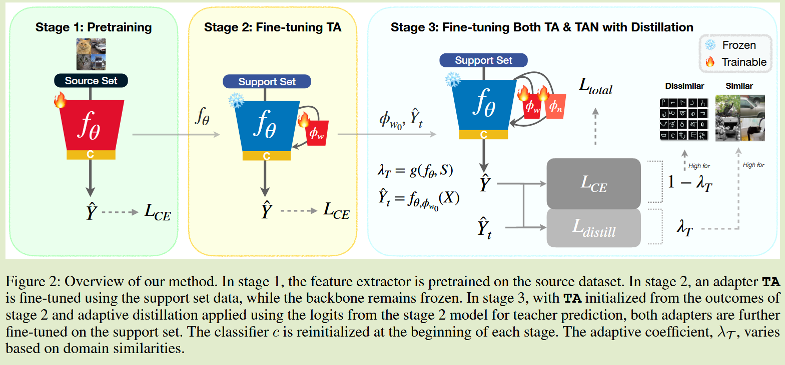
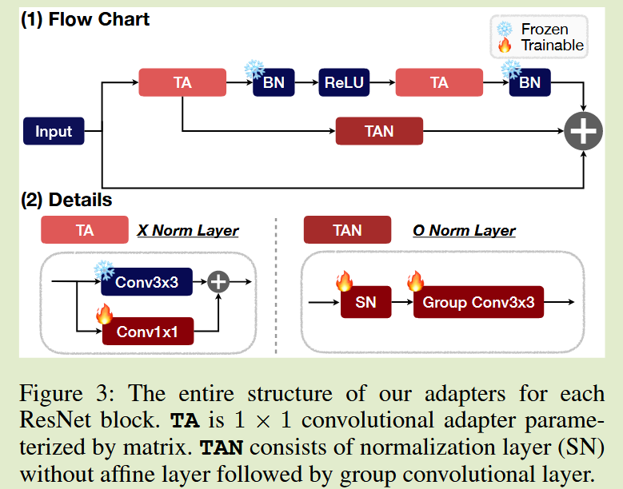

# Leveraging Normalization Layer in Adapters With Progressive Learning and Adaptive Distillation for Cross-Domain Few-Shot Learning

[2024 AAAI](https://ojs.aaai.org/index.php/AAAI/article/view/29573)	no code	Meta-dataset(2019)	20241011

*YongJin Yang  Taehyeon Kim  Se-Young Yun*

本文针对跨域小样本学习中不同领域差异问题和样本稀缺性给出了知识蒸馏的解决方案，提出渐进学习和自适应蒸馏来解决该问题，通过带归一化层和不带归一化层的适配器分别处理非相似域和相似域样本，提出一种三阶段的训练方案来训练模型和两个适配器，并针对相似域和非相似域提出一个自适应域系数来选择合适的适配器进行推理，该系数由相似性或支持集性能指标来衡量。

## Introduction

跨域小样本学习(Cross-Domain Few Shot Learning, CD-FSL)主要挑战来自于不同领域的差异和样本的稀缺性，模型需要调整到新的领域，这些领域可能在颜色空间背景场景中有所不同，并且由于样本呢的稀缺性，从源域到目标域容易产生过拟合的风险。

基于此我们提出一种高效参数微调方法，只对线性适配器进行调整，通过限制调整的参数来平衡域自适应性和过拟合的风险。

CD-FSL中的另一个挑战是，将目标域的统计信息与少量样本结合时可能会导致批次内的统计噪声，这些噪声数据会破坏预训练模型建立的良好统计表示

提出的ProLAD利用渐进学习和自适应蒸馏，使用了两种适配器，一种带有归一化层TAN和不带归一化层TA的适配器，TAN由于其归一化层对不相似的域进行优化，TA则适合于相似的域来保持批次统计量不变

## Method

#### 通过渐进式学习和蒸馏训练适配器

TAN适配器与TA适配器：

TAN中的归一化层对于不同域的适应至关重要，它收集了来自目标域的额外统计信息，组卷积则提供了更大的感受野。

TAN在不相似的域中表现更好，突出了归一化层在处理低域相似性方面的功效；TA则在相似域中表现更好，这表明统计量的噪声会阻碍高领域相似性的训练过程。

**作者的假设：目标域的统计信息与域外样本结合时会导致批次内的统计噪声，这些噪声数据会破坏预训练模型建立的良好统计表示**  sec4.3基于实验验证了这一点

两种适配器针对不同的场景，这就需要一个自适应的选择器来选择合适的适配器进行处理，

##### Stage 1

第一阶段我们使用源数据预训练以$\theta$为参数的特征提取器，$D_b = \{(x, y)\}$是包含图像和标签对的源数据集，损失函数表示为：
$$
L_{CE} (f, D) = -\sum_{x, y\in D}ylog(f(x)) \tag{1}
$$

##### Stage 2

在冻结特征提取器参数的情况下训练TA，并保存教师使用的特征记为$\hat{Y_t}$，该阶段对于指导TAN的后续训练至关重要，教师初始化特征以及TA的初始化参数都在该阶段进行。

$S = \{ (x_i, y_i)\}^{|S|}_{i=1}$由|S|个标签对组成的支撑集，我们使用$L_{CE}(f_{\theta,\phi_{w}}, S)$来作为损失函数训练TA， 然后计算教师特征$\hat{Y}_t = f_{\theta, \phi_w}(X)$

##### stage 3

同时训练TA和TAN，通过上一阶段的结果初始化TA， 并利用刚刚计算的教师特征$\hat{Y_t}$进行蒸馏，通过一个域相似性参数$\lambda_T$进行调整，该参数由$g(f_\theta, S)$进行计算（下一章节）。

在相似域中可以得到更多的蒸馏知识，而在不相似领域，优先考虑真实标签的影响，蒸馏损失中相似性依赖于余弦相似度：
$$
cos(f_{\theta, \phi_n, \phi_w}, X, \hat{Y}_t) = \sum_{x\in X, \hat{y}_t \in \hat{Y}_t}\frac{f_{\theta, \phi_n, \phi_w}(x)^T\hat{y}_t}{||f_{\theta, \phi_n, \phi_w}(x)||_2||\hat{y}_t||_2} \\
L_{distill} = 1-cos(f_{\theta, \phi_n, \phi_w}, X, \hat{Y}_t) \tag{2}
$$
总体损失定义为：
$$
L_{total} = (1-\lambda_T)L_{CE}(f_{\theta,\phi_{w}, \phi_{n}}, S) + \lambda_TL_{distill}(f_{\theta, \phi_n, \phi_w}, X, \hat{Y}_t) \tag{3}
$$

#### 蒸馏的域自适应系数$\lambda_T$

我们的目标是不增加额外参数的情况下估计领域相似度，讨论两种度量方案：基于特征之间的相似性和基于性能度量

##### 类间差异和特征相似度

我们使用特征相似性来衡量所有特征对之间的相似性，我们的方法通过比较类别原型的差异性和个体样本对之间的相似性来估计领域相似性，令$cos^{feat}_{ij}$表示第i个和第j个特征之间的余弦相似度，$cos^{inter-cls}_{ij}$表示第i个和第j个类别原型之间的相似度，余弦相似度通过Eq2进行计算，则域自适应系数计算为：
$$
\lambda_T = exp(\beta(|\frac{1}{N_s}\sum_{i<j}cos^{feat}_{ij} - \frac{1}{N_c}\sum_{i<j}cos^{inter-cls}_{ij}| - 1)) \tag{4}
$$
Ns表示从支持集得到的特征对数，Nc表示类别对数，利用指数函数将其限制在0-1，当两种相似性度量相差较大时会得到较大的域自适应系数，此时更有利于相似的域，该方法称为ProLAD-sim (*两种度量相差较大意味着样本间相似性高但类别原型相似性低或样本间相似性低但类别原型之间相似性高，这或许忽略了两者相似性都高的情况*)

##### 支持集的损失与精确度

另一种方案利用了预训练的特征提取器在支持集上的性能指标（损失 准确率），这些指标在衡量分布偏移和任务难度时较相关，更接近的领域相似性表现为更低的损失或更高的精确度，我们用acc表示准确率，$L_{orig} = L_{CE}(f_\theta, S)$表示支撑集S上的损失，则自适应系数可以定义为：
$$
\lambda_T = exp(-\beta L_{orig}(1-acc))
$$
这种方法称为ProLAD-loss