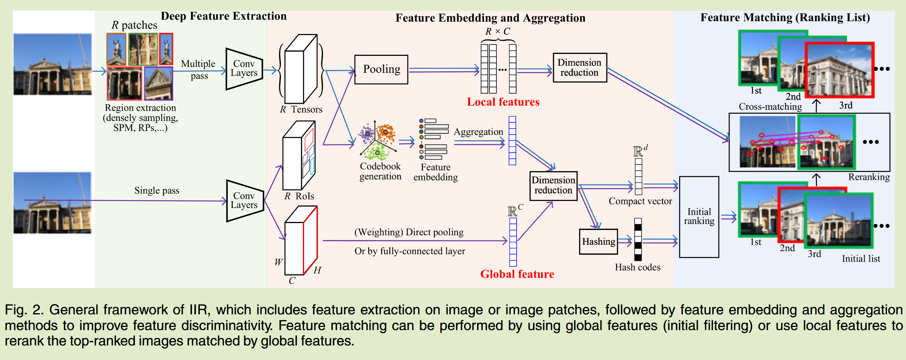
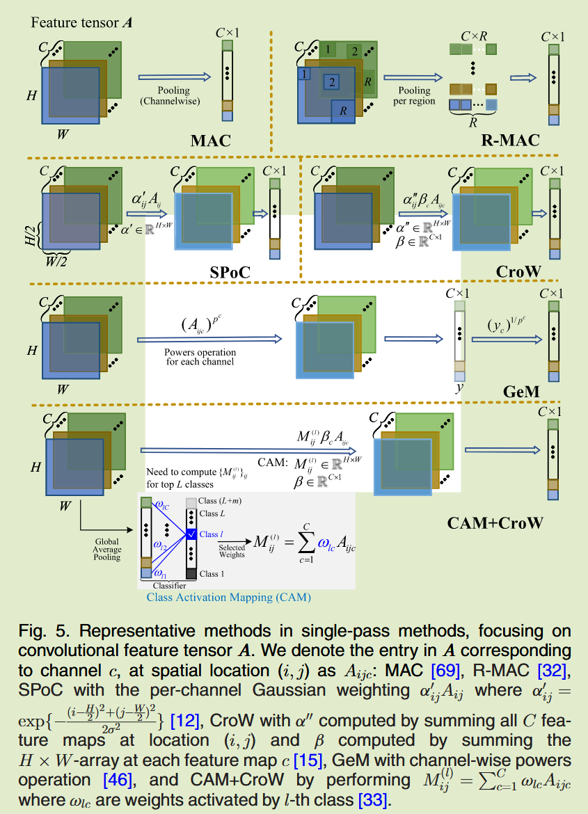

# Deep Learning for Instance Retrieval: A Survey

## Introduction 

基于内容的图像检索(content based image retrieval, CBIR)可以分为两个不同的任务：类别级图像检索CIR和实例级图像检索IIR，前者目标是找到与查询相同类别的任意图像，而后者目标是找到包含同一实例的图像，本综述主要总结IIR任务。

### 主要挑战：

与准确率相关的挑战取决于输入数据、特征提取器以及提取特征的处理方式：

- 不变性挑战： 图像实例可能会以不同方式旋转、平移或缩放，最终特征会受到这些转换的影响，检索准确性可能会降低。
- 分散注意力挑战：IIR可能之专注于某个对象，DCNN可能会收到图像噪声或背景的影响，因此在特征提取之前研究区域建议
- 判别性挑战：IIR的深度特征需要尽可能的具有判别性，以区分具有微小差异的实例，这些方法包括特征嵌入和聚合方法，以促进特征区分和注意力机制
- 微调挑战：DCNN可以作为强大的提取器进行微调，以捕获实例之间的精细语义差异

与效率相关的问题很重要，特别是对于大规模数据集，检索系统在获得查询时应快速响应。

## General Framework of IIR  IIR的一般框架

### Deep feature extraction 深度特征提取

特征提取是IIR的第一步，可以通过单通道或多通道的方式实现，单通道将整个图像作为输入，而多通道依赖于区域提取

来自给定DCNN的全连接层激活输出可以用作检索特征，无论是基于整个图像还是基于图像块，在大多数情况下，这些激活特征需要进一步处理。

### Embedding and aggregation 向量化然后聚合

特征向量化将单个局部特征映射到更高维的空间，而特征聚合将多个和映射向量或所有单个特征汇总到一个全局向量中，全局特征可能来自直接池化卷积特征图或使用一些复杂的加权方法

对于局部要素，所有区域的良好的向量表达单独存储，并用于重新排序阶段的交叉匹配而不用聚合。

### Feature matching 特征匹配

特征匹配是衡量图像之间相似度，然后返回排名的过程，全局匹配可以通过欧氏距离等方式进行计算。对于局部特征，图像相似性通常是通过使用经典的RANSAC或其变体来总结局部特征之间的相似性。单独存储局部特征，然后单独估计他们的相似性会导致额外的内存和搜索成本，因此大多情况下，局部特征用于对与全局特征匹配的初始排名图像进行重新排序。

IIR的前三个阶段依赖于DCNN作为主干框架，几乎所有情况下，这些主干网络中与存储的参数都可以进行微调，以更好的适应实例检索并有助于提高性能

## Retrieval With Off-the-shelf DCNN Models 使用现成的DCNN模型进行检索

DCNN往往需要在大规模数据集上进行训练，最初用于分类任务，并且能够识别来自不同类别的图像，因此一种方案是经过有效分类训练的DCNN直接用作图像检索任务的现成特赠检测器，即在DCNN的基础上进行图像检索，经过分类器训练并冻结预训练参数。

这种方法的局限性在于分类训练的模型不一定能提取出非常适合图像检索的特征，只要特征保持在分类边界内，分类决策就可以成功，但是在特征匹配本身比分类更重要的情况下，此类模型中的特征可能会显示检索能力不足。

### Deep Feature Extraction 深度特征提取

对于输入图像x和网络$f(·;\theta)$，我们将卷积层特征表示为$A:=f_{conv}(x) \in \R^{H\times W\times C}$，全连接层特征表示为$B:=f_{f_c(x)}\in\R^{D \times 1}$，维度为D

#### Network Feedforward Scheme 网络前馈方案

##### 单前馈传递方案

该方法获取整个图像并将其输送到现成的模型中提取特征，早期的IIR工作侧重于利用DCNN作为固定的提取器来获得全局特征，尤其是全连接层，但是这种方式提取的信息可能会影响检索的准确性，因为提取的特征可能会包含背景信息或不相关的对象。

单通道方案的关键字是嵌入和聚合特征以提高区分性，使得两个相关图像的特征比两个不相关图像的特征更相似，可以先将特征B映射到高维空间，然后将他们聚合成最终的全局特征；另一个方向是将卷积特征A的区域视为不同的子向量，所有特征的子向量组合都用来表示输入图像

##### 多前馈传递方案

与单通道相比，多通道方法更耗时，因为生成了多个补丁送到网络中，多通道方案更有助于解决先前提到的不变性挑战和分散注意力挑战，多个尺度的局部块对于图像平移、缩放和旋转变得更加稳健，并且这些块还有助于过滤不相关的背景信息

特征表示通常由两个阶段生成：补丁检测和补丁描述，使用滑动窗口模型或空间金字塔模型来获得多尺度图像块，补丁检测方法缺乏效率，他也会检测出不相关的补丁，区域建议方法不是随机或密集地生成多尺度图像块，而是引入一定程度的目标，可以使用对象检测器来生成区域建议，区域建议也可以使用区域建议网络RPN和卷积网络来学习，然后将这些网络应用于端到端微调以学习相似性，这些通常都需要定位良好的边界框作为监督。

#### Deep Feature Selection 深度特征选择

特征选择决定了特征提取的感受野，即全局级的全连接层特征和局部级的卷积特征

##### 从全连接层提取深度特征

选择一个全连接层作为全局特征提取器是一种简单的方案，通过PCA降维和归一化，可以测量图像相似性，从全连接层提取特征B会导致IIR的两个明显限制：不相关信息和缺乏全局几何不变性

关于第一个限制（不相关信息），图像级全局描述符可能包含不相关的模式或背景杂乱，尤其是当目标是实例只是图像的一小部分时，在更精细的尺度上提取特征可能更合理；对于第二个限制（缺乏全局几何不变性），一种方法是在卷积层上提取多尺度特征。

##### 从卷积层提取深度特征

卷积层的神经元仅连接到输入图像的局部区域，这个较小的感受野确保产生的特征A保留更多的局部结构信息，并且对图像的转换更鲁棒，从而解决*不变性挑战*。sum/average/max池化是生成全局特征的集中简单的聚合方法，对于池化层，最后一个卷积层通常比其他较浅的全连接层产生更高的准确性，在池化之前，特征图上没有其他的操作，这些方法称之为直接池化（Fig. 2）

相关工作还探索了复杂的聚合方法，例如卷积特征图上的通道或空间特征加权，这些方法旨在突出特征的重要性或减少某些区域的突发特征的不良影响，这些特征聚合方法通常在通道池化之前进行，并且不对将特征嵌入到更高维的空间中。

使用卷积特征的基本原理是，每一个向量都可以看作是密集SIFT特征，因为每个向量对应于输入图像的一个区域，基于此，许多工作在区域特征向量上利用用于SIFT特征的嵌入方法（例如BoW）然后将他们聚合到一个全局描述符中，特征嵌入方法通过将单个特征映射到高维空间并使其可区分来解决区分性挑战，特征嵌入之后是PCA降维，来降低特征维度和白化，以减轻特征之间的冗余。

#### Feature Fusion Strategies 特征融合策略

特征融合主要研究不同特征的互补性，包括层级和模型级融合探索

##### Layer-Level Fusion 层级别融合 

通过层级融合，可以在深度网络中融合多个全连接层，也可以融合来自多个卷积层的激活，来自全连接层的特征保留了全局高级语义，而来自卷积层的特征可以呈现出局部低级和中级线索，因此在测量语义相似性时，全局和局部特征是相辅相成的，并且在一定程度上能保证检索性能。

有些工作考虑了他们的差异性和互补性，考虑那些层组合更适合融合，实验表明融合卷积层和全连接层要优于仅融合卷积层

##### Model-Level Fusion 模型级别融合

还可以组合来自不同模型的特征，这种融合更侧重于模型的互补性，方法分为模型内和模型间。模型内融合表明多个深度模型具有相似或高度兼容的结构，而模型间融合涉及具有不同结构的模型。

不同深度网络具有不同的感受野，模型间融合是一种桥接不同特征的方法。层级融合和模型级融合的前提是关联的层或网络具有不同的特征描述能力，对于这些融合策略，关键问题是那些功能最适合组合。

### Feature Embedding and Aggregation 特征嵌入和聚合

特征嵌入和聚合的主要目的是进一步促进特征区分，以*判别性挑战*为目标，并获得最终全局/局部特征医检所特定的实例

#### Matching with Global Features 匹配全局特征

可以从全连接层中提取全局特征，然后进行降维和归一化，他们易于实现，并且无需进一步的聚合过程；卷积特征也可以聚合为紧凑的全局特征，简单的聚合方法是sum/average或max pooling，前两者考虑了所有激活的卷积输出，这削弱了高度激活的特征的效果；最大池化特别适用于活动概率较低的系数特征，但是当图像特征被白化时，最大池化性能坑你不如sum/average池化。

卷积特征被解释为局部区域的描述符，许多工作利用嵌入方法对区域特征进行向量编码，然后将他们聚合到一个全局描述符中

三种嵌入方法：BoW  VLAD  FV，BoW和VLAD是在欧几里得空间计算得到的，性能与质心数量密切相关，而FV可以捕获更高阶的统计数据，并提高特征嵌入的有效性，但代价是更高的内存成本。

#### Matching with Local Feature 匹配局部特征

尽管与全局特征的匹配对于特征提取和相似性计算都有很高的效率，但全局特征与空间验证和对应估计不兼容，这激发了与局部特征匹配的工作，在匹配过程中，全局特征仅匹配一次，而局部特征匹配是通过汇总所有单个局部特征的相似性来评估

局部特征的一个重要方面是检测图像中实例的关键点，然后将检测到的关键点描述为一组局部描述符，IIR的整个过程的常见策略可以描述为检测后描述和描述后检测。

检测后描述方法，外面将关键点周围的描述符视为局部特征，提取的关键点周围的粗略区域被送到DCNN中，然后是特征描述，传统检测器也可用于检测关键点周围的精细区域。