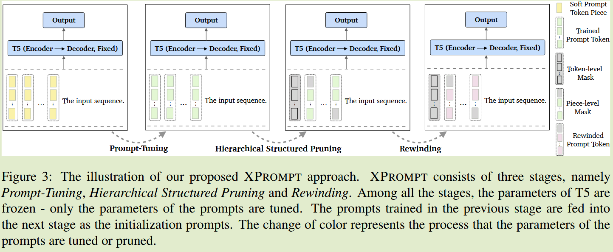

# XPROMPT: Exploring the Extreme of Prompt Tuning

2022 ACL	2024092

提出一种提示剪枝策略，对token和token内部进行剪枝，来进一步降低参数数量

本文为 2023ICCV E2VPT 所应用的方法，E2VPT将原本应用于NLP的剪枝策略迁移到CV中，两者思路完全一致

## Introduction

使用较少的可学习参数，提示调优方法随着模型规模的增大达到了与完全微调相当的性能，但是在规模相对较小的模型上，两者有着显著的性能差距。

我们旨在弥补这一差距，在彩票假说LTH的基础上，我们发现并非所有的提示token对任务表现出同等重要的作用，某些token甚至会产生负面影响。基于彩票假说原理，这一负面影响是可以规避的

>  彩票假说：一个过参数化的网络包含一个子网络，该子网络在单独初始化和训练时，最多经过相同迭代次数的训练就能达到或超过原网络的测试精度。

我们提出一种分层的结构化剪枝策略，先在token级别消除负面影响的token，然后在更细粒度对token进行剪枝，从而得到一个参数效率更高的小规模prompt，我们的方法XPROMPT导致了比Prompt-Tuning更大的性能增益，对于大多数任务甚至超过了微调。

## Method

整体流程分为三个阶段：提示调优；层次化剪枝；再训练

#### Prompt Tuning

在输入端添加若干个可学习token进行学习微调，遵循先前工作[2021ACL  [Super tickets in pretrained language models: From model compression to improving generalization](https://doi.org/10.18653/v1/2021.acl-long.510)]

#### Hierarchical Structured Pruning

层次化剪枝目的是在训练好的提示token中分离出负收益的token，来找到一个最优的软标签集合。

token级剪枝用于识别负收益token，片段级剪枝来识别token中的负收益片段

##### Token-level Pruning

我们引入一个掩码变量，与每一个提示token相关联：
$$
\hat{P_e} = \gamma\cdot P_e \\
\gamma = \{\gamma_1, \gamma_2, ...,\gamma_m\}, \gamma_i\in \{0, 1 \}
$$
我们定义token重要性得分来查找负增益token，每个token的重要性得分为：
$$
I_{p_i} = E_{x\sim D_x}|\frac{\partial L(x)}{\partial\gamma_i}|
$$

##### Piece-level Pruning

每个token中可能存在负增益的段，对下游任务产生负面影响，因此进一步对token内进行剪枝。

将token内的向量模型分割成k个相同大小的段，在每个段上添加掩码：
$$
\hat{q_e} = \xi \cdot q_e \\
\xi = \{\xi_1, \xi_2, ...,\xi_k\}, \xi\in \{0, 1 \}
$$
同理段重要性定义为：
$$
I_{q_i} = E_{x\sim D_x}|\frac{\partial L(x)}{\partial\xi_i}|
$$

#### Rewinding

对掩码为0的token和token内部段进行剪枝，然后利用原始的训练策略对模型进行再训练