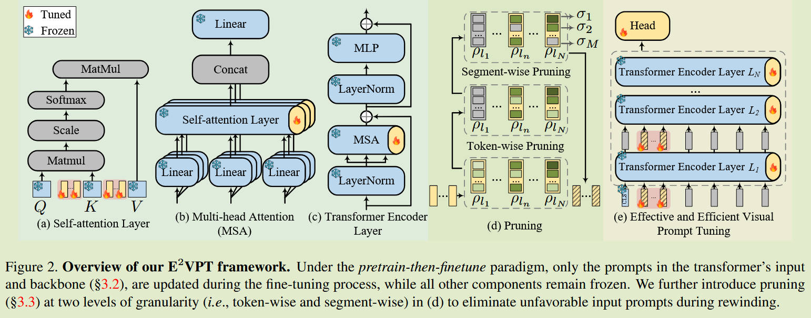

# $E^2VPT$: An Effective and Efficient Approach for Visual Prompt Tuning

**[ICCV 2023](https://arxiv.org/abs/2307.13770)	[code in github](https://github.com/ChengHan111/E2VPT)	VTAB-1k FGVC	20240920**

*Cheng Han, Qifan Wang, Yiming Cui, Zhiwen Cao, Wenguan Wang, Siyuan Qi, Dongfang Liu*

针对提示调优方法[VPT]，本文认为先前方法没有考虑Transformer内部注意力机制的架构，当微调数据集与预训练数据集有较大差异时性能将于完全微调有较大差异，这是由于内部自注意力模块无法获取新的知识，本文在VPT的基础上方提出添加KV提示token来捕获新的知识，并提出token剪枝和token内部段剪枝来进一步减少参数，获得更高效的微调性能。

## Introduction

从头开始训练一个大模型开销很大，一个常见的处理方案使用预训练模型进行微调来适应不同的下游任务，然而传统的全微调需要为每个任务存储完整的模型参数，这仍然需要很大的计算开销，不适合快速部署。

解决这一问题的现有方法：

- **部分调优**  仅微调部分网络，如最后的分类头或最后几层，其他部分不动
- **添加额外模块**  添加可学习的偏置项或者是额外的适配器进行微调
- **提示调优**  在不改变或微调骨干网络的情况下在Transformer输入层添加可学习的token

上述方法普遍存在两个问题，首先他们没有仔细考虑Transformer注意力机制的核心架构，导致与完全微调性能差距较大；另外他们都需要微调数量相对较多的参数才能达到相对合理的性能，无法探索参数效率极端的情况。

引出两个问题：

- 如何才能建立有效的大规模基于Transformer的视觉模型的提示调优方法？
- 如何探索参数效率的极值，来减少可学习参数的数量？

我们的方法基于这两个问题来进行改进，我们不仅仅关注修改输入，而应当明确的调查在微调过程中改进自注意力的潜力，我们将可学习的token集成到KV矩阵中；我们还融合了剪枝策略，在保证性能的前提下尽可能的减少参数

## Method

### Effective Prompting  有效提示

现有的提示调优方法没有考虑Transformer的内部结构，我们提出的方法常规的在输入的视觉提示token($P_I$)之外，还包括一组KV提示token($P_K, P_V$)

#### Visual Prompts [VPT 2022ECCV]

$P_I = \{P^1_I, P^2_I, ..., P^N_I\}$，其中$P^i_I$表示第i个编码器层中可学习的token，N为总层数，则编码器层表示为：
$$
Z^1 = L_1(P^1_I, E) \\
Z^i = L_i(P^i_I, Z^{i-1}), i=2, 3, ..., N
$$

#### Key-Value Prompts

VPT在指导Transformer内部信息交互方面不足，因为微调时图像可能与预训练时的图像显著不同，因此需要增强内部自注意力模块捕获新知识的能力，我们提出引入KV提示，这些提示token只有少数几列，但与原始矩阵共享相同的行数：
$$
L(·) = FFN(MSA(·)) \\
MSA(·) = concat(softmax(\frac{Q_hK_h'^T}{\sqrt{d}})V'_h)
$$
其中K' V'是添加提示token后的KV矩阵：
$$
K' = concat(K, P_K), V' = concat(V, P_V)
$$
K V 提示token可以帮助模型适应新的数据，Q是注意力机制中另一重要因素，但是它不需要提示token：

- 对Q进行提示学习类似于对K，计算每一对QK分数，同时对两者进行提示学习是没有必要的
- Q的变化会影响注意力图的输出维度，这就需要在后面添加额外的线性投影层会引入额外的参数

### Efficient Prompting  高效提示

能否在不牺牲性能的情况下减少可学习的提示token？

先前工作的**彩票假设**证明了：对于给定的任务，存在一个子网络可以达到与原始网络相同的测试性能

首次启发，我们进行了掩蔽提示token试验，我们发现不同的提示对模型有不同的影响，有的甚至有负面影响，因此我们**提出一种针对视觉提示token的剪枝方法**保留最具影响力的token并去除冗余的token，我们分别进行token剪枝和分段剪枝

#### Token-wise Pruning  对token剪枝

我们引入一个可学习的掩码变量$\rho = \{\rho_1,\rho_2, ..., \rho_M \}$, M表示提示token的数量，$\rho_k \in \{0, 1\}$, 取0时表示被剪枝，则带掩码的提示块表示为$\tilde{P_k}$，为了确定剪枝位置，我们计算token的重要性得分，定义为对掩码变量$\rho_k$的期望敏感度：
$$
S_{P_K} = E_{x\sim D_x}|\frac{\partial L(x)}{\partial \rho_k}|
$$
L表示损失函数，Dx表示训练分布。*（可以理解为值越大则该token对整个样本学习的贡献大）*

#### Segment-wise Pruning  对token内的每一维度剪枝

我们进一步提出分段剪枝，来排除每个token内部的负作用段，每个token被等分为R段，类似于token剪枝，为每一段分配一个掩码变量来过滤掉贡献较低的部分。 

#### Rewinding

在两轮剪枝过后对剪枝后的提示token进行重训练