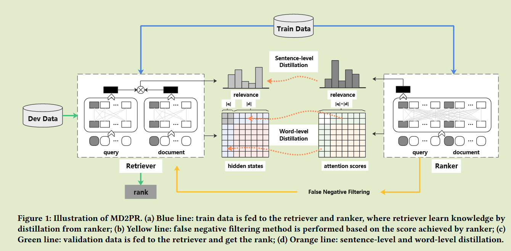
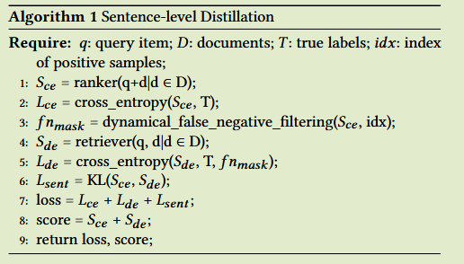
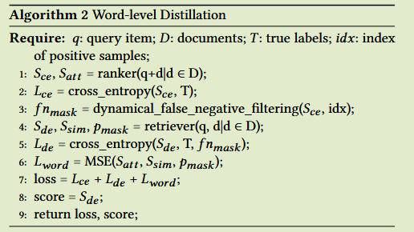
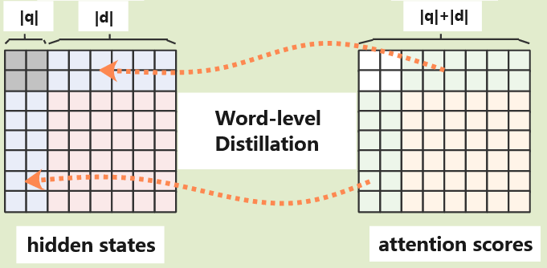

# MD2PR: A Multi-level Distillation based Dense Passage Retrieval Model

**蒸馏改进密集检索算法。**

## Introduction

信息检索中，将查询与文档进行匹配，检索器用于从大量文档集合中检索与给定查询具有较高相关性的一组段落，利用排序器进行排序，来获得与查询最相关的段落。

近年来，Transformer Bert等模型被用于信息检索，将单词和句子表示为稠密向量，捕获查询和文档之间的上下文信息和语义相关性，称为稠密段落检索。

主要的稠密检索模型包括双编码器和交叉编码器模型。双编码器中针对查询和文档分别训练两个模型，使用CLS token获得整个句子的语义表示，用于计算相关性；交叉编码器模型通过将查询和文档串接在一起进行训练，是的查询和段落之间的单词可以进行交互，能够捕获更多的上下文信息，总体比双编码器模型表现更好。

这些密集检索现在仍存在几个问题：

- 双编码器模型分别对查询和段落进行编码，导致他们缺乏交互，这会扭曲相似度计算并造成上下文信息的丢失
- 交叉编码器模型使用注意力机制来进行充分的交互，但这会带来巨大的计算开销，它与文本长度的平方成正比；他在有效提高模型性能的同时，也显著降低了训练和推理效率
- 负样本通常是从当前批次数据或整个数据集中随机抽取，缺乏真是标签，这些样本可能只是与查询高度相似的伪负样本，简单的从查询中推开可能会影响句子的表示，从而影响整个模型的性能

我们提出一种称为MD2PR的多级蒸馏模型，在检索阶段使用双编码器进行大规模候选检索，而在排序阶段使用交叉编码器对检索结果进行精细排序，这种方法提高了检索质量还降低了计算代价：

- 使用一种知识蒸馏方法，通过这种方法，排序器学习到的知识在句子和单词级别上都转移到了检索器，这种方法克服了双编码器模型中查询与文档缺乏交互的问题，使得检索器能够有效的找到与给定查询相关度更高的文档，同时也降低了交叉编码器模型引入的计算成本
- 词级别蒸馏中，探索了排序者的注意力和检索者的隐藏状态之间的对应关系，通过对构造的损失函数的优化，检索器的注意力可以精确的近似为排序器的注意力。
- 提出一种动态过滤方法，使用动态阈值而不是固定阈值来选择漏报，该方法减少了采样过程中引入的偏差，保证了空间一致性

## Method

#### Mutli-level distillation dense passage reteriecal 多级蒸馏密集通道检索

提出一个名为MD2PR多级蒸馏稠密通道检索模型，包括句子级蒸馏和词级蒸馏，基于这两个层次提取的知识，作为排序器的交叉编码器学习到的查询和文档之间的交互知识被有效的迁移到作为检索器的双编码器中，为了减少随机负样本带来的偏差，引入了动态假负滤波方法，可以提高负样本的质量，增强表示空间的一致性。

#### Sentence-level Distillation 句子级蒸馏

我们讨论了每一个句子对之间的知识蒸馏方法，对于查询q，有n个文档$d\in D$包括1个正样本和n-1个负样本,T表示真实标签

排序器作为交叉编码器，查询项q与每个文档d串联作为输入，生成由n个评分组成的相关向量$S_{ce}$；双编码器将查询项和文档作为单独的输入，生成一个相关向量$S_{de}$，检索器和排序器均以交叉熵作为损失函数：
$$
L_{de}(S_{de}, T) = -\sum^n_{1}S_{de}log(T(x_i)) \\
L_{ce}(S_{ce}, T) = -\sum^n_{1}S_{ce}log(T(x_i)) \\
$$
为了减少漏报的影响，检索器根据排序的结果计算一个漏报掩码，使用KL散度作为损失函数进行句子级别的蒸馏：
$$
L_{sent}(S_{de}, S_{ce}) = \sum S_{de}·log\frac{S_{de}}{S_{ce}}
$$
这一步的目的是利用排序器的相关性分布$S_{ce}$来指导检索器$S_{de}$使其能够学习到更细粒度的知识

#### Word-level Distillation  词级蒸馏

为了实现词级别的蒸馏，我们考虑注意力层和隐藏层，模型的间接输出是注意力分数，捕获了输入序列中每个单词与其他单词之间的关系；直接输出是编码器最后一层的隐藏层的状态，他结合了所有层的上下文语义信息，第一个位置是CLS向量，其次是序列种其他单词的表示，通过合理利用隐藏状态和注意力分数，可以实现有效的单词级别的蒸馏以达到检索目的.

排序器中，每个查询q和文档d，串联输入到模型中，得到一个长度为|q| + |d|的注意力矩阵，矩阵中每个元素代表新序列中对应两个单词之间的注意力分数。

检索器中，选择隐状态来白哦是查询或文档中单词之间的关系，Bert模型最后一层隐状态包含了具体的语义信息，给定n个长度为|q|的查询和m个长度为|d|的文档，可以将查询和文档进行拼接，得到一个形状为$(n^2\times m, |q| + |d|, |h|)$的张量，h表示隐藏状态。

（n个查询每个m个文档，共nm个文档，每个查询与所有文档拼接得到$n^2m$）

为了实现单词级别的蒸馏，利用检索器中的隐藏状态矩阵$S_{sim}$和排序器中的注意力得分矩阵$S_{att}$具有相同形状，使用均方误差进行优化。

双编码器模型，知识不足主要集中在查询和文档之间的交互信息上，我们主要从交叉编码器模型中提取查询和文档之间的交叉注意力分数，而忽略了查询或文档本身的交叉注意力分数，因此我们在注意力矩阵中的右上和左下部分进行蒸馏。

因此我们在检索器中配对一个掩码矩阵$p_{mask}$，用于损失函数的计算，成对掩码被设置为1，其他区域设置为0，有效阻断梯度的反向传播来忽略自注意力的计算。
$$
L_{word}(S_{att}, S_{sim}, p_{mask}) = \frac{\sum(S_{att}-w(S_{sim}·p_{mask}))^2}{\sum p_{mask}}
$$

#### Dynamical False Negative Filtering  动态伪负样本过滤

评估一个查询和一个文档之间的相关性在于对比学习，将同一类别的样本映射到相似的特征空间，来提高泛化性和鲁棒性。在密集检索中可能通过人工的方式找到一个高度相关的文档作为正样本，但是负样本的收集是随意的，可能是从整个数据集中随机收集的，所选择的负样本有可能不是真正的负样本，可能与查询高度相关，从而会导致不准确的表示。

如果有得分高于给定的正样本的文档，表名查询与文档匹配度很高，应该被认为是正样本，我们提出一种简单高效的动态方法来过滤训练中的漏报。

对于一个查询，如果文档的相关度得分s高于正样本的相关度得分，则认为该查询为假阴性，通过掩码将其排除在计算中，通过这种方式来增强表示空间的一致性。

我们同时使用句子级输出和单词级输出进行蒸馏，使得检索器更全面，更深入的学习文本匹配的知识，总体损失表示为：
$$
L_{total} = L_{de} + L_{ce} + L_{sent} + L_{word}
$$
交叉编码排序器只会在训练中使用，不会再后续编码和检索中使用，排序器的知识已经蒸馏到了检索器中，再推理阶段移除排序器来加快推理速度。
